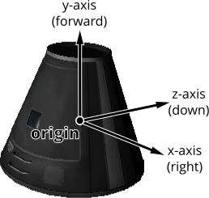
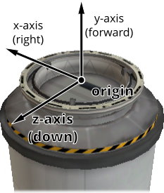
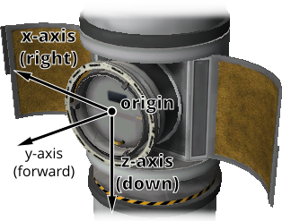
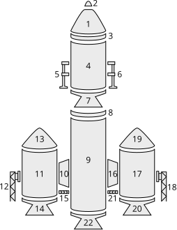
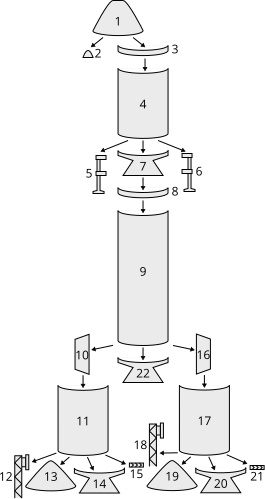
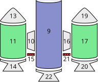
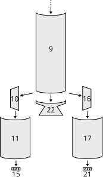
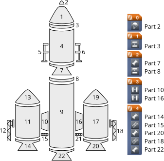
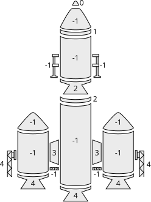

# Parts

The following classes allow interaction with a vessels individual parts.

- [Parts](#id1)
- [Part](#part)
- [Module](#module)
- [Config Node](#config-node)
- [Specific Types of Part](#specific-types-of-part)

  - [Antenna](#antenna)
  - [Cargo Bay](#cargo-bay)
  - [Control Surface](#control-surface)
  - [Decoupler](#decoupler)
  - [Deployable State](#deployable-state)
  - [Docking Port](#docking-port)
  - [Engine](#engine)
  - [Experiment](#experiment)
  - [Fairing](#fairing)
  - [Intake](#intake)
  - [Leg](#leg)
  - [Launch Clamp](#launch-clamp)
  - [Light](#light)
  - [Parachute](#parachute)
  - [Radiator](#radiator)
  - [Resource Converter](#resource-converter)
  - [Resource Harvester](#resource-harvester)
  - [Reaction Wheel](#reaction-wheel)
  - [Resource Drain](#resource-drain)
  - [Robotic Controller](#robotic-controller)
  - [Robotic Hinge](#robotic-hinge)
  - [Robotic Piston](#robotic-piston)
  - [Robotic Rotation](#robotic-rotation)
  - [Robotic Rotor](#robotic-rotor)
  - [RCS](#rcs)
  - [Sensor](#sensor)
  - [Solar Panel](#solar-panel)
  - [Thruster](#thruster)
  - [Wheel](#wheel)
- [Trees of Parts](#trees-of-parts)

  - [Traversing the Tree](#traversing-the-tree)
  - [Attachment Modes](#attachment-modes)
- [Fuel Lines](#fuel-lines)
- [Staging](#staging)

## [Parts](#id21)

class Parts
:   Instances of this class are used to interact with the parts of a vessel.
    An instance can be obtained by calling [`Vessel.parts`](./vessel.md#SpaceCenter.Vessel.parts "SpaceCenter.Vessel.parts").

    all
    :   A list of all of the vessels parts.

        Attribute:
        :   Read-only, cannot be set

        Return type:
        :   list([`Part`](#SpaceCenter.Part "SpaceCenter.Part"))

    root
    :   The vessels root part.

        Attribute:
        :   Read-only, cannot be set

        Return type:
        :   [`Part`](#SpaceCenter.Part "SpaceCenter.Part")

        > **Note**
        >
        > See the discussion on [Trees of Parts](#python-api-parts-trees-of-parts).

    controlling
    :   The part from which the vessel is controlled.

        Attribute:
        :   Can be read or written

        Return type:
        :   [`Part`](#SpaceCenter.Part "SpaceCenter.Part")

    with\_name(*name*)
    :   A list of parts whose [`Part.name`](#SpaceCenter.Part.name "SpaceCenter.Part.name") is *name*.

        Parameters:
        :   **name** (*str*)

        Return type:
        :   list([`Part`](#SpaceCenter.Part "SpaceCenter.Part"))

    with\_title(*title*)
    :   A list of all parts whose [`Part.title`](#SpaceCenter.Part.title "SpaceCenter.Part.title") is *title*.

        Parameters:
        :   **title** (*str*)

        Return type:
        :   list([`Part`](#SpaceCenter.Part "SpaceCenter.Part"))

    with\_tag(*tag*)
    :   A list of all parts whose [`Part.tag`](#SpaceCenter.Part.tag "SpaceCenter.Part.tag") is *tag*.

        Parameters:
        :   **tag** (*str*)

        Return type:
        :   list([`Part`](#SpaceCenter.Part "SpaceCenter.Part"))

    with\_module(*module\_name*)
    :   A list of all parts that contain a [`Module`](#SpaceCenter.Module "SpaceCenter.Module") whose
        [`Module.name`](#SpaceCenter.Module.name "SpaceCenter.Module.name") is *module\_name*.

        Parameters:
        :   **module\_name** (*str*)

        Return type:
        :   list([`Part`](#SpaceCenter.Part "SpaceCenter.Part"))

    in\_stage(*stage*)
    :   > **Warning**
        >
        > Deprecated. Use [`Stage.parts`](./stage.md#SpaceCenter.Stage.parts "SpaceCenter.Stage.parts") from the object returned by [`Vessel.stage_at()`](./vessel.md#SpaceCenter.Vessel.stage_at "SpaceCenter.Vessel.stage_at") instead.

        A list of all parts that are activated in the given *stage*.

        Parameters:
        :   **stage** (*int*)

        Return type:
        :   list([`Part`](#SpaceCenter.Part "SpaceCenter.Part"))

        > **Note**
        >
        > Deprecated. Use [`Vessel.stage_at()`](./vessel.md#SpaceCenter.Vessel.stage_at "SpaceCenter.Vessel.stage_at") and
        > [`Stage.parts`](./stage.md#SpaceCenter.Stage.parts "SpaceCenter.Stage.parts") instead. See the discussion on
        > [Staging](#python-api-parts-staging).

    in\_decouple\_stage(*stage*)
    :   > **Warning**
        >
        > Deprecated. Use [`Stage.parts`](./stage.md#SpaceCenter.Stage.parts "SpaceCenter.Stage.parts") from the object returned by [`Vessel.decouple_stage_at()`](./vessel.md#SpaceCenter.Vessel.decouple_stage_at "SpaceCenter.Vessel.decouple_stage_at") instead.

        A list of all parts that are decoupled in the given *stage*.

        Parameters:
        :   **stage** (*int*)

        Return type:
        :   list([`Part`](#SpaceCenter.Part "SpaceCenter.Part"))

        > **Note**
        >
        > Deprecated. Use [`Vessel.decouple_stage_at()`](./vessel.md#SpaceCenter.Vessel.decouple_stage_at "SpaceCenter.Vessel.decouple_stage_at") and
        > [`Stage.parts`](./stage.md#SpaceCenter.Stage.parts "SpaceCenter.Stage.parts") instead. See the discussion on
        > [Staging](#python-api-parts-staging).

    modules\_with\_name(*module\_name*)
    :   A list of modules (combined across all parts in the vessel) whose
        [`Module.name`](#SpaceCenter.Module.name "SpaceCenter.Module.name") is *module\_name*.

        Parameters:
        :   **module\_name** (*str*)

        Return type:
        :   list([`Module`](#SpaceCenter.Module "SpaceCenter.Module"))

    antennas
    :   A list of all antennas in the vessel.

        Attribute:
        :   Read-only, cannot be set

        Return type:
        :   list([`Antenna`](#SpaceCenter.Antenna "SpaceCenter.Antenna"))

        > **Note**
        >
        > If RemoteTech is installed, this will always return an empty list.
        > To interact with RemoteTech antennas, use the RemoteTech service APIs.

    cargo\_bays
    :   A list of all cargo bays in the vessel.

        Attribute:
        :   Read-only, cannot be set

        Return type:
        :   list([`CargoBay`](#SpaceCenter.CargoBay "SpaceCenter.CargoBay"))

    control\_surfaces
    :   A list of all control surfaces in the vessel.

        Attribute:
        :   Read-only, cannot be set

        Return type:
        :   list([`ControlSurface`](#SpaceCenter.ControlSurface "SpaceCenter.ControlSurface"))

    decouplers
    :   A list of all decouplers in the vessel.

        Attribute:
        :   Read-only, cannot be set

        Return type:
        :   list([`Decoupler`](#SpaceCenter.Decoupler "SpaceCenter.Decoupler"))

    docking\_ports
    :   A list of all docking ports in the vessel.

        Attribute:
        :   Read-only, cannot be set

        Return type:
        :   list([`DockingPort`](#SpaceCenter.DockingPort "SpaceCenter.DockingPort"))

    engines
    :   A list of all engines in the vessel.

        Attribute:
        :   Read-only, cannot be set

        Return type:
        :   list([`Engine`](#SpaceCenter.Engine "SpaceCenter.Engine"))

        > **Note**
        >
        > This includes any part that generates thrust. This covers many different types
        > of engine, including liquid fuel rockets, solid rocket boosters, jet engines and
        > RCS thrusters.

    experiments
    :   A list of all science experiments in the vessel.

        Attribute:
        :   Read-only, cannot be set

        Return type:
        :   list([`Experiment`](#SpaceCenter.Experiment "SpaceCenter.Experiment"))

    fairings
    :   A list of all fairings in the vessel.

        Attribute:
        :   Read-only, cannot be set

        Return type:
        :   list([`Fairing`](#SpaceCenter.Fairing "SpaceCenter.Fairing"))

    intakes
    :   A list of all intakes in the vessel.

        Attribute:
        :   Read-only, cannot be set

        Return type:
        :   list([`Intake`](#SpaceCenter.Intake "SpaceCenter.Intake"))

    legs
    :   A list of all landing legs attached to the vessel.

        Attribute:
        :   Read-only, cannot be set

        Return type:
        :   list([`Leg`](#SpaceCenter.Leg "SpaceCenter.Leg"))

    launch\_clamps
    :   A list of all launch clamps attached to the vessel.

        Attribute:
        :   Read-only, cannot be set

        Return type:
        :   list([`LaunchClamp`](#SpaceCenter.LaunchClamp "SpaceCenter.LaunchClamp"))

    lights
    :   A list of all lights in the vessel.

        Attribute:
        :   Read-only, cannot be set

        Return type:
        :   list([`Light`](#SpaceCenter.Light "SpaceCenter.Light"))

    parachutes
    :   A list of all parachutes in the vessel.

        Attribute:
        :   Read-only, cannot be set

        Return type:
        :   list([`Parachute`](#SpaceCenter.Parachute "SpaceCenter.Parachute"))

    radiators
    :   A list of all radiators in the vessel.

        Attribute:
        :   Read-only, cannot be set

        Return type:
        :   list([`Radiator`](#SpaceCenter.Radiator "SpaceCenter.Radiator"))

    resource\_drains
    :   A list of all resource drains in the vessel.

        Attribute:
        :   Read-only, cannot be set

        Return type:
        :   list([`ResourceDrain`](#SpaceCenter.ResourceDrain "SpaceCenter.ResourceDrain"))

    rcs
    :   A list of all RCS blocks/thrusters in the vessel.

        Attribute:
        :   Read-only, cannot be set

        Return type:
        :   list([`RCS`](#SpaceCenter.RCS "SpaceCenter.RCS"))

    reaction\_wheels
    :   A list of all reaction wheels in the vessel.

        Attribute:
        :   Read-only, cannot be set

        Return type:
        :   list([`ReactionWheel`](#SpaceCenter.ReactionWheel "SpaceCenter.ReactionWheel"))

    resource\_converters
    :   A list of all resource converters in the vessel.

        Attribute:
        :   Read-only, cannot be set

        Return type:
        :   list([`ResourceConverter`](#SpaceCenter.ResourceConverter "SpaceCenter.ResourceConverter"))

    resource\_harvesters
    :   A list of all resource harvesters in the vessel.

        Attribute:
        :   Read-only, cannot be set

        Return type:
        :   list([`ResourceHarvester`](#SpaceCenter.ResourceHarvester "SpaceCenter.ResourceHarvester"))

    robotic\_controllers
    :   A list of all robotic controllers in the vessel.

        Attribute:
        :   Read-only, cannot be set

        Return type:
        :   list([`RoboticController`](#SpaceCenter.RoboticController "SpaceCenter.RoboticController"))

    robotic\_hinges
    :   A list of all robotic hinges in the vessel.

        Attribute:
        :   Read-only, cannot be set

        Return type:
        :   list([`RoboticHinge`](#SpaceCenter.RoboticHinge "SpaceCenter.RoboticHinge"))

    robotic\_pistons
    :   A list of all robotic pistons in the vessel.

        Attribute:
        :   Read-only, cannot be set

        Return type:
        :   list([`RoboticPiston`](#SpaceCenter.RoboticPiston "SpaceCenter.RoboticPiston"))

    robotic\_rotations
    :   A list of all robotic rotations in the vessel.

        Attribute:
        :   Read-only, cannot be set

        Return type:
        :   list([`RoboticRotation`](#SpaceCenter.RoboticRotation "SpaceCenter.RoboticRotation"))

    robotic\_rotors
    :   A list of all robotic rotors in the vessel.

        Attribute:
        :   Read-only, cannot be set

        Return type:
        :   list([`RoboticRotor`](#SpaceCenter.RoboticRotor "SpaceCenter.RoboticRotor"))

    sensors
    :   A list of all sensors in the vessel.

        Attribute:
        :   Read-only, cannot be set

        Return type:
        :   list([`Sensor`](#SpaceCenter.Sensor "SpaceCenter.Sensor"))

    solar\_panels
    :   A list of all solar panels in the vessel.

        Attribute:
        :   Read-only, cannot be set

        Return type:
        :   list([`SolarPanel`](#SpaceCenter.SolarPanel "SpaceCenter.SolarPanel"))

    wheels
    :   A list of all wheels in the vessel.

        Attribute:
        :   Read-only, cannot be set

        Return type:
        :   list([`Wheel`](#SpaceCenter.Wheel "SpaceCenter.Wheel"))

## [Part](#id22)

class Part
:   Represents an individual part. Vessels are made up of multiple parts.
    Instances of this class can be obtained by several methods in [`Parts`](#SpaceCenter.Parts "SpaceCenter.Parts").

    name
    :   Internal name of the part, as used in
        [part cfg files](https://wiki.kerbalspaceprogram.com/wiki/CFG_File_Documentation).
        For example “Mark1-2Pod”.

        Attribute:
        :   Read-only, cannot be set

        Return type:
        :   str

    title
    :   Title of the part, as shown when the part is right clicked in-game. For example “Mk1-2 Command Pod”.

        Attribute:
        :   Read-only, cannot be set

        Return type:
        :   str

    config
    :   The static configuration of the part, as found in its
        [part cfg file](https://wiki.kerbalspaceprogram.com/wiki/CFG_File_Documentation).
        This provides access to data that is not exposed elsewhere, such as the
        configuration of the part’s modules. Returns `None` if the part has no
        associated configuration node.

        Attribute:
        :   Read-only, cannot be set

        Return type:
        :   [`ConfigNode`](#SpaceCenter.ConfigNode "SpaceCenter.ConfigNode")

    tag
    :   The name tag for the part. Can be set to a custom string using the
        in-game user interface.

        Attribute:
        :   Can be read or written

        Return type:
        :   str

        > **Note**
        >
        > This string is shared with
        > [kOS](https://forum.kerbalspaceprogram.com/index.php?/topic/61827-/)
        > if it is installed.

    flag\_url
    :   The asset URL for the part’s flag.

        Attribute:
        :   Can be read or written

        Return type:
        :   str

    highlighted
    :   Whether the part is highlighted.

        Attribute:
        :   Can be read or written

        Return type:
        :   bool

        > **Note**
        >
        > The highlighting is removed when the client that enabled it disconnects.

    highlight\_color
    :   The color used to highlight the part, as an RGB triple.

        Attribute:
        :   Can be read or written

        Return type:
        :   tuple(float, float, float)

    cost
    :   The cost of the part, in units of funds.

        Attribute:
        :   Read-only, cannot be set

        Return type:
        :   float

    vessel
    :   The vessel that contains this part.

        Attribute:
        :   Read-only, cannot be set

        Return type:
        :   [`Vessel`](./vessel.md#SpaceCenter.Vessel "SpaceCenter.Vessel")

    parent
    :   The parts parent. Returns `None` if the part does not have a parent.
        This, in combination with [`Part.children`](#SpaceCenter.Part.children "SpaceCenter.Part.children"), can be used to traverse the vessels
        parts tree.

        Attribute:
        :   Read-only, cannot be set

        Return type:
        :   [`Part`](#SpaceCenter.Part "SpaceCenter.Part")

        > **Note**
        >
        > See the discussion on [Trees of Parts](#python-api-parts-trees-of-parts).

    children
    :   The parts children. Returns an empty list if the part has no children.
        This, in combination with [`Part.parent`](#SpaceCenter.Part.parent "SpaceCenter.Part.parent"), can be used to traverse the vessels
        parts tree.

        Attribute:
        :   Read-only, cannot be set

        Return type:
        :   list([`Part`](#SpaceCenter.Part "SpaceCenter.Part"))

        > **Note**
        >
        > See the discussion on [Trees of Parts](#python-api-parts-trees-of-parts).

    axially\_attached
    :   Whether the part is axially attached to its parent, i.e. on the top
        or bottom of its parent. If the part has no parent, returns `False`.

        Attribute:
        :   Read-only, cannot be set

        Return type:
        :   bool

        > **Note**
        >
        > See the discussion on [Attachment Modes](#python-api-parts-attachment-modes).

    radially\_attached
    :   Whether the part is radially attached to its parent, i.e. on the side of its parent.
        If the part has no parent, returns `False`.

        Attribute:
        :   Read-only, cannot be set

        Return type:
        :   bool

        > **Note**
        >
        > See the discussion on [Attachment Modes](#python-api-parts-attachment-modes).

    stage
    :   The stage in which this part will be activated. Returns -1 if the part is not
        activated by staging.

        Attribute:
        :   Read-only, cannot be set

        Return type:
        :   int

        > **Note**
        >
        > See the discussion on [Staging](#python-api-parts-staging).

    decouple\_stage
    :   The stage in which this part will be decoupled. Returns -1 if the part is never
        decoupled from the vessel.

        Attribute:
        :   Read-only, cannot be set

        Return type:
        :   int

        > **Note**
        >
        > See the discussion on [Staging](#python-api-parts-staging).

    massless
    :   Whether the part is
        [massless](https://wiki.kerbalspaceprogram.com/wiki/Massless_part).

        Attribute:
        :   Read-only, cannot be set

        Return type:
        :   bool

    mass
    :   The current mass of the part, including resources it contains, in kilograms.
        Returns zero if the part is massless.

        Attribute:
        :   Read-only, cannot be set

        Return type:
        :   float

    dry\_mass
    :   The mass of the part, not including any resources it contains, in kilograms.
        Returns zero if the part is massless.

        Attribute:
        :   Read-only, cannot be set

        Return type:
        :   float

    shielded
    :   Whether the part is shielded from the exterior of the vessel, for example by a fairing.

        Attribute:
        :   Read-only, cannot be set

        Return type:
        :   bool

    dynamic\_pressure
    :   The dynamic pressure acting on the part, in Pascals.

        Attribute:
        :   Read-only, cannot be set

        Return type:
        :   float

    impact\_tolerance
    :   The impact tolerance of the part, in meters per second.

        Attribute:
        :   Read-only, cannot be set

        Return type:
        :   float

    temperature
    :   Temperature of the part, in Kelvin.

        Attribute:
        :   Read-only, cannot be set

        Return type:
        :   float

    skin\_temperature
    :   Temperature of the skin of the part, in Kelvin.

        Attribute:
        :   Read-only, cannot be set

        Return type:
        :   float

    max\_temperature
    :   Maximum temperature that the part can survive, in Kelvin.

        Attribute:
        :   Read-only, cannot be set

        Return type:
        :   float

    max\_skin\_temperature
    :   Maximum temperature that the skin of the part can survive, in Kelvin.

        Attribute:
        :   Read-only, cannot be set

        Return type:
        :   float

    thermal\_mass
    :   A measure of how much energy it takes to increase the internal temperature of the part,
        in Joules per Kelvin.

        Attribute:
        :   Read-only, cannot be set

        Return type:
        :   float

    thermal\_skin\_mass
    :   A measure of how much energy it takes to increase the skin temperature of the part,
        in Joules per Kelvin.

        Attribute:
        :   Read-only, cannot be set

        Return type:
        :   float

    thermal\_resource\_mass
    :   A measure of how much energy it takes to increase the temperature of the resources
        contained in the part, in Joules per Kelvin.

        Attribute:
        :   Read-only, cannot be set

        Return type:
        :   float

    thermal\_conduction\_flux
    :   The rate at which heat energy is conducting into or out of the part via contact with
        other parts. Measured in energy per unit time, or power, in Watts.
        A positive value means the part is gaining heat energy, and negative means it is
        losing heat energy.

        Attribute:
        :   Read-only, cannot be set

        Return type:
        :   float

    thermal\_convection\_flux
    :   The rate at which heat energy is convecting into or out of the part from the
        surrounding atmosphere. Measured in energy per unit time, or power, in Watts.
        A positive value means the part is gaining heat energy, and negative means it is
        losing heat energy.

        Attribute:
        :   Read-only, cannot be set

        Return type:
        :   float

    thermal\_radiation\_flux
    :   The rate at which heat energy is radiating into or out of the part from the surrounding
        environment. Measured in energy per unit time, or power, in Watts.
        A positive value means the part is gaining heat energy, and negative means it is
        losing heat energy.

        Attribute:
        :   Read-only, cannot be set

        Return type:
        :   float

    thermal\_internal\_flux
    :   The rate at which heat energy is begin generated by the part.
        For example, some engines generate heat by combusting fuel.
        Measured in energy per unit time, or power, in Watts.
        A positive value means the part is gaining heat energy, and negative means it is losing
        heat energy.

        Attribute:
        :   Read-only, cannot be set

        Return type:
        :   float

    thermal\_skin\_to\_internal\_flux
    :   The rate at which heat energy is transferring between the part’s skin and its internals.
        Measured in energy per unit time, or power, in Watts.
        A positive value means the part’s internals are gaining heat energy,
        and negative means its skin is gaining heat energy.

        Attribute:
        :   Read-only, cannot be set

        Return type:
        :   float

    crew\_capacity
    :   The number of crew members that can occupy the part.

        Attribute:
        :   Read-only, cannot be set

        Return type:
        :   int

    crew
    :   The crew members occupying the part.

        Attribute:
        :   Read-only, cannot be set

        Return type:
        :   list([`CrewMember`](./vessel.md#SpaceCenter.CrewMember "SpaceCenter.CrewMember"))

    available\_seats
    :   How many open seats the part has.

        Attribute:
        :   Read-only, cannot be set

        Return type:
        :   int

    resources
    :   A [`Part.resources`](#SpaceCenter.Part.resources "SpaceCenter.Part.resources") object for the part.

        Attribute:
        :   Read-only, cannot be set

        Return type:
        :   [`Resources`](./resources.md#SpaceCenter.Resources "SpaceCenter.Resources")

    crossfeed
    :   Whether this part is crossfeed capable.

        Attribute:
        :   Read-only, cannot be set

        Return type:
        :   bool

    is\_fuel\_line
    :   Whether this part is a fuel line.

        Attribute:
        :   Read-only, cannot be set

        Return type:
        :   bool

    fuel\_lines\_from
    :   The parts that are connected to this part via fuel lines, where the direction of the
        fuel line is into this part.

        Attribute:
        :   Read-only, cannot be set

        Return type:
        :   list([`Part`](#SpaceCenter.Part "SpaceCenter.Part"))

        > **Note**
        >
        > See the discussion on [Fuel Lines](#python-api-parts-fuel-lines).

    fuel\_lines\_to
    :   The parts that are connected to this part via fuel lines, where the direction of the
        fuel line is out of this part.

        Attribute:
        :   Read-only, cannot be set

        Return type:
        :   list([`Part`](#SpaceCenter.Part "SpaceCenter.Part"))

        > **Note**
        >
        > See the discussion on [Fuel Lines](#python-api-parts-fuel-lines).

    modules
    :   The modules for this part.

        Attribute:
        :   Read-only, cannot be set

        Return type:
        :   list([`Module`](#SpaceCenter.Module "SpaceCenter.Module"))

    antenna
    :   An [`Part.antenna`](#SpaceCenter.Part.antenna "SpaceCenter.Part.antenna") if the part is an antenna, otherwise `None`.

        Attribute:
        :   Read-only, cannot be set

        Return type:
        :   [`Antenna`](#SpaceCenter.Antenna "SpaceCenter.Antenna")

        > **Note**
        >
        > If RemoteTech is installed, this will always return `None`.
        > To interact with RemoteTech antennas, use the RemoteTech service APIs.

    cargo\_bay
    :   A [`Part.cargo_bay`](#SpaceCenter.Part.cargo_bay "SpaceCenter.Part.cargo_bay") if the part is a cargo bay, otherwise `None`.

        Attribute:
        :   Read-only, cannot be set

        Return type:
        :   [`CargoBay`](#SpaceCenter.CargoBay "SpaceCenter.CargoBay")

    control\_surface
    :   A [`Part.control_surface`](#SpaceCenter.Part.control_surface "SpaceCenter.Part.control_surface") if the part is an aerodynamic control surface,
        otherwise `None`.

        Attribute:
        :   Read-only, cannot be set

        Return type:
        :   [`ControlSurface`](#SpaceCenter.ControlSurface "SpaceCenter.ControlSurface")

    decoupler
    :   A [`Part.decoupler`](#SpaceCenter.Part.decoupler "SpaceCenter.Part.decoupler") if the part is a decoupler, otherwise `None`.

        Attribute:
        :   Read-only, cannot be set

        Return type:
        :   [`Decoupler`](#SpaceCenter.Decoupler "SpaceCenter.Decoupler")

    docking\_port
    :   A [`Part.docking_port`](#SpaceCenter.Part.docking_port "SpaceCenter.Part.docking_port") if the part is a docking port, otherwise `None`.

        Attribute:
        :   Read-only, cannot be set

        Return type:
        :   [`DockingPort`](#SpaceCenter.DockingPort "SpaceCenter.DockingPort")

    engine
    :   An [`Part.engine`](#SpaceCenter.Part.engine "SpaceCenter.Part.engine") if the part is an engine, otherwise `None`.

        Attribute:
        :   Read-only, cannot be set

        Return type:
        :   [`Engine`](#SpaceCenter.Engine "SpaceCenter.Engine")

    experiment
    :   An [`Part.experiment`](#SpaceCenter.Part.experiment "SpaceCenter.Part.experiment") if the part contains a
        single science experiment, otherwise `None`.

        Attribute:
        :   Read-only, cannot be set

        Return type:
        :   [`Experiment`](#SpaceCenter.Experiment "SpaceCenter.Experiment")

        > **Note**
        >
        > Throws an exception if the part contains more than one experiment.
        > In that case, use [`Part.experiments`](#SpaceCenter.Part.experiments "SpaceCenter.Part.experiments") to get the list of experiments in the part.

    experiments
    :   A list of [`Part.experiment`](#SpaceCenter.Part.experiment "SpaceCenter.Part.experiment") objects that the part contains.

        Attribute:
        :   Read-only, cannot be set

        Return type:
        :   list([`Experiment`](#SpaceCenter.Experiment "SpaceCenter.Experiment"))

    fairing
    :   A [`Part.fairing`](#SpaceCenter.Part.fairing "SpaceCenter.Part.fairing") if the part is a fairing, otherwise `None`.

        Attribute:
        :   Read-only, cannot be set

        Return type:
        :   [`Fairing`](#SpaceCenter.Fairing "SpaceCenter.Fairing")

    intake
    :   An [`Part.intake`](#SpaceCenter.Part.intake "SpaceCenter.Part.intake") if the part is an intake, otherwise `None`.

        Attribute:
        :   Read-only, cannot be set

        Return type:
        :   [`Intake`](#SpaceCenter.Intake "SpaceCenter.Intake")

        > **Note**
        >
        > This includes any part that generates thrust. This covers many different types
        > of engine, including liquid fuel rockets, solid rocket boosters and jet engines.
        > For RCS thrusters see [`Part.rcs`](#SpaceCenter.Part.rcs "SpaceCenter.Part.rcs").

    leg
    :   A [`Part.leg`](#SpaceCenter.Part.leg "SpaceCenter.Part.leg") if the part is a landing leg, otherwise `None`.

        Attribute:
        :   Read-only, cannot be set

        Return type:
        :   [`Leg`](#SpaceCenter.Leg "SpaceCenter.Leg")

    launch\_clamp
    :   A [`Part.launch_clamp`](#SpaceCenter.Part.launch_clamp "SpaceCenter.Part.launch_clamp") if the part is a launch clamp, otherwise `None`.

        Attribute:
        :   Read-only, cannot be set

        Return type:
        :   [`LaunchClamp`](#SpaceCenter.LaunchClamp "SpaceCenter.LaunchClamp")

    light
    :   A [`Part.light`](#SpaceCenter.Part.light "SpaceCenter.Part.light") if the part is a light, otherwise `None`.

        Attribute:
        :   Read-only, cannot be set

        Return type:
        :   [`Light`](#SpaceCenter.Light "SpaceCenter.Light")

    parachute
    :   A [`Part.parachute`](#SpaceCenter.Part.parachute "SpaceCenter.Part.parachute") if the part is a parachute, otherwise `None`.

        Attribute:
        :   Read-only, cannot be set

        Return type:
        :   [`Parachute`](#SpaceCenter.Parachute "SpaceCenter.Parachute")

    radiator
    :   A [`Part.radiator`](#SpaceCenter.Part.radiator "SpaceCenter.Part.radiator") if the part is a radiator, otherwise `None`.

        Attribute:
        :   Read-only, cannot be set

        Return type:
        :   [`Radiator`](#SpaceCenter.Radiator "SpaceCenter.Radiator")

    resource\_drain
    :   A [`Part.resource_drain`](#SpaceCenter.Part.resource_drain "SpaceCenter.Part.resource_drain") if the part is a resource drain, otherwise `None`.

        Attribute:
        :   Read-only, cannot be set

        Return type:
        :   [`ResourceDrain`](#SpaceCenter.ResourceDrain "SpaceCenter.ResourceDrain")

    rcs
    :   A [`Part.rcs`](#SpaceCenter.Part.rcs "SpaceCenter.Part.rcs") if the part is an RCS block/thruster, otherwise `None`.

        Attribute:
        :   Read-only, cannot be set

        Return type:
        :   [`RCS`](#SpaceCenter.RCS "SpaceCenter.RCS")

    reaction\_wheel
    :   A [`Part.reaction_wheel`](#SpaceCenter.Part.reaction_wheel "SpaceCenter.Part.reaction_wheel") if the part is a reaction wheel, otherwise `None`.

        Attribute:
        :   Read-only, cannot be set

        Return type:
        :   [`ReactionWheel`](#SpaceCenter.ReactionWheel "SpaceCenter.ReactionWheel")

    resource\_converter
    :   A [`Part.resource_converter`](#SpaceCenter.Part.resource_converter "SpaceCenter.Part.resource_converter") if the part is a resource converter,
        otherwise `None`.

        Attribute:
        :   Read-only, cannot be set

        Return type:
        :   [`ResourceConverter`](#SpaceCenter.ResourceConverter "SpaceCenter.ResourceConverter")

    resource\_harvester
    :   A [`Part.resource_harvester`](#SpaceCenter.Part.resource_harvester "SpaceCenter.Part.resource_harvester") if the part is a resource harvester,
        otherwise `None`.

        Attribute:
        :   Read-only, cannot be set

        Return type:
        :   [`ResourceHarvester`](#SpaceCenter.ResourceHarvester "SpaceCenter.ResourceHarvester")

    robotic\_controller
    :   A [`Part.robotic_controller`](#SpaceCenter.Part.robotic_controller "SpaceCenter.Part.robotic_controller") if the part is a robotic controller,
        otherwise `None`.

        Attribute:
        :   Read-only, cannot be set

        Return type:
        :   [`RoboticController`](#SpaceCenter.RoboticController "SpaceCenter.RoboticController")

    robotic\_hinge
    :   A [`Part.robotic_hinge`](#SpaceCenter.Part.robotic_hinge "SpaceCenter.Part.robotic_hinge") if the part is a robotic hinge, otherwise `None`.

        Attribute:
        :   Read-only, cannot be set

        Return type:
        :   [`RoboticHinge`](#SpaceCenter.RoboticHinge "SpaceCenter.RoboticHinge")

    robotic\_piston
    :   A [`Part.robotic_piston`](#SpaceCenter.Part.robotic_piston "SpaceCenter.Part.robotic_piston") if the part is a robotic piston, otherwise `None`.

        Attribute:
        :   Read-only, cannot be set

        Return type:
        :   [`RoboticPiston`](#SpaceCenter.RoboticPiston "SpaceCenter.RoboticPiston")

    robotic\_rotation
    :   A [`Part.robotic_rotation`](#SpaceCenter.Part.robotic_rotation "SpaceCenter.Part.robotic_rotation") if the part is a robotic rotation servo, otherwise `None`.

        Attribute:
        :   Read-only, cannot be set

        Return type:
        :   [`RoboticRotation`](#SpaceCenter.RoboticRotation "SpaceCenter.RoboticRotation")

    robotic\_rotor
    :   A [`Part.robotic_rotor`](#SpaceCenter.Part.robotic_rotor "SpaceCenter.Part.robotic_rotor") if the part is a robotic rotor, otherwise `None`.

        Attribute:
        :   Read-only, cannot be set

        Return type:
        :   [`RoboticRotor`](#SpaceCenter.RoboticRotor "SpaceCenter.RoboticRotor")

    sensor
    :   A [`Part.sensor`](#SpaceCenter.Part.sensor "SpaceCenter.Part.sensor") if the part is a sensor, otherwise `None`.

        Attribute:
        :   Read-only, cannot be set

        Return type:
        :   [`Sensor`](#SpaceCenter.Sensor "SpaceCenter.Sensor")

    solar\_panel
    :   A [`Part.solar_panel`](#SpaceCenter.Part.solar_panel "SpaceCenter.Part.solar_panel") if the part is a solar panel, otherwise `None`.

        Attribute:
        :   Read-only, cannot be set

        Return type:
        :   [`SolarPanel`](#SpaceCenter.SolarPanel "SpaceCenter.SolarPanel")

    wheel
    :   A [`Part.wheel`](#SpaceCenter.Part.wheel "SpaceCenter.Part.wheel") if the part is a wheel, otherwise `None`.

        Attribute:
        :   Read-only, cannot be set

        Return type:
        :   [`Wheel`](#SpaceCenter.Wheel "SpaceCenter.Wheel")

    position(*reference\_frame*)
    :   The position of the part in the given reference frame.

        Parameters:
        :   **reference\_frame** ([*ReferenceFrame*](./reference-frame.md#SpaceCenter.ReferenceFrame "SpaceCenter.ReferenceFrame")) – The reference frame that the returned position vector is in.

        Returns:
        :   The position as a vector.

        Return type:
        :   tuple(float, float, float)

        > **Note**
        >
        > This is a fixed position in the part, defined by the parts model.
        > It s not necessarily the same as the parts center of mass.
        > Use [`Part.center_of_mass()`](#SpaceCenter.Part.center_of_mass "SpaceCenter.Part.center_of_mass") to get the parts center of mass.

    center\_of\_mass(*reference\_frame*)
    :   The position of the parts center of mass in the given reference frame.
        If the part is physicsless, this is equivalent to [`Part.position()`](#SpaceCenter.Part.position "SpaceCenter.Part.position").

        Parameters:
        :   **reference\_frame** ([*ReferenceFrame*](./reference-frame.md#SpaceCenter.ReferenceFrame "SpaceCenter.ReferenceFrame")) – The reference frame that the returned position vector is in.

        Returns:
        :   The position as a vector.

        Return type:
        :   tuple(float, float, float)

    bounding\_box(*reference\_frame*)
    :   The axis-aligned bounding box of the part in the given reference frame.

        Parameters:
        :   **reference\_frame** ([*ReferenceFrame*](./reference-frame.md#SpaceCenter.ReferenceFrame "SpaceCenter.ReferenceFrame")) – The reference frame that the returned position vectors are in.

        Returns:
        :   The positions of the minimum and maximum vertices of the box, as position vectors.

        Return type:
        :   tuple(tuple(float, float, float), tuple(float, float, float))

        > **Note**
        >
        > This is computed from the collision mesh of the part.
        > If the part is not collidable, the box has zero volume and is centered on
        > the [`Part.position()`](#SpaceCenter.Part.position "SpaceCenter.Part.position") of the part.

    direction(*reference\_frame*)
    :   The direction the part points in, in the given reference frame.

        Parameters:
        :   **reference\_frame** ([*ReferenceFrame*](./reference-frame.md#SpaceCenter.ReferenceFrame "SpaceCenter.ReferenceFrame")) – The reference frame that the returned direction is in.

        Returns:
        :   The direction as a unit vector.

        Return type:
        :   tuple(float, float, float)

    velocity(*reference\_frame*)
    :   The linear velocity of the part in the given reference frame.

        Parameters:
        :   **reference\_frame** ([*ReferenceFrame*](./reference-frame.md#SpaceCenter.ReferenceFrame "SpaceCenter.ReferenceFrame")) – The reference frame that the returned velocity vector is in.

        Returns:
        :   The velocity as a vector. The vector points in the direction of travel, and its magnitude is the speed of the body in meters per second.

        Return type:
        :   tuple(float, float, float)

    rotation(*reference\_frame*)
    :   The rotation of the part, in the given reference frame.

        Parameters:
        :   **reference\_frame** ([*ReferenceFrame*](./reference-frame.md#SpaceCenter.ReferenceFrame "SpaceCenter.ReferenceFrame")) – The reference frame that the returned rotation is in.

        Returns:
        :   The rotation as a quaternion of the form \((x, y, z, w)\).

        Return type:
        :   tuple(float, float, float, float)

    lift(*reference\_frame*)
    :   The aerodynamic [lift](https://en.wikipedia.org/wiki/Aerodynamic_force)
        currently acting on the part.

        Parameters:
        :   **reference\_frame** ([*ReferenceFrame*](./reference-frame.md#SpaceCenter.ReferenceFrame "SpaceCenter.ReferenceFrame")) – The reference frame that the returned vector is in.

        Returns:
        :   A vector pointing in the direction that the force acts, with its magnitude equal to the strength of the force in Newtons.

        Return type:
        :   tuple(float, float, float)

        > **Note**
        >
        > Not available when the Ferram Aerospace Research mod is installed.

    drag(*reference\_frame*)
    :   The aerodynamic [drag](https://en.wikipedia.org/wiki/Aerodynamic_force)
        currently acting on the part.

        Parameters:
        :   **reference\_frame** ([*ReferenceFrame*](./reference-frame.md#SpaceCenter.ReferenceFrame "SpaceCenter.ReferenceFrame")) – The reference frame that the returned vector is in.

        Returns:
        :   A vector pointing in the direction that the force acts, with its magnitude equal to the strength of the force in Newtons.

        Return type:
        :   tuple(float, float, float)

        > **Note**
        >
        > Not available when the Ferram Aerospace Research mod is installed.

    moment\_of\_inertia
    :   The moment of inertia of the part in \(kg.m^2\) around its center of mass
        in the parts reference frame ([`Part.reference_frame`](#SpaceCenter.Part.reference_frame "SpaceCenter.Part.reference_frame")).

        Attribute:
        :   Read-only, cannot be set

        Return type:
        :   tuple(float, float, float)

    inertia\_tensor
    :   The inertia tensor of the part in the parts reference frame
        ([`Part.reference_frame`](#SpaceCenter.Part.reference_frame "SpaceCenter.Part.reference_frame")).
        Returns the 3x3 matrix as a list of elements, in row-major order.

        Attribute:
        :   Read-only, cannot be set

        Return type:
        :   list(float)

    reference\_frame
    :   The reference frame that is fixed relative to this part, and centered on a fixed
        position within the part, defined by the parts model.

        - The origin is at the position of the part, as returned by
          [`Part.position()`](#SpaceCenter.Part.position "SpaceCenter.Part.position").
        - The axes rotate with the part.
        - The x, y and z axis directions depend on the design of the part.

        Attribute:
        :   Read-only, cannot be set

        Return type:
        :   [`ReferenceFrame`](./reference-frame.md#SpaceCenter.ReferenceFrame "SpaceCenter.ReferenceFrame")

        > **Note**
        >
        > For docking port parts, this reference frame is not necessarily equivalent to the
        > reference frame for the docking port, returned by
        > [`DockingPort.reference_frame`](#SpaceCenter.DockingPort.reference_frame "SpaceCenter.DockingPort.reference_frame").

        

        Mk1 Command Pod reference frame origin and axes

    center\_of\_mass\_reference\_frame
    :   The reference frame that is fixed relative to this part, and centered on its
        center of mass.

        - The origin is at the center of mass of the part, as returned by
          [`Part.center_of_mass()`](#SpaceCenter.Part.center_of_mass "SpaceCenter.Part.center_of_mass").
        - The axes rotate with the part.
        - The x, y and z axis directions depend on the design of the part.

        Attribute:
        :   Read-only, cannot be set

        Return type:
        :   [`ReferenceFrame`](./reference-frame.md#SpaceCenter.ReferenceFrame "SpaceCenter.ReferenceFrame")

        > **Note**
        >
        > For docking port parts, this reference frame is not necessarily equivalent to the
        > reference frame for the docking port, returned by
        > [`DockingPort.reference_frame`](#SpaceCenter.DockingPort.reference_frame "SpaceCenter.DockingPort.reference_frame").

    add\_force(*force*, *position*, *reference\_frame*)
    :   Exert a constant force on the part, acting at the given position.

        Parameters:
        :   - **force** (*tuple*) – A vector pointing in the direction that the force acts, with its magnitude equal to the strength of the force in Newtons.
            - **position** (*tuple*) – The position at which the force acts, as a vector.
            - **reference\_frame** ([*ReferenceFrame*](./reference-frame.md#SpaceCenter.ReferenceFrame "SpaceCenter.ReferenceFrame")) – The reference frame that the force and position are in.

        Returns:
        :   An object that can be used to remove or modify the force.

        Return type:
        :   [`Force`](#SpaceCenter.Force "SpaceCenter.Force")

        > **Note**
        >
        > The force is removed when the client that added it disconnects.

    instantaneous\_force(*force*, *position*, *reference\_frame*)
    :   Exert an instantaneous force on the part, acting at the given position.

        Parameters:
        :   - **force** (*tuple*) – A vector pointing in the direction that the force acts, with its magnitude equal to the strength of the force in Newtons.
            - **position** (*tuple*) – The position at which the force acts, as a vector.
            - **reference\_frame** ([*ReferenceFrame*](./reference-frame.md#SpaceCenter.ReferenceFrame "SpaceCenter.ReferenceFrame")) – The reference frame that the force and position are in.

        > **Note**
        >
        > The force is applied instantaneously in a single physics update.

    glow
    :   Whether the part is glowing.

        Attribute:
        :   Write-only, cannot be read

        Return type:
        :   bool

    auto\_strut\_mode
    :   Auto-strut mode.

        Attribute:
        :   Read-only, cannot be set

        Return type:
        :   [`AutoStrutMode`](#SpaceCenter.AutoStrutMode "SpaceCenter.AutoStrutMode")

class AutoStrutMode
:   The state of an auto-strut. [`Part.auto_strut_mode`](#SpaceCenter.Part.auto_strut_mode "SpaceCenter.Part.auto_strut_mode")

    off
    :   Off

    root
    :   Root

    heaviest
    :   Heaviest

    grandparent
    :   Grandparent

    force\_root
    :   ForceRoot

    force\_heaviest
    :   ForceHeaviest

    force\_grandparent
    :   ForceGrandparent

class Force
:   Obtained by calling [`Part.add_force()`](#SpaceCenter.Part.add_force "SpaceCenter.Part.add_force").

    part
    :   The part that this force is applied to.

        Attribute:
        :   Read-only, cannot be set

        Return type:
        :   [`Part`](#SpaceCenter.Part "SpaceCenter.Part")

    force\_vector
    :   The force vector, in Newtons.

        Attribute:
        :   Can be read or written

        Returns:
        :   A vector pointing in the direction that the force acts, with its magnitude equal to the strength of the force in Newtons.

        Return type:
        :   tuple(float, float, float)

    position
    :   The position at which the force acts, in reference frame [`Force.reference_frame`](#SpaceCenter.Force.reference_frame "SpaceCenter.Force.reference_frame").

        Attribute:
        :   Can be read or written

        Returns:
        :   The position as a vector.

        Return type:
        :   tuple(float, float, float)

    reference\_frame
    :   The reference frame of the force vector and position.

        Attribute:
        :   Can be read or written

        Return type:
        :   [`ReferenceFrame`](./reference-frame.md#SpaceCenter.ReferenceFrame "SpaceCenter.ReferenceFrame")

    remove()
    :   Remove the force.

## [Module](#id23)

class Module
:   This can be used to interact with a specific part module. This includes part modules in
    stock KSP, and those added by mods.

    In KSP, each part has zero or more
    [PartModules](https://wiki.kerbalspaceprogram.com/wiki/CFG_File_Documentation#MODULES)
    associated with it. Each one contains some of the functionality of the part.
    For example, an engine has a “ModuleEngines” part module that contains all the
    functionality of an engine.

    name
    :   Name of the PartModule. For example, “ModuleEngines”.

        Attribute:
        :   Read-only, cannot be set

        Return type:
        :   str

    part
    :   The part that contains this module.

        Attribute:
        :   Read-only, cannot be set

        Return type:
        :   [`Part`](#SpaceCenter.Part "SpaceCenter.Part")

    config
    :   The static configuration of the module, as found in the part’s
        [cfg file](https://wiki.kerbalspaceprogram.com/wiki/CFG_File_Documentation#MODULES).
        This provides access to data that is not exposed as a field, such as the
        resources produced by a generator. Returns `None` if the module’s
        configuration node cannot be found.

        Attribute:
        :   Read-only, cannot be set

        Return type:
        :   [`ConfigNode`](#SpaceCenter.ConfigNode "SpaceCenter.ConfigNode")

    field\_list
    :   A list of all the fields of the module, including those not visible in the right-click
        menu of the part. Filter by [`PartField.visible`](#SpaceCenter.PartField.visible "SpaceCenter.PartField.visible") to get just the visible ones.

        Attribute:
        :   Read-only, cannot be set

        Return type:
        :   list([`PartField`](#SpaceCenter.PartField "SpaceCenter.PartField"))

    event\_list
    :   A list of all the events of the module, including those not currently visible or active.
        Events are the clickable buttons visible in the right-click menu of the part. Filter by
        [`PartEvent.visible`](#SpaceCenter.PartEvent.visible "SpaceCenter.PartEvent.visible") and [`PartEvent.active`](#SpaceCenter.PartEvent.active "SpaceCenter.PartEvent.active") to get just the ones
        shown in the menu.

        Attribute:
        :   Read-only, cannot be set

        Return type:
        :   list([`PartEvent`](#SpaceCenter.PartEvent "SpaceCenter.PartEvent"))

    action\_list
    :   A list of all the actions of the module. These are the parts actions that can be assigned
        to action groups in the in-game editor.

        Attribute:
        :   Read-only, cannot be set

        Return type:
        :   list([`PartAction`](#SpaceCenter.PartAction "SpaceCenter.PartAction"))

    fields
    :   > **Warning**
        >
        > Deprecated. Use [`Module.field_list`](#SpaceCenter.Module.field_list "SpaceCenter.Module.field_list") instead, filtering by [`PartField.visible`](#SpaceCenter.PartField.visible "SpaceCenter.PartField.visible").

        The modules field names and their associated values, as a dictionary.
        These are the values visible in the right-click menu of the part.

        Attribute:
        :   Read-only, cannot be set

        Return type:
        :   dict(str, str)

        > **Note**
        >
        > Throws an exception if there is more than one field with the same name.
        > In that case, use [`Module.fields_by_id`](#SpaceCenter.Module.fields_by_id "SpaceCenter.Module.fields_by_id") to get the fields by identifier.

    fields\_by\_id
    :   > **Warning**
        >
        > Deprecated. Use [`Module.field_list`](#SpaceCenter.Module.field_list "SpaceCenter.Module.field_list") instead, filtering by [`PartField.visible`](#SpaceCenter.PartField.visible "SpaceCenter.PartField.visible").

        The modules field identifiers and their associated values, as a dictionary.
        These are the values visible in the right-click menu of the part.

        Attribute:
        :   Read-only, cannot be set

        Return type:
        :   dict(str, str)

    has\_field(*name*)
    :   > **Warning**
        >
        > Deprecated. Filter [`Module.field_list`](#SpaceCenter.Module.field_list "SpaceCenter.Module.field_list") by [`PartField.gui_name`](#SpaceCenter.PartField.gui_name "SpaceCenter.PartField.gui_name") instead.

        Returns `True` if the module has a field with the given name.

        Parameters:
        :   **name** (*str*) – Name of the field.

        Return type:
        :   bool

    has\_field\_with\_id(*id*)
    :   > **Warning**
        >
        > Deprecated. Filter [`Module.field_list`](#SpaceCenter.Module.field_list "SpaceCenter.Module.field_list") by [`PartField.name`](#SpaceCenter.PartField.name "SpaceCenter.PartField.name") instead.

        Returns `True` if the module has a field with the given identifier.

        Parameters:
        :   **id** (*str*) – Identifier of the field.

        Return type:
        :   bool

    get\_field(*name*)
    :   > **Warning**
        >
        > Deprecated. Filter [`Module.field_list`](#SpaceCenter.Module.field_list "SpaceCenter.Module.field_list") by [`PartField.gui_name`](#SpaceCenter.PartField.gui_name "SpaceCenter.PartField.gui_name") and read [`PartField.value`](#SpaceCenter.PartField.value "SpaceCenter.PartField.value") instead.

        Returns the value of a field with the given name.

        Parameters:
        :   **name** (*str*) – Name of the field.

        Return type:
        :   str

    get\_field\_by\_id(*id*)
    :   > **Warning**
        >
        > Deprecated. Filter [`Module.field_list`](#SpaceCenter.Module.field_list "SpaceCenter.Module.field_list") by [`PartField.name`](#SpaceCenter.PartField.name "SpaceCenter.PartField.name") and read [`PartField.value`](#SpaceCenter.PartField.value "SpaceCenter.PartField.value") instead.

        Returns the value of a field with the given identifier.

        Parameters:
        :   **id** (*str*) – Identifier of the field.

        Return type:
        :   str

    set\_field\_int(*name*, *value*)
    :   > **Warning**
        >
        > Deprecated. Set [`PartField.int_value`](#SpaceCenter.PartField.int_value "SpaceCenter.PartField.int_value") instead.

        Set the value of a field to the given integer number.

        Parameters:
        :   - **name** (*str*) – Name of the field.
            - **value** (*int*) – Value to set.

    set\_field\_int\_by\_id(*id*, *value*)
    :   > **Warning**
        >
        > Deprecated. Set [`PartField.int_value`](#SpaceCenter.PartField.int_value "SpaceCenter.PartField.int_value") instead.

        Set the value of a field to the given integer number.

        Parameters:
        :   - **id** (*str*) – Identifier of the field.
            - **value** (*int*) – Value to set.

    set\_field\_float(*name*, *value*)
    :   > **Warning**
        >
        > Deprecated. Set [`PartField.float_value`](#SpaceCenter.PartField.float_value "SpaceCenter.PartField.float_value") instead.

        Set the value of a field to the given floating point number.

        Parameters:
        :   - **name** (*str*) – Name of the field.
            - **value** (*float*) – Value to set.

    set\_field\_float\_by\_id(*id*, *value*)
    :   > **Warning**
        >
        > Deprecated. Set [`PartField.float_value`](#SpaceCenter.PartField.float_value "SpaceCenter.PartField.float_value") instead.

        Set the value of a field to the given floating point number.

        Parameters:
        :   - **id** (*str*) – Identifier of the field.
            - **value** (*float*) – Value to set.

    set\_field\_string(*name*, *value*)
    :   > **Warning**
        >
        > Deprecated. Set [`PartField.value`](#SpaceCenter.PartField.value "SpaceCenter.PartField.value") instead.

        Set the value of a field to the given string.

        Parameters:
        :   - **name** (*str*) – Name of the field.
            - **value** (*str*) – Value to set.

    set\_field\_string\_by\_id(*id*, *value*)
    :   > **Warning**
        >
        > Deprecated. Set [`PartField.value`](#SpaceCenter.PartField.value "SpaceCenter.PartField.value") instead.

        Set the value of a field to the given string.

        Parameters:
        :   - **id** (*str*) – Identifier of the field.
            - **value** (*str*) – Value to set.

    set\_field\_bool(*name*, *value*)
    :   > **Warning**
        >
        > Deprecated. Set [`PartField.bool_value`](#SpaceCenter.PartField.bool_value "SpaceCenter.PartField.bool_value") instead.

        Set the value of a field to true or false.

        Parameters:
        :   - **name** (*str*) – Name of the field.
            - **value** (*bool*) – Value to set.

    set\_field\_bool\_by\_id(*id*, *value*)
    :   > **Warning**
        >
        > Deprecated. Set [`PartField.bool_value`](#SpaceCenter.PartField.bool_value "SpaceCenter.PartField.bool_value") instead.

        Set the value of a field to true or false.

        Parameters:
        :   - **id** (*str*) – Identifier of the field.
            - **value** (*bool*) – Value to set.

    reset\_field(*name*)
    :   > **Warning**
        >
        > Deprecated. Use [`PartField.reset()`](#SpaceCenter.PartField.reset "SpaceCenter.PartField.reset") instead.

        Set the value of a field to its original value.

        Parameters:
        :   **name** (*str*) – Name of the field.

    reset\_field\_by\_id(*id*)
    :   > **Warning**
        >
        > Deprecated. Use [`PartField.reset()`](#SpaceCenter.PartField.reset "SpaceCenter.PartField.reset") instead.

        Set the value of a field to its original value.

        Parameters:
        :   **id** (*str*) – Identifier of the field.

        > **Note**
        >
        > The original value is the value the field had when the part was loaded.

    events
    :   > **Warning**
        >
        > Deprecated. Use [`Module.event_list`](#SpaceCenter.Module.event_list "SpaceCenter.Module.event_list") instead, filtering by [`PartEvent.visible`](#SpaceCenter.PartEvent.visible "SpaceCenter.PartEvent.visible") and [`PartEvent.active`](#SpaceCenter.PartEvent.active "SpaceCenter.PartEvent.active").

        A list of the names of all of the modules events. Events are the clickable buttons
        visible in the right-click menu of the part.

        Attribute:
        :   Read-only, cannot be set

        Return type:
        :   list(str)

    events\_by\_id
    :   > **Warning**
        >
        > Deprecated. Use [`Module.event_list`](#SpaceCenter.Module.event_list "SpaceCenter.Module.event_list") instead, filtering by [`PartEvent.visible`](#SpaceCenter.PartEvent.visible "SpaceCenter.PartEvent.visible") and [`PartEvent.active`](#SpaceCenter.PartEvent.active "SpaceCenter.PartEvent.active").

        A list of the identifiers of all of the modules events. Events are the clickable buttons
        visible in the right-click menu of the part.

        Attribute:
        :   Read-only, cannot be set

        Return type:
        :   list(str)

    has\_event(*name*)
    :   > **Warning**
        >
        > Deprecated. Filter [`Module.event_list`](#SpaceCenter.Module.event_list "SpaceCenter.Module.event_list") by [`PartEvent.gui_name`](#SpaceCenter.PartEvent.gui_name "SpaceCenter.PartEvent.gui_name") instead.

        `True` if the module has an event with the given name.

        Parameters:
        :   **name** (*str*)

        Return type:
        :   bool

    has\_event\_with\_id(*id*)
    :   > **Warning**
        >
        > Deprecated. Filter [`Module.event_list`](#SpaceCenter.Module.event_list "SpaceCenter.Module.event_list") by [`PartEvent.name`](#SpaceCenter.PartEvent.name "SpaceCenter.PartEvent.name") instead.

        `True` if the module has an event with the given identifier.

        Parameters:
        :   **id** (*str*)

        Return type:
        :   bool

    trigger\_event(*name*)
    :   > **Warning**
        >
        > Deprecated. Filter [`Module.event_list`](#SpaceCenter.Module.event_list "SpaceCenter.Module.event_list") by [`PartEvent.gui_name`](#SpaceCenter.PartEvent.gui_name "SpaceCenter.PartEvent.gui_name") and call [`PartEvent.trigger()`](#SpaceCenter.PartEvent.trigger "SpaceCenter.PartEvent.trigger") instead.

        Trigger the named event. Equivalent to clicking the button in the right-click menu
        of the part.

        Parameters:
        :   **name** (*str*)

    trigger\_event\_by\_id(*id*)
    :   > **Warning**
        >
        > Deprecated. Filter [`Module.event_list`](#SpaceCenter.Module.event_list "SpaceCenter.Module.event_list") by [`PartEvent.name`](#SpaceCenter.PartEvent.name "SpaceCenter.PartEvent.name") and call [`PartEvent.trigger()`](#SpaceCenter.PartEvent.trigger "SpaceCenter.PartEvent.trigger") instead.

        Trigger the event with the given identifier.
        Equivalent to clicking the button in the right-click menu of the part.

        Parameters:
        :   **id** (*str*)

    actions
    :   > **Warning**
        >
        > Deprecated. Use [`Module.action_list`](#SpaceCenter.Module.action_list "SpaceCenter.Module.action_list") instead.

        A list of all the names of the modules actions. These are the parts actions that can
        be assigned to action groups in the in-game editor.

        Attribute:
        :   Read-only, cannot be set

        Return type:
        :   list(str)

    actions\_by\_id
    :   > **Warning**
        >
        > Deprecated. Use [`Module.action_list`](#SpaceCenter.Module.action_list "SpaceCenter.Module.action_list") instead.

        A list of all the identifiers of the modules actions. These are the parts actions
        that can be assigned to action groups in the in-game editor.

        Attribute:
        :   Read-only, cannot be set

        Return type:
        :   list(str)

    has\_action(*name*)
    :   > **Warning**
        >
        > Deprecated. Filter [`Module.action_list`](#SpaceCenter.Module.action_list "SpaceCenter.Module.action_list") by [`PartAction.gui_name`](#SpaceCenter.PartAction.gui_name "SpaceCenter.PartAction.gui_name") instead.

        `True` if the part has an action with the given name.

        Parameters:
        :   **name** (*str*)

        Return type:
        :   bool

    has\_action\_with\_id(*id*)
    :   > **Warning**
        >
        > Deprecated. Filter [`Module.action_list`](#SpaceCenter.Module.action_list "SpaceCenter.Module.action_list") by [`PartAction.name`](#SpaceCenter.PartAction.name "SpaceCenter.PartAction.name") instead.

        `True` if the part has an action with the given identifier.

        Parameters:
        :   **id** (*str*)

        Return type:
        :   bool

    set\_action(*name*[, *value=True*])
    :   > **Warning**
        >
        > Deprecated. Filter [`Module.action_list`](#SpaceCenter.Module.action_list "SpaceCenter.Module.action_list") by [`PartAction.gui_name`](#SpaceCenter.PartAction.gui_name "SpaceCenter.PartAction.gui_name") and set [`PartAction.activated`](#SpaceCenter.PartAction.activated "SpaceCenter.PartAction.activated") instead.

        Set the value of an action with the given name.

        Parameters:
        :   - **name** (*str*)
            - **value** (*bool*)

    set\_action\_by\_id(*id*[, *value=True*])
    :   > **Warning**
        >
        > Deprecated. Filter [`Module.action_list`](#SpaceCenter.Module.action_list "SpaceCenter.Module.action_list") by [`PartAction.name`](#SpaceCenter.PartAction.name "SpaceCenter.PartAction.name") and set [`PartAction.activated`](#SpaceCenter.PartAction.activated "SpaceCenter.PartAction.activated") instead.

        Set the value of an action with the given identifier.

        Parameters:
        :   - **id** (*str*)
            - **value** (*bool*)

class PartField
:   A field of a part module. Obtained by calling [`Module.field_list`](#SpaceCenter.Module.field_list "SpaceCenter.Module.field_list").

    module
    :   The part module that contains this field.

        Attribute:
        :   Read-only, cannot be set

        Return type:
        :   [`Module`](#SpaceCenter.Module "SpaceCenter.Module")

    name
    :   The identifier of the field. This is stable and does not change between game versions,
        unlike [`PartField.gui_name`](#SpaceCenter.PartField.gui_name "SpaceCenter.PartField.gui_name").

        Attribute:
        :   Read-only, cannot be set

        Return type:
        :   str

    gui\_name
    :   The name of the field, as displayed in the right-click menu of the part. This may be
        empty for fields that are not visible in the menu.

        Attribute:
        :   Read-only, cannot be set

        Return type:
        :   str

    visible
    :   Whether the field is visible in the right-click menu of the part, in the current scene
        (flight or editor).

        Attribute:
        :   Read-only, cannot be set

        Return type:
        :   bool

    type
    :   The type of the field.

        Attribute:
        :   Read-only, cannot be set

        Return type:
        :   [`FieldType`](#SpaceCenter.FieldType "SpaceCenter.FieldType")

    value
    :   The value of the field, as a string. This works for fields of any type, and returns the
        same string that is shown in the right-click menu of the part.

        Attribute:
        :   Can be read or written

        Return type:
        :   str

        > **Note**
        >
        > Setting the value using this property is only permitted for string fields. Use the typed
        > properties ([`PartField.bool_value`](#SpaceCenter.PartField.bool_value "SpaceCenter.PartField.bool_value"), [`PartField.int_value`](#SpaceCenter.PartField.int_value "SpaceCenter.PartField.int_value"), [`PartField.float_value`](#SpaceCenter.PartField.float_value "SpaceCenter.PartField.float_value"),
        > [`PartField.double_value`](#SpaceCenter.PartField.double_value "SpaceCenter.PartField.double_value")) to set fields of other types.

    bool\_value
    :   The value of a boolean field.

        Attribute:
        :   Can be read or written

        Return type:
        :   bool

        > **Note**
        >
        > The getter throws an exception if the field is not a boolean field
        > (see [`PartField.type`](#SpaceCenter.PartField.type "SpaceCenter.PartField.type")).

    int\_value
    :   The value of an integer field.

        Attribute:
        :   Can be read or written

        Return type:
        :   int

        > **Note**
        >
        > The getter throws an exception if the field is not an integer field
        > (see [`PartField.type`](#SpaceCenter.PartField.type "SpaceCenter.PartField.type")).

    float\_value
    :   The value of a single precision floating point field.

        Attribute:
        :   Can be read or written

        Return type:
        :   float

        > **Note**
        >
        > The getter throws an exception if the field is not a single precision floating point
        > field (see [`PartField.type`](#SpaceCenter.PartField.type "SpaceCenter.PartField.type")).

    double\_value
    :   The value of a double precision floating point field.

        Attribute:
        :   Can be read or written

        Return type:
        :   float

        > **Note**
        >
        > The getter throws an exception if the field is not a double precision floating point
        > field (see [`PartField.type`](#SpaceCenter.PartField.type "SpaceCenter.PartField.type")).

    reset()
    :   Set the value of the field to its original value.

        > **Note**
        >
        > The original value is the value the field had when the part was loaded.
        > Works for any field, including those not visible in the right-click menu.

class FieldType
:   The type of a part module field. See [`PartField.type`](#SpaceCenter.PartField.type "SpaceCenter.PartField.type").

    boolean
    :   A boolean field. Access using [`PartField.bool_value`](#SpaceCenter.PartField.bool_value "SpaceCenter.PartField.bool_value").

    integer
    :   An integer field. Access using [`PartField.int_value`](#SpaceCenter.PartField.int_value "SpaceCenter.PartField.int_value").

    float
    :   A single precision floating point field. Access using [`PartField.float_value`](#SpaceCenter.PartField.float_value "SpaceCenter.PartField.float_value").

    double
    :   A double precision floating point field. Access using [`PartField.double_value`](#SpaceCenter.PartField.double_value "SpaceCenter.PartField.double_value").

    string
    :   A string field. Access using [`PartField.value`](#SpaceCenter.PartField.value "SpaceCenter.PartField.value").

    unknown
    :   A field whose type is not one of the above. Its value can still be read as a
        string using [`PartField.value`](#SpaceCenter.PartField.value "SpaceCenter.PartField.value").

class PartEvent
:   An event of a part module. Events are the clickable buttons visible in the right-click menu
    of the part. Obtained by calling [`Module.event_list`](#SpaceCenter.Module.event_list "SpaceCenter.Module.event_list").

    module
    :   The part module that contains this event.

        Attribute:
        :   Read-only, cannot be set

        Return type:
        :   [`Module`](#SpaceCenter.Module "SpaceCenter.Module")

    name
    :   The identifier of the event. This is stable and does not change between game versions,
        unlike [`PartEvent.gui_name`](#SpaceCenter.PartEvent.gui_name "SpaceCenter.PartEvent.gui_name").

        Attribute:
        :   Read-only, cannot be set

        Return type:
        :   str

    gui\_name
    :   The name of the event, as displayed in the right-click menu of the part.

        Attribute:
        :   Read-only, cannot be set

        Return type:
        :   str

    visible
    :   Whether the event is visible in the right-click menu of the part, in the current scene
        (flight or editor).

        Attribute:
        :   Read-only, cannot be set

        Return type:
        :   bool

    active
    :   Whether the event is currently active.

        Attribute:
        :   Read-only, cannot be set

        Return type:
        :   bool

    trigger()
    :   Trigger the event. Equivalent to clicking the button in the right-click menu of the part.

class PartAction
:   An action of a part module. These are the part actions that can be assigned to action groups
    in the in-game editor. Obtained by calling [`Module.action_list`](#SpaceCenter.Module.action_list "SpaceCenter.Module.action_list").

    module
    :   The part module that contains this action.

        Attribute:
        :   Read-only, cannot be set

        Return type:
        :   [`Module`](#SpaceCenter.Module "SpaceCenter.Module")

    name
    :   The identifier of the action. This is stable and does not change between game versions,
        unlike [`PartAction.gui_name`](#SpaceCenter.PartAction.gui_name "SpaceCenter.PartAction.gui_name").

        Attribute:
        :   Read-only, cannot be set

        Return type:
        :   str

    gui\_name
    :   The name of the action, as displayed in the in-game editor.

        Attribute:
        :   Read-only, cannot be set

        Return type:
        :   str

    activated
    :   Activate or deactivate the action. Equivalent to triggering the action from an action
        group. Set to `True` to activate the action, or `False` to deactivate it.

        Attribute:
        :   Write-only, cannot be read

        Return type:
        :   bool

## [Config Node](#id24)

class ConfigNode
:   Represents a configuration node, as found in a part’s configuration file. A node has a
    name, a set of named values and a set of child nodes. This is used to access the
    static configuration of a part or part module, for example via
    [`Part.config`](#SpaceCenter.Part.config "SpaceCenter.Part.config") and [`Module.config`](#SpaceCenter.Module.config "SpaceCenter.Module.config").

    name
    :   The name of the configuration node. For example “MODULE”.

        Attribute:
        :   Read-only, cannot be set

        Return type:
        :   str

    values
    :   The values stored in the node, as a dictionary mapping names to values.

        Attribute:
        :   Read-only, cannot be set

        Return type:
        :   dict(str, str)

        > **Note**
        >
        > If a name appears more than once, only the first value is included. Use
        > [`ConfigNode.get_values()`](#SpaceCenter.ConfigNode.get_values "SpaceCenter.ConfigNode.get_values") to get all of the values with a given name.

    has\_value(*name*)
    :   Returns `True` if the node has a value with the given name.

        Parameters:
        :   **name** (*str*) – Name of the value.

        Return type:
        :   bool

    get\_value(*name*)
    :   Returns the value with the given name. If there is more than one value with
        the given name, the first is returned. Throws an exception if there is no
        value with the given name.

        Parameters:
        :   **name** (*str*) – Name of the value.

        Return type:
        :   str

    get\_values(*name*)
    :   Returns all of the values with the given name, as a list.

        Parameters:
        :   **name** (*str*) – Name of the values.

        Return type:
        :   list(str)

    nodes
    :   The child nodes contained in this node.

        Attribute:
        :   Read-only, cannot be set

        Return type:
        :   list([`ConfigNode`](#SpaceCenter.ConfigNode "SpaceCenter.ConfigNode"))

    has\_node(*name*)
    :   Returns `True` if the node has a child node with the given name.

        Parameters:
        :   **name** (*str*) – Name of the child node.

        Return type:
        :   bool

    get\_node(*name*)
    :   Returns the child node with the given name. If there is more than one child
        node with the given name, the first is returned. Throws an exception if there
        is no child node with the given name.

        Parameters:
        :   **name** (*str*) – Name of the child node.

        Return type:
        :   [`ConfigNode`](#SpaceCenter.ConfigNode "SpaceCenter.ConfigNode")

    get\_nodes(*name*)
    :   Returns all of the child nodes with the given name, as a list.

        Parameters:
        :   **name** (*str*) – Name of the child nodes.

        Return type:
        :   list([`ConfigNode`](#SpaceCenter.ConfigNode "SpaceCenter.ConfigNode"))

## [Specific Types of Part](#id25)

The following classes provide functionality for specific types of part.

- [Antenna](#antenna)
- [Cargo Bay](#cargo-bay)
- [Control Surface](#control-surface)
- [Decoupler](#decoupler)
- [Deployable State](#deployable-state)
- [Docking Port](#docking-port)
- [Engine](#engine)
- [Experiment](#experiment)
- [Fairing](#fairing)
- [Intake](#intake)
- [Leg](#leg)
- [Launch Clamp](#launch-clamp)
- [Light](#light)
- [Parachute](#parachute)
- [Radiator](#radiator)
- [Resource Converter](#resource-converter)
- [Resource Harvester](#resource-harvester)
- [Reaction Wheel](#reaction-wheel)
- [Resource Drain](#resource-drain)
- [Robotic Controller](#robotic-controller)
- [Robotic Hinge](#robotic-hinge)
- [Robotic Piston](#robotic-piston)
- [Robotic Rotation](#robotic-rotation)
- [Robotic Rotor](#robotic-rotor)
- [RCS](#rcs)
- [Sensor](#sensor)
- [Solar Panel](#solar-panel)
- [Thruster](#thruster)
- [Wheel](#wheel)

### [Antenna](#id60)

> **Note**
>
> If RemoteTech is installed, use the RemoteTech service APIs to interact with antennas.
> This class is only for stock KSP antennas.

class Antenna
:   An antenna. Obtained by calling [`Part.antenna`](#SpaceCenter.Part.antenna "SpaceCenter.Part.antenna").

    part
    :   The part object for this antenna.

        Attribute:
        :   Read-only, cannot be set

        Return type:
        :   [`Part`](#SpaceCenter.Part "SpaceCenter.Part")

    state
    :   The current state of the antenna.

        Attribute:
        :   Read-only, cannot be set

        Return type:
        :   [`DeployableState`](#SpaceCenter.DeployableState "SpaceCenter.DeployableState")

    deployable
    :   Whether the antenna is deployable.

        Attribute:
        :   Read-only, cannot be set

        Return type:
        :   bool

    deployed
    :   Whether the antenna is deployed.

        Attribute:
        :   Can be read or written

        Return type:
        :   bool

        > **Note**
        >
        > Fixed antennas are always deployed.
        > Returns an error if you try to deploy a fixed antenna.

    can\_transmit
    :   Whether data can be transmitted by this antenna.

        Attribute:
        :   Read-only, cannot be set

        Return type:
        :   bool

    transmit()
    :   Transmit data.

    cancel()
    :   Cancel current transmission of data.

    allow\_partial
    :   Whether partial data transmission is permitted.

        Attribute:
        :   Can be read or written

        Return type:
        :   bool

    power
    :   The power of the antenna.

        Attribute:
        :   Read-only, cannot be set

        Return type:
        :   float

    combinable
    :   Whether the antenna can be combined with other antennae on the vessel
        to boost the power.

        Attribute:
        :   Read-only, cannot be set

        Return type:
        :   bool

    combinable\_exponent
    :   Exponent used to calculate the combined power of multiple antennae on a vessel.

        Attribute:
        :   Read-only, cannot be set

        Return type:
        :   float

    packet\_interval
    :   Interval between sending packets in seconds.

        Attribute:
        :   Read-only, cannot be set

        Return type:
        :   float

    packet\_size
    :   Amount of data sent per packet in Mits.

        Attribute:
        :   Read-only, cannot be set

        Return type:
        :   float

    packet\_resource\_cost
    :   Units of electric charge consumed per packet sent.

        Attribute:
        :   Read-only, cannot be set

        Return type:
        :   float

### [Cargo Bay](#id61)

class CargoBay
:   A cargo bay. Obtained by calling [`Part.cargo_bay`](#SpaceCenter.Part.cargo_bay "SpaceCenter.Part.cargo_bay").

    part
    :   The part object for this cargo bay.

        Attribute:
        :   Read-only, cannot be set

        Return type:
        :   [`Part`](#SpaceCenter.Part "SpaceCenter.Part")

    state
    :   The state of the cargo bay.

        Attribute:
        :   Read-only, cannot be set

        Return type:
        :   [`DeployableState`](#SpaceCenter.DeployableState "SpaceCenter.DeployableState")

        > **Note**
        >
        > This describes where the bay’s doors are, which is not the same as whether the parts
        > inside are sheltered: a bay whose open end has nothing attached to it never shelters
        > anything, however tightly shut it is. Use [`Part.shielded`](#SpaceCenter.Part.shielded "SpaceCenter.Part.shielded") for that.
        >
        > A cargo bay is never [`DeployableState.broken`](#SpaceCenter.DeployableState.broken "SpaceCenter.DeployableState.broken"), as the game
        > does not track damage for them.

    open
    :   Whether the cargo bay is open.

        Attribute:
        :   Can be read or written

        Return type:
        :   bool

### [Control Surface](#id62)

class ControlSurface
:   An aerodynamic control surface. Obtained by calling [`Part.control_surface`](#SpaceCenter.Part.control_surface "SpaceCenter.Part.control_surface").

    part
    :   The part object for this control surface.

        Attribute:
        :   Read-only, cannot be set

        Return type:
        :   [`Part`](#SpaceCenter.Part "SpaceCenter.Part")

    pitch\_enabled
    :   Whether the control surface has pitch control enabled.

        Attribute:
        :   Can be read or written

        Return type:
        :   bool

    yaw\_enabled
    :   Whether the control surface has yaw control enabled.

        Attribute:
        :   Can be read or written

        Return type:
        :   bool

    roll\_enabled
    :   Whether the control surface has roll control enabled.

        Attribute:
        :   Can be read or written

        Return type:
        :   bool

    authority\_limiter
    :   The authority limiter for the control surface, which controls how far the
        control surface will move.

        Attribute:
        :   Can be read or written

        Return type:
        :   float

    inverted
    :   Whether the control surface movement is inverted.

        Attribute:
        :   Can be read or written

        Return type:
        :   bool

    deployed
    :   Whether the control surface has been fully deployed.

        Attribute:
        :   Can be read or written

        Return type:
        :   bool

    deflection\_override
    :   Whether the control surface deflection is being set directly, bypassing the vessel’s
        normal flight control. When enabled, the surface holds the deflection set by
        [`ControlSurface.deflection`](#SpaceCenter.ControlSurface.deflection "SpaceCenter.ControlSurface.deflection") instead of responding to pitch, yaw and roll control inputs.
        The prior state is restored when the override is released, when the
        controlling client disconnects, or when the vessel changes.

        Attribute:
        :   Can be read or written

        Return type:
        :   bool

    deflection
    :   The deflection command applied when [`ControlSurface.deflection_override`](#SpaceCenter.ControlSurface.deflection_override "SpaceCenter.ControlSurface.deflection_override") is enabled, as a
        value between -1 and 1, mapped onto the surface’s deploy angle range.

        Attribute:
        :   Can be read or written

        Return type:
        :   float

    surface\_area
    :   Surface area of the control surface in \(m^2\).

        Attribute:
        :   Read-only, cannot be set

        Return type:
        :   float

    available\_torque
    :   The available torque, in Newton meters, that can be produced by this control surface,
        in the positive and negative pitch, roll and yaw axes of the vessel. These axes
        correspond to the coordinate axes of the [`Vessel.reference_frame`](./vessel.md#SpaceCenter.Vessel.reference_frame "SpaceCenter.Vessel.reference_frame").

        Attribute:
        :   Read-only, cannot be set

        Return type:
        :   tuple(tuple(float, float, float), tuple(float, float, float))

### [Decoupler](#id63)

class Decoupler
:   A decoupler. Obtained by calling [`Part.decoupler`](#SpaceCenter.Part.decoupler "SpaceCenter.Part.decoupler")

    part
    :   The part object for this decoupler.

        Attribute:
        :   Read-only, cannot be set

        Return type:
        :   [`Part`](#SpaceCenter.Part "SpaceCenter.Part")

    decouple()
    :   Fires the decoupler. Returns the new vessel created when the decoupler fires.
        Throws an exception if the decoupler has already fired.

        Return type:
        :   [`Vessel`](./vessel.md#SpaceCenter.Vessel "SpaceCenter.Vessel")

        > **Note**
        >
        > When called, the active vessel may change. It is therefore possible that,
        > after calling this function, the object(s) returned by previous call(s) to
        > [`active_vessel`](./space-center.md#SpaceCenter.active_vessel "SpaceCenter.active_vessel") no longer refer to the active vessel.

    decoupled
    :   Whether the decoupler has fired.

        Attribute:
        :   Read-only, cannot be set

        Return type:
        :   bool

    staged
    :   Whether the decoupler is enabled in the staging sequence.

        Attribute:
        :   Read-only, cannot be set

        Return type:
        :   bool

    impulse
    :   The impulse that the decoupler imparts when it is fired, in Newton seconds.

        Attribute:
        :   Read-only, cannot be set

        Return type:
        :   float

    is\_omni\_decoupler
    :   Whether the decoupler is an omni-decoupler (e.g. stack separator)

        Attribute:
        :   Read-only, cannot be set

        Return type:
        :   bool

    attached\_part
    :   The part attached to this decoupler’s explosive node.

        Attribute:
        :   Read-only, cannot be set

        Return type:
        :   [`Part`](#SpaceCenter.Part "SpaceCenter.Part")

### [Deployable State](#id64)

The deployment state shared by antennas, cargo bays, landing legs, radiators,
resource harvesters, solar panels and wheels.

class DeployableState
:   The state of a deployable part.
    [`Antenna.state`](#SpaceCenter.Antenna.state "SpaceCenter.Antenna.state"), [`CargoBay.state`](#SpaceCenter.CargoBay.state "SpaceCenter.CargoBay.state"),
    [`Leg.state`](#SpaceCenter.Leg.state "SpaceCenter.Leg.state"), [`Radiator.state`](#SpaceCenter.Radiator.state "SpaceCenter.Radiator.state"),
    [`ResourceHarvester.state`](#SpaceCenter.ResourceHarvester.state "SpaceCenter.ResourceHarvester.state"), [`SolarPanel.state`](#SpaceCenter.SolarPanel.state "SpaceCenter.SolarPanel.state"),
    [`Wheel.state`](#SpaceCenter.Wheel.state "SpaceCenter.Wheel.state")

    deployed
    :   The part is fully deployed. A cargo bay in this state is fully open.
        Parts that cannot be retracted, such as fixed radiators, solar panels,
        antennas, landing legs and wheels, are always in this state.

    retracted
    :   The part is fully retracted. A cargo bay in this state is closed and locked.

    deploying
    :   The part is being deployed. A cargo bay in this state is opening.

    retracting
    :   The part is being retracted. A cargo bay in this state is closing.

    broken
    :   The part is broken. Cargo bays and resource harvesters never report
        this state, as the game does not track damage for them.

### [Docking Port](#id65)

class DockingPort
:   A docking port. Obtained by calling [`Part.docking_port`](#SpaceCenter.Part.docking_port "SpaceCenter.Part.docking_port")

    part
    :   The part object for this docking port.

        Attribute:
        :   Read-only, cannot be set

        Return type:
        :   [`Part`](#SpaceCenter.Part "SpaceCenter.Part")

    state
    :   The current state of the docking port.

        Attribute:
        :   Read-only, cannot be set

        Return type:
        :   [`DockingPortState`](#SpaceCenter.DockingPortState "SpaceCenter.DockingPortState")

    docked\_part
    :   The part that this docking port is docked to. Returns `None` if this
        docking port is not docked to anything.

        Attribute:
        :   Read-only, cannot be set

        Return type:
        :   [`Part`](#SpaceCenter.Part "SpaceCenter.Part")

    undock()
    :   Undocks the docking port and returns the new [`Vessel`](./vessel.md#SpaceCenter.Vessel "SpaceCenter.Vessel") that is created.
        This method can be called for either docking port in a docked pair.
        Throws an exception if the docking port is not docked to anything.

        Return type:
        :   [`Vessel`](./vessel.md#SpaceCenter.Vessel "SpaceCenter.Vessel")

        > **Note**
        >
        > When called, the active vessel may change. It is therefore possible that,
        > after calling this function, the object(s) returned by previous call(s) to
        > [`active_vessel`](./space-center.md#SpaceCenter.active_vessel "SpaceCenter.active_vessel") no longer refer to the active vessel.

    reengage\_distance
    :   The distance a docking port must move away when it undocks before it
        becomes ready to dock with another port, in meters.

        Attribute:
        :   Read-only, cannot be set

        Return type:
        :   float

    has\_shield
    :   Whether the docking port has a shield.

        Attribute:
        :   Read-only, cannot be set

        Return type:
        :   bool

    shielded
    :   The state of the docking ports shield, if it has one.

        Returns `True` if the docking port has a shield, and the shield is
        closed. Otherwise returns `False`. When set to `True`, the shield is
        closed, and when set to `False` the shield is opened. If the docking
        port does not have a shield, setting this attribute has no effect.

        Attribute:
        :   Can be read or written

        Return type:
        :   bool

    can\_rotate
    :   Whether the docking port can be commanded to rotate while docked.

        Attribute:
        :   Read-only, cannot be set

        Return type:
        :   bool

    maximum\_rotation
    :   Maximum rotation angle in degrees.

        Attribute:
        :   Read-only, cannot be set

        Return type:
        :   float

    minimum\_rotation
    :   Minimum rotation angle in degrees.

        Attribute:
        :   Read-only, cannot be set

        Return type:
        :   float

    rotation\_target
    :   Rotation target angle in degrees.

        Attribute:
        :   Can be read or written

        Return type:
        :   float

    rotation\_locked
    :   Lock rotation. When locked, allows auto-strut to work across the joint.

        Attribute:
        :   Can be read or written

        Return type:
        :   bool

    position(*reference\_frame*)
    :   The position of the docking port, in the given reference frame.

        Parameters:
        :   **reference\_frame** ([*ReferenceFrame*](./reference-frame.md#SpaceCenter.ReferenceFrame "SpaceCenter.ReferenceFrame")) – The reference frame that the returned position vector is in.

        Returns:
        :   The position as a vector.

        Return type:
        :   tuple(float, float, float)

    direction(*reference\_frame*)
    :   The direction that docking port points in, in the given reference frame.

        Parameters:
        :   **reference\_frame** ([*ReferenceFrame*](./reference-frame.md#SpaceCenter.ReferenceFrame "SpaceCenter.ReferenceFrame")) – The reference frame that the returned direction is in.

        Returns:
        :   The direction as a unit vector.

        Return type:
        :   tuple(float, float, float)

    rotation(*reference\_frame*)
    :   The rotation of the docking port, in the given reference frame.

        Parameters:
        :   **reference\_frame** ([*ReferenceFrame*](./reference-frame.md#SpaceCenter.ReferenceFrame "SpaceCenter.ReferenceFrame")) – The reference frame that the returned rotation is in.

        Returns:
        :   The rotation as a quaternion of the form \((x, y, z, w)\).

        Return type:
        :   tuple(float, float, float, float)

    reference\_frame
    :   The reference frame that is fixed relative to this docking port, and
        oriented with the port.

        - The origin is at the position of the docking port.
        - The axes rotate with the docking port.
        - The x-axis points out to the right side of the docking port.
        - The y-axis points in the direction the docking port is facing.
        - The z-axis points out of the bottom off the docking port.

        Attribute:
        :   Read-only, cannot be set

        Return type:
        :   [`ReferenceFrame`](./reference-frame.md#SpaceCenter.ReferenceFrame "SpaceCenter.ReferenceFrame")

        > **Note**
        >
        > This reference frame is not necessarily equivalent to the reference frame
        > for the part, returned by [`Part.reference_frame`](#SpaceCenter.Part.reference_frame "SpaceCenter.Part.reference_frame").

        

        Docking port reference frame origin and axes

        

        Inline docking port reference frame origin and axes

class DockingPortState
:   The state of a docking port. See [`DockingPort.state`](#SpaceCenter.DockingPort.state "SpaceCenter.DockingPort.state").

    ready
    :   The docking port is ready to dock to another docking port.

    docked
    :   The docking port is docked to another docking port, or docked to
        another part (from the VAB/SPH).

    docking
    :   The docking port is very close to another docking port,
        but has not docked. It is using magnetic force to acquire a solid dock.

    undocking
    :   The docking port has just been undocked from another docking port,
        and is disabled until it moves away by a sufficient distance
        ([`DockingPort.reengage_distance`](#SpaceCenter.DockingPort.reengage_distance "SpaceCenter.DockingPort.reengage_distance")).

    shielded
    :   The docking port has a shield, and the shield is closed.

    moving
    :   The docking ports shield is currently opening/closing.

### [Engine](#id66)

class Engine
:   An engine, including ones of various types.
    For example liquid fuelled gimballed engines, solid rocket boosters and jet engines.
    Obtained by calling [`Part.engine`](#SpaceCenter.Part.engine "SpaceCenter.Part.engine").

    > **Note**
    >
    > For RCS thrusters [`Part.rcs`](#SpaceCenter.Part.rcs "SpaceCenter.Part.rcs").

    part
    :   The part object for this engine.

        Attribute:
        :   Read-only, cannot be set

        Return type:
        :   [`Part`](#SpaceCenter.Part "SpaceCenter.Part")

    active
    :   Whether the engine is active. Setting this attribute may have no effect,
        depending on [`Engine.can_shutdown`](#SpaceCenter.Engine.can_shutdown "SpaceCenter.Engine.can_shutdown") and [`Engine.can_restart`](#SpaceCenter.Engine.can_restart "SpaceCenter.Engine.can_restart").

        Attribute:
        :   Can be read or written

        Return type:
        :   bool

    thrust
    :   The current amount of thrust being produced by the engine, in Newtons.

        Attribute:
        :   Read-only, cannot be set

        Return type:
        :   float

    available\_thrust
    :   The amount of thrust, in Newtons, that would be produced by the engine
        when activated and with its throttle set to 100%.
        Returns zero if the engine does not have any fuel.
        Takes the engine’s current [`Engine.thrust_limit`](#SpaceCenter.Engine.thrust_limit "SpaceCenter.Engine.thrust_limit") and atmospheric conditions
        into account.

        Attribute:
        :   Read-only, cannot be set

        Return type:
        :   float

    available\_thrust\_at(*pressure*)
    :   The amount of thrust, in Newtons, that would be produced by the engine
        when activated and with its throttle set to 100%.
        Returns zero if the engine does not have any fuel.
        Takes the given pressure into account.

        Parameters:
        :   **pressure** (*float*) – Atmospheric pressure in atmospheres

        Return type:
        :   float

    max\_thrust
    :   The amount of thrust, in Newtons, that would be produced by the engine
        when activated and fueled, with its throttle and throttle limiter set to 100%.

        Attribute:
        :   Read-only, cannot be set

        Return type:
        :   float

    max\_thrust\_at(*pressure*)
    :   The amount of thrust, in Newtons, that would be produced by the engine
        when activated and fueled, with its throttle and throttle limiter set to 100%.
        Takes the given pressure into account.

        Parameters:
        :   **pressure** (*float*) – Atmospheric pressure in atmospheres

        Return type:
        :   float

    max\_vacuum\_thrust
    :   The maximum amount of thrust that can be produced by the engine in a
        vacuum, in Newtons. This is the amount of thrust produced by the engine
        when activated, [`Engine.thrust_limit`](#SpaceCenter.Engine.thrust_limit "SpaceCenter.Engine.thrust_limit") is set to 100%, the main
        vessel’s throttle is set to 100% and the engine is in a vacuum.

        Attribute:
        :   Read-only, cannot be set

        Return type:
        :   float

    thrust\_limit
    :   The thrust limiter of the engine. A value between 0 and 1. Setting this
        attribute may have no effect, for example the thrust limit for a solid
        rocket booster cannot be changed in flight.

        Attribute:
        :   Can be read or written

        Return type:
        :   float

    thrusters
    :   The components of the engine that generate thrust.

        Attribute:
        :   Read-only, cannot be set

        Return type:
        :   list([`Thruster`](#SpaceCenter.Thruster "SpaceCenter.Thruster"))

        > **Note**
        >
        > For example, this corresponds to the rocket nozzel on a solid rocket booster,
        > or the individual nozzels on a RAPIER engine.
        > The overall thrust produced by the engine, as reported by [`Engine.available_thrust`](#SpaceCenter.Engine.available_thrust "SpaceCenter.Engine.available_thrust"),
        > [`Engine.max_thrust`](#SpaceCenter.Engine.max_thrust "SpaceCenter.Engine.max_thrust") and others, is the sum of the thrust generated by each thruster.

    specific\_impulse
    :   The current specific impulse of the engine, in seconds. Returns zero
        if the engine is not active.

        Attribute:
        :   Read-only, cannot be set

        Return type:
        :   float

    specific\_impulse\_at(*pressure*)
    :   The specific impulse of the engine under the given pressure, in seconds. Returns zero
        if the engine is not active.

        Parameters:
        :   **pressure** (*float*) – Atmospheric pressure in atmospheres

        Return type:
        :   float

    vacuum\_specific\_impulse
    :   The vacuum specific impulse of the engine, in seconds.

        Attribute:
        :   Read-only, cannot be set

        Return type:
        :   float

    kerbin\_sea\_level\_specific\_impulse
    :   The specific impulse of the engine at sea level on Kerbin, in seconds.

        Attribute:
        :   Read-only, cannot be set

        Return type:
        :   float

    propellant\_names
    :   The names of the propellants that the engine consumes.

        Attribute:
        :   Read-only, cannot be set

        Return type:
        :   list(str)

    propellant\_ratios
    :   The ratio of resources that the engine consumes. A dictionary mapping resource names
        to the ratio at which they are consumed by the engine.

        Attribute:
        :   Read-only, cannot be set

        Return type:
        :   dict(str, float)

        > **Note**
        >
        > For example, if the ratios are 0.6 for LiquidFuel and 0.4 for Oxidizer, then for every
        > 0.6 units of LiquidFuel that the engine burns, it will burn 0.4 units of Oxidizer.

    propellants
    :   The propellants that the engine consumes.

        Attribute:
        :   Read-only, cannot be set

        Return type:
        :   list([`Propellant`](#SpaceCenter.Propellant "SpaceCenter.Propellant"))

    has\_fuel
    :   Whether the engine has any fuel available.

        Attribute:
        :   Read-only, cannot be set

        Return type:
        :   bool

    flameout
    :   Whether the engine has flamed out - it is active but has run out of
        propellant, so it is producing no thrust. This is the signal a client
        can use to decide when to activate the next stage. Note that on a
        vessel with drop tanks or asparagus staging some engines can flame out
        while others keep burning.

        Attribute:
        :   Read-only, cannot be set

        Return type:
        :   bool

    throttle
    :   The current throttle setting for the engine. A value between 0 and 1.
        This is not necessarily the same as the vessel’s main throttle
        setting, as some engines take time to adjust their throttle
        (such as jet engines), or independent throttle may be enabled.

        When the engine’s independent throttle is enabled
        (see [`Engine.independent_throttle`](#SpaceCenter.Engine.independent_throttle "SpaceCenter.Engine.independent_throttle")), can be used to set the throttle percentage.

        Attribute:
        :   Can be read or written

        Return type:
        :   float

    throttle\_locked
    :   Whether the [`Control.throttle`](./control.md#SpaceCenter.Control.throttle "SpaceCenter.Control.throttle") affects the engine. For example,
        this is `True` for liquid fueled rockets, and `False` for solid rocket
        boosters.

        Attribute:
        :   Read-only, cannot be set

        Return type:
        :   bool

    independent\_throttle
    :   Whether the independent throttle is enabled for the engine.

        Attribute:
        :   Can be read or written

        Return type:
        :   bool

    can\_restart
    :   Whether the engine can be restarted once shutdown. If the engine cannot be shutdown,
        returns `False`. For example, this is `True` for liquid fueled rockets
        and `False` for solid rocket boosters.

        Attribute:
        :   Read-only, cannot be set

        Return type:
        :   bool

    can\_shutdown
    :   Whether the engine can be shutdown once activated. For example, this is
        `True` for liquid fueled rockets and `False` for solid rocket boosters.

        Attribute:
        :   Read-only, cannot be set

        Return type:
        :   bool

    has\_modes
    :   Whether the engine has multiple modes of operation.

        Attribute:
        :   Read-only, cannot be set

        Return type:
        :   bool

    mode
    :   The name of the current engine mode.

        Attribute:
        :   Can be read or written

        Return type:
        :   str

    modes
    :   The available modes for the engine.
        A dictionary mapping mode names to [`Engine`](#SpaceCenter.Engine "SpaceCenter.Engine") objects.

        Attribute:
        :   Read-only, cannot be set

        Return type:
        :   dict(str, [`Engine`](#SpaceCenter.Engine "SpaceCenter.Engine"))

    toggle\_mode()
    :   Toggle the current engine mode.

    auto\_mode\_switch
    :   Whether the engine will automatically switch modes.

        Attribute:
        :   Can be read or written

        Return type:
        :   bool

    gimballed
    :   Whether the engine is gimballed.

        Attribute:
        :   Read-only, cannot be set

        Return type:
        :   bool

    gimbal\_range
    :   The range over which the gimbal can move, in degrees.
        Returns 0 if the engine is not gimballed.

        Attribute:
        :   Read-only, cannot be set

        Return type:
        :   float

    gimbal\_locked
    :   Whether the engines gimbal is locked in place. Setting this attribute has
        no effect if the engine is not gimballed.

        Attribute:
        :   Can be read or written

        Return type:
        :   bool

    gimbal\_limit
    :   The gimbal limiter of the engine. A value between 0 and 1.
        Returns 0 if the gimbal is locked.

        Attribute:
        :   Can be read or written

        Return type:
        :   float

    gimbal\_override
    :   Whether the gimbal is being controlled directly, bypassing the vessel’s normal
        flight controls. When enabled, the gimbal deflection is set by
        [`Engine.gimbal_actuation`](#SpaceCenter.Engine.gimbal_actuation "SpaceCenter.Engine.gimbal_actuation") instead of the normal control inputs.
        The override is automatically released if the controlling client disconnects or the
        vessel changes. Has no effect if the engine is not gimballed.

        Attribute:
        :   Can be read or written

        Return type:
        :   bool

    gimbal\_actuation
    :   The gimbal actuation command applied when [`Engine.gimbal_override`](#SpaceCenter.Engine.gimbal_override "SpaceCenter.Engine.gimbal_override") is enabled, in
        the pitch, roll and yaw axes. Each component is a normalized control input between -1
        and 1. The physical deflection is scaled by [`Engine.gimbal_range`](#SpaceCenter.Engine.gimbal_range "SpaceCenter.Engine.gimbal_range")
        and [`Engine.gimbal_limit`](#SpaceCenter.Engine.gimbal_limit "SpaceCenter.Engine.gimbal_limit"). When the gimbal is not being overridden,
        returns the current actuation.

        Attribute:
        :   Can be read or written

        Return type:
        :   tuple(float, float, float)

    available\_torque
    :   The available torque, in Newton meters, that can be produced by this engine,
        in the positive and negative pitch, roll and yaw axes of the vessel. These axes
        correspond to the coordinate axes of the [`Vessel.reference_frame`](./vessel.md#SpaceCenter.Vessel.reference_frame "SpaceCenter.Vessel.reference_frame").
        Returns zero if the engine is inactive, or not gimballed.

        Attribute:
        :   Read-only, cannot be set

        Return type:
        :   tuple(tuple(float, float, float), tuple(float, float, float))

    can\_reverse\_thrust
    :   Whether the engine has a recognized thrust reverser. This is `True` for
        stock engines with a thrust reverser (such as the J-33 “Wheesley” and
        J-90 “Goliath” turbofan engines) and for selected mod engines. It is
        `False` for engines whose reverser is not recognized, as KSP provides no
        standard way to detect one.

        Attribute:
        :   Read-only, cannot be set

        Return type:
        :   bool

    thrust\_reversed
    :   Whether the engine’s thrust reverser is engaged, reversing the
        direction of thrust. While the reverser is still moving, this reports
        the state it is moving to, so a read immediately after a set returns
        the value that was set and setting the same value again has no effect.
        Raises an exception if the engine does not have a thrust reverser
        (see [`Engine.can_reverse_thrust`](#SpaceCenter.Engine.can_reverse_thrust "SpaceCenter.Engine.can_reverse_thrust")).

        Attribute:
        :   Can be read or written

        Return type:
        :   bool

    toggle\_thrust\_reversal()
    :   Toggle the engine’s thrust reverser. Raises an exception if the engine
        does not have a thrust reverser (see [`Engine.can_reverse_thrust`](#SpaceCenter.Engine.can_reverse_thrust "SpaceCenter.Engine.can_reverse_thrust")).

class Propellant
:   A propellant for an engine. Obtains by calling [`Engine.propellants`](#SpaceCenter.Engine.propellants "SpaceCenter.Engine.propellants").

    name
    :   The name of the propellant.

        Attribute:
        :   Read-only, cannot be set

        Return type:
        :   str

    current\_amount
    :   The current amount of propellant consumed in the current physics update.

        Attribute:
        :   Read-only, cannot be set

        Return type:
        :   float

    current\_requirement
    :   The required amount of propellant for the current physics update.

        Attribute:
        :   Read-only, cannot be set

        Return type:
        :   float

    total\_resource\_available
    :   The total amount of the underlying resource currently reachable given
        resource flow rules.

        Attribute:
        :   Read-only, cannot be set

        Return type:
        :   float

    total\_resource\_capacity
    :   The total vehicle capacity for the underlying propellant resource,
        restricted by resource flow rules.

        Attribute:
        :   Read-only, cannot be set

        Return type:
        :   float

    ignore\_for\_isp
    :   If this propellant should be ignored when calculating required mass flow
        given specific impulse.

        Attribute:
        :   Read-only, cannot be set

        Return type:
        :   bool

    ignore\_for\_thrust\_curve
    :   If this propellant should be ignored for thrust curve calculations.

        Attribute:
        :   Read-only, cannot be set

        Return type:
        :   bool

    draw\_stack\_gauge
    :   If this propellant has a stack gauge or not.

        Attribute:
        :   Read-only, cannot be set

        Return type:
        :   bool

    is\_deprived
    :   If this propellant is deprived.

        Attribute:
        :   Read-only, cannot be set

        Return type:
        :   bool

    ratio
    :   The propellant ratio.

        Attribute:
        :   Read-only, cannot be set

        Return type:
        :   float

### [Experiment](#id67)

class Experiment
:   Obtained by calling [`Part.experiment`](#SpaceCenter.Part.experiment "SpaceCenter.Part.experiment").

    part
    :   The part object for this experiment.

        Attribute:
        :   Read-only, cannot be set

        Return type:
        :   [`Part`](#SpaceCenter.Part "SpaceCenter.Part")

    name
    :   Internal name of the experiment, as used in
        [part cfg files](https://wiki.kerbalspaceprogram.com/wiki/CFG_File_Documentation).

        Attribute:
        :   Read-only, cannot be set

        Return type:
        :   str

    title
    :   Title of the experiment, as shown on the in-game UI.

        Attribute:
        :   Read-only, cannot be set

        Return type:
        :   str

    run()
    :   Run the experiment.

    transmit()
    :   Transmit all experimental data contained by this part.

    dump()
    :   Dump the experimental data contained by the experiment.

    reset()
    :   Reset the experiment.

    deployed
    :   Whether the experiment has been deployed.

        Attribute:
        :   Read-only, cannot be set

        Return type:
        :   bool

    rerunnable
    :   Whether the experiment can be re-run.

        Attribute:
        :   Read-only, cannot be set

        Return type:
        :   bool

    inoperable
    :   Whether the experiment is inoperable.

        Attribute:
        :   Read-only, cannot be set

        Return type:
        :   bool

    has\_data
    :   Whether the experiment contains data.

        Attribute:
        :   Read-only, cannot be set

        Return type:
        :   bool

    data
    :   The data contained in this experiment.

        Attribute:
        :   Read-only, cannot be set

        Return type:
        :   list([`ScienceData`](#SpaceCenter.ScienceData "SpaceCenter.ScienceData"))

    biome
    :   The name of the biome the experiment is currently in.

        Attribute:
        :   Read-only, cannot be set

        Return type:
        :   str

    available
    :   Determines if the experiment is available given the current conditions.

        Attribute:
        :   Read-only, cannot be set

        Return type:
        :   bool

    science\_subject
    :   Containing information on the corresponding specific science result for the current
        conditions. Returns `None` if the experiment is unavailable.

        Attribute:
        :   Read-only, cannot be set

        Return type:
        :   [`ScienceSubject`](#SpaceCenter.ScienceSubject "SpaceCenter.ScienceSubject")

class ScienceData
:   Obtained by calling [`Experiment.data`](#SpaceCenter.Experiment.data "SpaceCenter.Experiment.data").

    data\_amount
    :   Data amount.

        Attribute:
        :   Read-only, cannot be set

        Return type:
        :   float

    science\_value
    :   Science value.

        Attribute:
        :   Read-only, cannot be set

        Return type:
        :   float

    transmit\_value
    :   Transmit value.

        Attribute:
        :   Read-only, cannot be set

        Return type:
        :   float

class ScienceSubject
:   Obtained by calling [`Experiment.science_subject`](#SpaceCenter.Experiment.science_subject "SpaceCenter.Experiment.science_subject").

    title
    :   Title of science subject, displayed in science archives

        Attribute:
        :   Read-only, cannot be set

        Return type:
        :   str

    is\_complete
    :   Whether the subject has been fully researched. This is true once the science banked for
        the subject reaches the science cap. As the banked science (see [`ScienceSubject.science`](#SpaceCenter.ScienceSubject.science "SpaceCenter.ScienceSubject.science")) is
        only updated after transmission/recovery, this reflects fully mining the subject over
        repeated experiments, not whether a single run has produced data. To check whether a run
        has produced data, and how valuable it is, use [`Experiment.has_data`](#SpaceCenter.Experiment.has_data "SpaceCenter.Experiment.has_data") and
        [`ScienceData.transmit_value`](#SpaceCenter.ScienceData.transmit_value "SpaceCenter.ScienceData.transmit_value").

        Attribute:
        :   Read-only, cannot be set

        Return type:
        :   bool

    science
    :   Amount of science already earned from this subject, not updated until after
        transmission/recovery.

        Attribute:
        :   Read-only, cannot be set

        Return type:
        :   float

    science\_cap
    :   Total science allowable for this subject.

        Attribute:
        :   Read-only, cannot be set

        Return type:
        :   float

    data\_scale
    :   Multiply science value by this to determine data amount in mits.

        Attribute:
        :   Read-only, cannot be set

        Return type:
        :   float

    subject\_value
    :   Multiplier for specific Celestial Body/Experiment Situation combination.

        Attribute:
        :   Read-only, cannot be set

        Return type:
        :   float

    scientific\_value
    :   Diminishing value multiplier for decreasing the science value returned from repeated
        experiments.

        Attribute:
        :   Read-only, cannot be set

        Return type:
        :   float

### [Fairing](#id68)

class Fairing
:   A fairing. Obtained by calling [`Part.fairing`](#SpaceCenter.Part.fairing "SpaceCenter.Part.fairing").
    Supports both stock fairings, and those from the ProceduralFairings mod.

    part
    :   The part object for this fairing.

        Attribute:
        :   Read-only, cannot be set

        Return type:
        :   [`Part`](#SpaceCenter.Part "SpaceCenter.Part")

    jettison()
    :   Jettison the fairing. Has no effect if it has already been jettisoned.

    jettisoned
    :   Whether the fairing has been jettisoned.

        Attribute:
        :   Read-only, cannot be set

        Return type:
        :   bool

### [Intake](#id69)

class Intake
:   An air intake. Obtained by calling [`Part.intake`](#SpaceCenter.Part.intake "SpaceCenter.Part.intake").

    part
    :   The part object for this intake.

        Attribute:
        :   Read-only, cannot be set

        Return type:
        :   [`Part`](#SpaceCenter.Part "SpaceCenter.Part")

    open
    :   Whether the intake is open.

        Attribute:
        :   Can be read or written

        Return type:
        :   bool

    speed
    :   Speed of the flow into the intake, in \(m/s\).

        Attribute:
        :   Read-only, cannot be set

        Return type:
        :   float

    flow
    :   The rate of flow into the intake, in units of resource per second.

        Attribute:
        :   Read-only, cannot be set

        Return type:
        :   float

    area
    :   The area of the intake’s opening, in square meters.

        Attribute:
        :   Read-only, cannot be set

        Return type:
        :   float

### [Leg](#id70)

class Leg
:   A landing leg. Obtained by calling [`Part.leg`](#SpaceCenter.Part.leg "SpaceCenter.Part.leg").

    part
    :   The part object for this landing leg.

        Attribute:
        :   Read-only, cannot be set

        Return type:
        :   [`Part`](#SpaceCenter.Part "SpaceCenter.Part")

    state
    :   The current state of the landing leg.

        Attribute:
        :   Read-only, cannot be set

        Return type:
        :   [`DeployableState`](#SpaceCenter.DeployableState "SpaceCenter.DeployableState")

    deployable
    :   Whether the leg is deployable.

        Attribute:
        :   Read-only, cannot be set

        Return type:
        :   bool

    deployed
    :   Whether the landing leg is deployed.

        Attribute:
        :   Can be read or written

        Return type:
        :   bool

        > **Note**
        >
        > Fixed landing legs are always deployed.
        > Returns an error if you try to deploy fixed landing gear.

    is\_grounded
    :   Returns whether the leg is touching the ground.

        Attribute:
        :   Read-only, cannot be set

        Return type:
        :   bool

### [Launch Clamp](#id71)

class LaunchClamp
:   A launch clamp. Obtained by calling [`Part.launch_clamp`](#SpaceCenter.Part.launch_clamp "SpaceCenter.Part.launch_clamp").

    part
    :   The part object for this launch clamp.

        Attribute:
        :   Read-only, cannot be set

        Return type:
        :   [`Part`](#SpaceCenter.Part "SpaceCenter.Part")

    release()
    :   Releases the docking clamp. Has no effect if the clamp has already been released.

### [Light](#id72)

class Light
:   A light. Obtained by calling [`Part.light`](#SpaceCenter.Part.light "SpaceCenter.Part.light").

    part
    :   The part object for this light.

        Attribute:
        :   Read-only, cannot be set

        Return type:
        :   [`Part`](#SpaceCenter.Part "SpaceCenter.Part")

    active
    :   Whether the light is switched on.

        Attribute:
        :   Can be read or written

        Return type:
        :   bool

    color
    :   The color of the light, as an RGB triple.

        Attribute:
        :   Can be read or written

        Return type:
        :   tuple(float, float, float)

    blink
    :   Whether blinking is enabled.

        Attribute:
        :   Can be read or written

        Return type:
        :   bool

    blink\_rate
    :   The blink rate of the light.

        Attribute:
        :   Can be read or written

        Return type:
        :   float

    power\_usage
    :   The current power usage, in units of charge per second.

        Attribute:
        :   Read-only, cannot be set

        Return type:
        :   float

### [Parachute](#id73)

class Parachute
:   A parachute. Obtained by calling [`Part.parachute`](#SpaceCenter.Part.parachute "SpaceCenter.Part.parachute").

    part
    :   The part object for this parachute.

        Attribute:
        :   Read-only, cannot be set

        Return type:
        :   [`Part`](#SpaceCenter.Part "SpaceCenter.Part")

    deploy()
    :   Deploys the parachute. This has no effect if the parachute has already
        been deployed.

    deployed
    :   Whether the parachute has been deployed.

        Attribute:
        :   Read-only, cannot be set

        Return type:
        :   bool

    arm()
    :   Deploys the parachute. This has no effect if the parachute has already
        been armed or deployed.

    armed
    :   Whether the parachute has been armed or deployed.

        Attribute:
        :   Read-only, cannot be set

        Return type:
        :   bool

    cut()
    :   Cuts the parachute.

    state
    :   The current state of the parachute.

        Attribute:
        :   Read-only, cannot be set

        Return type:
        :   [`ParachuteState`](#SpaceCenter.ParachuteState "SpaceCenter.ParachuteState")

    deploy\_altitude
    :   The altitude at which the parachute will full deploy, in meters.
        Only applicable to stock parachutes.

        Attribute:
        :   Can be read or written

        Return type:
        :   float

    deploy\_min\_pressure
    :   The minimum pressure at which the parachute will semi-deploy, in atmospheres.
        Only applicable to stock parachutes.

        Attribute:
        :   Can be read or written

        Return type:
        :   float

    safe\_state
    :   Whether it is currently safe to deploy the parachute, given the vessel’s
        flight conditions. Computed by KSP from the current airspeed, pressure and
        temperature. Only applicable to stock parachutes.
        Note that KSP reports [`ParachuteSafeState.unsafe`](#SpaceCenter.ParachuteSafeState.unsafe "SpaceCenter.ParachuteSafeState.unsafe") for the first
        second after the vessel unpacks, before its thermal data is valid.

        Attribute:
        :   Read-only, cannot be set

        Return type:
        :   [`ParachuteSafeState`](#SpaceCenter.ParachuteSafeState "SpaceCenter.ParachuteSafeState")

class ParachuteState
:   The state of a parachute. See [`Parachute.state`](#SpaceCenter.Parachute.state "SpaceCenter.Parachute.state").

    stowed
    :   The parachute is safely tucked away inside its housing.

    armed
    :   The parachute is armed for deployment.

    semi\_deployed
    :   The parachute has been deployed and is providing some drag,
        but is not fully deployed yet. (Stock parachutes only)

    deployed
    :   The parachute is fully deployed.

    cut
    :   The parachute has been cut.

class ParachuteSafeState
:   The safety state of deploying a parachute. See [`Parachute.safe_state`](#SpaceCenter.Parachute.safe_state "SpaceCenter.Parachute.safe_state").

    safe
    :   The parachute is safe to deploy.

    risky
    :   Deploying the parachute is risky, and it may break off.

    unsafe
    :   The parachute is unsafe to deploy, and will break off.

    none
    :   The safety state is not available, because the vessel is not in an
        atmosphere or the parachute has already been deployed or cut.

### [Radiator](#id74)

class Radiator
:   A radiator. Obtained by calling [`Part.radiator`](#SpaceCenter.Part.radiator "SpaceCenter.Part.radiator").

    part
    :   The part object for this radiator.

        Attribute:
        :   Read-only, cannot be set

        Return type:
        :   [`Part`](#SpaceCenter.Part "SpaceCenter.Part")

    deployable
    :   Whether the radiator is deployable.

        Attribute:
        :   Read-only, cannot be set

        Return type:
        :   bool

    deployed
    :   For a deployable radiator, `True` if the radiator is extended.
        If the radiator is not deployable, this is always `True`.

        Attribute:
        :   Can be read or written

        Return type:
        :   bool

    state
    :   The current state of the radiator.

        Attribute:
        :   Read-only, cannot be set

        Return type:
        :   [`DeployableState`](#SpaceCenter.DeployableState "SpaceCenter.DeployableState")

        > **Note**
        >
        > A fixed radiator is always [`DeployableState.deployed`](#SpaceCenter.DeployableState.deployed "SpaceCenter.DeployableState.deployed").

### [Resource Converter](#id75)

class ResourceConverter
:   A resource converter. Obtained by calling [`Part.resource_converter`](#SpaceCenter.Part.resource_converter "SpaceCenter.Part.resource_converter").

    part
    :   The part object for this converter.

        Attribute:
        :   Read-only, cannot be set

        Return type:
        :   [`Part`](#SpaceCenter.Part "SpaceCenter.Part")

    count
    :   The number of converters in the part.

        Attribute:
        :   Read-only, cannot be set

        Return type:
        :   int

    name(*index*)
    :   The name of the specified converter.

        Parameters:
        :   **index** (*int*) – Index of the converter.

        Return type:
        :   str

    active(*index*)
    :   True if the specified converter is active.

        Parameters:
        :   **index** (*int*) – Index of the converter.

        Return type:
        :   bool

    start(*index*)
    :   Start the specified converter.

        Parameters:
        :   **index** (*int*) – Index of the converter.

    stop(*index*)
    :   Stop the specified converter.

        Parameters:
        :   **index** (*int*) – Index of the converter.

    state(*index*)
    :   The state of the specified converter.

        Parameters:
        :   **index** (*int*) – Index of the converter.

        Return type:
        :   [`ResourceConverterState`](#SpaceCenter.ResourceConverterState "SpaceCenter.ResourceConverterState")

    status\_info(*index*)
    :   Status information for the specified converter.
        This is the full status message shown in the in-game UI.

        Parameters:
        :   **index** (*int*) – Index of the converter.

        Return type:
        :   str

    inputs(*index*)
    :   List of the names of resources consumed by the specified converter.

        Parameters:
        :   **index** (*int*) – Index of the converter.

        Return type:
        :   list(str)

    outputs(*index*)
    :   List of the names of resources produced by the specified converter.

        Parameters:
        :   **index** (*int*) – Index of the converter.

        Return type:
        :   list(str)

    optimum\_core\_temperature
    :   The core temperature at which the converter will operate with peak efficiency, in Kelvin.

        Attribute:
        :   Read-only, cannot be set

        Return type:
        :   float

    core\_temperature
    :   The core temperature of the converter, in Kelvin.

        Attribute:
        :   Read-only, cannot be set

        Return type:
        :   float

    thermal\_efficiency
    :   The thermal efficiency of the converter, as a percentage of its maximum.

        Attribute:
        :   Read-only, cannot be set

        Return type:
        :   float

class ResourceConverterState
:   The state of a resource converter. See [`ResourceConverter.state()`](#SpaceCenter.ResourceConverter.state "SpaceCenter.ResourceConverter.state").

    running
    :   Converter is running.

    idle
    :   Converter is idle.

    missing\_resource
    :   Converter is missing a required resource.

    storage\_full
    :   No available storage for output resource.

    capacity
    :   At preset resource capacity.

    unknown
    :   Unknown state. Possible with modified resource converters.
        In this case, check [`ResourceConverter.status_info()`](#SpaceCenter.ResourceConverter.status_info "SpaceCenter.ResourceConverter.status_info") for more information.

### [Resource Harvester](#id76)

class ResourceHarvester
:   A resource harvester (drill). Obtained by calling [`Part.resource_harvester`](#SpaceCenter.Part.resource_harvester "SpaceCenter.Part.resource_harvester").

    part
    :   The part object for this harvester.

        Attribute:
        :   Read-only, cannot be set

        Return type:
        :   [`Part`](#SpaceCenter.Part "SpaceCenter.Part")

    state
    :   The deployment state of the harvester. Whether it is drilling is
        reported separately by [`ResourceHarvester.active`](#SpaceCenter.ResourceHarvester.active "SpaceCenter.ResourceHarvester.active").

        Attribute:
        :   Read-only, cannot be set

        Return type:
        :   [`DeployableState`](#SpaceCenter.DeployableState "SpaceCenter.DeployableState")

        > **Note**
        >
        > A harvester is never [`DeployableState.broken`](#SpaceCenter.DeployableState.broken "SpaceCenter.DeployableState.broken"), as the game
        > does not track damage for them.

    deployed
    :   Whether the harvester is deployed.

        Attribute:
        :   Can be read or written

        Return type:
        :   bool

    active
    :   Whether the harvester is actively drilling.

        Attribute:
        :   Can be read or written

        Return type:
        :   bool

        > **Note**
        >
        > A value set while the harvester is deploying is applied when the
        > deploy completes, so it can be set immediately after setting
        > [`ResourceHarvester.deployed`](#SpaceCenter.ResourceHarvester.deployed "SpaceCenter.ResourceHarvester.deployed") without waiting for the deploy animation.
        > Setting it has no effect while the harvester is retracted or
        > retracting.

    extraction\_rate
    :   The rate at which the drill is extracting ore, in units per second.

        Attribute:
        :   Read-only, cannot be set

        Return type:
        :   float

    thermal\_efficiency
    :   The thermal efficiency of the drill, as a percentage of its maximum.

        Attribute:
        :   Read-only, cannot be set

        Return type:
        :   float

    core\_temperature
    :   The core temperature of the drill, in Kelvin.

        Attribute:
        :   Read-only, cannot be set

        Return type:
        :   float

    optimum\_core\_temperature
    :   The core temperature at which the drill will operate with peak efficiency, in Kelvin.

        Attribute:
        :   Read-only, cannot be set

        Return type:
        :   float

### [Reaction Wheel](#id77)

class ReactionWheel
:   A reaction wheel. Obtained by calling [`Part.reaction_wheel`](#SpaceCenter.Part.reaction_wheel "SpaceCenter.Part.reaction_wheel").

    part
    :   The part object for this reaction wheel.

        Attribute:
        :   Read-only, cannot be set

        Return type:
        :   [`Part`](#SpaceCenter.Part "SpaceCenter.Part")

    active
    :   Whether the reaction wheel is active.

        Attribute:
        :   Can be read or written

        Return type:
        :   bool

    broken
    :   Whether the reaction wheel is broken.

        Attribute:
        :   Read-only, cannot be set

        Return type:
        :   bool

    available\_torque
    :   The available torque, in Newton meters, that can be produced by this reaction wheel,
        in the positive and negative pitch, roll and yaw axes of the vessel. These axes
        correspond to the coordinate axes of the [`Vessel.reference_frame`](./vessel.md#SpaceCenter.Vessel.reference_frame "SpaceCenter.Vessel.reference_frame").
        Returns zero if the reaction wheel is inactive or broken.

        Attribute:
        :   Read-only, cannot be set

        Return type:
        :   tuple(tuple(float, float, float), tuple(float, float, float))

    max\_torque
    :   The maximum torque, in Newton meters, that can be produced by this reaction wheel,
        when it is active, in the positive and negative pitch, roll and yaw axes of the vessel.
        These axes correspond to the coordinate axes of the [`Vessel.reference_frame`](./vessel.md#SpaceCenter.Vessel.reference_frame "SpaceCenter.Vessel.reference_frame").

        Attribute:
        :   Read-only, cannot be set

        Return type:
        :   tuple(tuple(float, float, float), tuple(float, float, float))

    authority\_limiter
    :   The authority limiter for the reaction wheel, as a percentage of maximum torque.
        A value between 0 and 1.

        Attribute:
        :   Can be read or written

        Return type:
        :   float

### [Resource Drain](#id78)

class ResourceDrain
:   A resource drain. Obtained by calling [`Part.resource_drain`](#SpaceCenter.Part.resource_drain "SpaceCenter.Part.resource_drain").

    part
    :   The part object for this resource drain.

        Attribute:
        :   Read-only, cannot be set

        Return type:
        :   [`Part`](#SpaceCenter.Part "SpaceCenter.Part")

    available\_resources
    :   List of available resources.

        Attribute:
        :   Read-only, cannot be set

        Return type:
        :   list([`Resource`](./resources.md#SpaceCenter.Resource "SpaceCenter.Resource"))

    set\_resource(*resource*, *enabled*)
    :   Whether the given resource should be drained.

        Parameters:
        :   - **resource** ([*Resource*](./resources.md#SpaceCenter.Resource "SpaceCenter.Resource"))
            - **enabled** (*bool*)

    check\_resource(*resource*)
    :   Whether the provided resource is enabled for draining.

        Parameters:
        :   **resource** ([*Resource*](./resources.md#SpaceCenter.Resource "SpaceCenter.Resource"))

        Return type:
        :   bool

    drain\_mode
    :   The drain mode.

        Attribute:
        :   Can be read or written

        Return type:
        :   [`DrainMode`](#SpaceCenter.DrainMode "SpaceCenter.DrainMode")

    min\_rate
    :   Minimum possible drain rate

        Attribute:
        :   Read-only, cannot be set

        Return type:
        :   float

    max\_rate
    :   Maximum possible drain rate.

        Attribute:
        :   Read-only, cannot be set

        Return type:
        :   float

    rate
    :   Current drain rate.

        Attribute:
        :   Can be read or written

        Return type:
        :   float

    start()
    :   Activates resource draining for all enabled parts.

    stop()
    :   Turns off resource draining.

class DrainMode
:   Resource drain mode.
    See [`ResourceDrain.drain_mode`](#SpaceCenter.ResourceDrain.drain_mode "SpaceCenter.ResourceDrain.drain_mode").

    part
    :   Drains from the parent part.

    vessel
    :   Drains from all available parts.

### [Robotic Controller](#id79)

class RoboticController
:   A robotic controller. Obtained by calling [`Part.robotic_controller`](#SpaceCenter.Part.robotic_controller "SpaceCenter.Part.robotic_controller").

    part
    :   The part object for this controller.

        Attribute:
        :   Read-only, cannot be set

        Return type:
        :   [`Part`](#SpaceCenter.Part "SpaceCenter.Part")

    enabled
    :   Whether the controller is enabled.

        Attribute:
        :   Can be read or written

        Return type:
        :   bool

    playing
    :   Whether the controller’s sequence is currently playing.

        Attribute:
        :   Read-only, cannot be set

        Return type:
        :   bool

    position
    :   The current position along the sequence, in seconds.

        Attribute:
        :   Can be read or written

        Return type:
        :   float

    length
    :   The length of the sequence, in seconds.

        Attribute:
        :   Read-only, cannot be set

        Return type:
        :   float

    play\_speed
    :   The speed at which the sequence is played back, as a multiple of normal speed.

        Attribute:
        :   Read-only, cannot be set

        Return type:
        :   float

    play()
    :   Start playing the controller’s sequence.

    stop()
    :   Stop playing the controller’s sequence.

    has\_part(*part*)
    :   Whether the controller has a part.

        Parameters:
        :   **part** ([*Part*](#SpaceCenter.Part "SpaceCenter.Part"))

        Return type:
        :   bool

    axes()
    :   The axes for the controller.

        Return type:
        :   list(list(str))

    add\_axis(*module*, *field\_name*)
    :   Add an axis to the controller.

        Parameters:
        :   - **module** ([*Module*](#SpaceCenter.Module "SpaceCenter.Module")) – The part module that the axis belongs to.
            - **field\_name** (*str*) – The name of the axis field, as returned by [`RoboticController.axes()`](#SpaceCenter.RoboticController.axes "SpaceCenter.RoboticController.axes").

        Returns:
        :   Returns `True` if the axis is added successfully.

        Return type:
        :   bool

    add\_key\_frame(*module*, *field\_name*, *time*, *value*)
    :   Add key frame value for controller axis.

        Parameters:
        :   - **module** ([*Module*](#SpaceCenter.Module "SpaceCenter.Module")) – The part module that the axis belongs to.
            - **field\_name** (*str*) – The name of the axis field, as returned by [`RoboticController.axes()`](#SpaceCenter.RoboticController.axes "SpaceCenter.RoboticController.axes").
            - **time** (*float*) – The time of the key frame.
            - **value** (*float*) – The value of the key frame.

        Returns:
        :   Returns `True` if the key frame is added successfully.

        Return type:
        :   bool

    clear\_axis(*module*, *field\_name*)
    :   Clear axis.

        Parameters:
        :   - **module** ([*Module*](#SpaceCenter.Module "SpaceCenter.Module")) – The part module that the axis belongs to.
            - **field\_name** (*str*) – The name of the axis field, as returned by [`RoboticController.axes()`](#SpaceCenter.RoboticController.axes "SpaceCenter.RoboticController.axes").

        Returns:
        :   Returns `True` if the axis is cleared successfully.

        Return type:
        :   bool

### [Robotic Hinge](#id80)

class RoboticHinge
:   A robotic hinge. Obtained by calling [`Part.robotic_hinge`](#SpaceCenter.Part.robotic_hinge "SpaceCenter.Part.robotic_hinge").

    part
    :   The part object for this robotic hinge.

        Attribute:
        :   Read-only, cannot be set

        Return type:
        :   [`Part`](#SpaceCenter.Part "SpaceCenter.Part")

    target\_angle
    :   Target angle.

        Attribute:
        :   Can be read or written

        Return type:
        :   float

    current\_angle
    :   Current angle.

        Attribute:
        :   Read-only, cannot be set

        Return type:
        :   float

    min\_angle
    :   The minimum angle the hinge can move to, in degrees.

        Attribute:
        :   Can be read or written

        Return type:
        :   float

    max\_angle
    :   The maximum angle the hinge can move to, in degrees.

        Attribute:
        :   Can be read or written

        Return type:
        :   float

    rate
    :   Target movement rate in degrees per second.

        Attribute:
        :   Can be read or written

        Return type:
        :   float

    damping
    :   Damping percentage.

        Attribute:
        :   Can be read or written

        Return type:
        :   float

    locked
    :   Lock movement.

        Attribute:
        :   Can be read or written

        Return type:
        :   bool

    motor\_engaged
    :   Whether the motor is engaged.

        Attribute:
        :   Can be read or written

        Return type:
        :   bool

    is\_moving
    :   Whether the servo is currently moving.

        Attribute:
        :   Read-only, cannot be set

        Return type:
        :   bool

    move\_home()
    :   Move hinge to its built position.

### [Robotic Piston](#id81)

class RoboticPiston
:   A robotic piston part. Obtained by calling [`Part.robotic_piston`](#SpaceCenter.Part.robotic_piston "SpaceCenter.Part.robotic_piston").

    part
    :   The part object for this robotic piston.

        Attribute:
        :   Read-only, cannot be set

        Return type:
        :   [`Part`](#SpaceCenter.Part "SpaceCenter.Part")

    target\_extension
    :   Target extension of the piston.

        Attribute:
        :   Can be read or written

        Return type:
        :   float

    current\_extension
    :   Current extension of the piston.

        Attribute:
        :   Read-only, cannot be set

        Return type:
        :   float

    min\_extension
    :   The minimum extension of the piston, in meters.

        Attribute:
        :   Can be read or written

        Return type:
        :   float

    max\_extension
    :   The maximum extension of the piston, in meters.

        Attribute:
        :   Can be read or written

        Return type:
        :   float

    rate
    :   Target movement rate in meters per second.

        Attribute:
        :   Can be read or written

        Return type:
        :   float

    damping
    :   Damping percentage.

        Attribute:
        :   Can be read or written

        Return type:
        :   float

    locked
    :   Lock movement.

        Attribute:
        :   Can be read or written

        Return type:
        :   bool

    motor\_engaged
    :   Whether the motor is engaged.

        Attribute:
        :   Can be read or written

        Return type:
        :   bool

    is\_moving
    :   Whether the servo is currently moving.

        Attribute:
        :   Read-only, cannot be set

        Return type:
        :   bool

    move\_home()
    :   Move piston to its built position.

### [Robotic Rotation](#id82)

class RoboticRotation
:   A robotic rotation servo. Obtained by calling [`Part.robotic_rotation`](#SpaceCenter.Part.robotic_rotation "SpaceCenter.Part.robotic_rotation").

    part
    :   The part object for this robotic rotation servo.

        Attribute:
        :   Read-only, cannot be set

        Return type:
        :   [`Part`](#SpaceCenter.Part "SpaceCenter.Part")

    target\_angle
    :   Target angle.

        Attribute:
        :   Can be read or written

        Return type:
        :   float

    current\_angle
    :   Current angle.

        Attribute:
        :   Read-only, cannot be set

        Return type:
        :   float

    min\_angle
    :   The minimum angle the servo can rotate to, in degrees.

        Attribute:
        :   Can be read or written

        Return type:
        :   float

    max\_angle
    :   The maximum angle the servo can rotate to, in degrees.

        Attribute:
        :   Can be read or written

        Return type:
        :   float

    allow\_full\_rotation
    :   Whether the servo is allowed to rotate freely through a full revolution,
        ignoring the angle limits.

        Attribute:
        :   Can be read or written

        Return type:
        :   bool

    rate
    :   Target movement rate in degrees per second.

        Attribute:
        :   Can be read or written

        Return type:
        :   float

    damping
    :   Damping percentage.

        Attribute:
        :   Can be read or written

        Return type:
        :   float

    locked
    :   Lock Movement

        Attribute:
        :   Can be read or written

        Return type:
        :   bool

    motor\_engaged
    :   Whether the motor is engaged.

        Attribute:
        :   Can be read or written

        Return type:
        :   bool

    is\_moving
    :   Whether the servo is currently moving.

        Attribute:
        :   Read-only, cannot be set

        Return type:
        :   bool

    move\_home()
    :   Move rotation servo to its built position.

### [Robotic Rotor](#id83)

class RoboticRotor
:   A robotic rotor. Obtained by calling [`Part.robotic_rotor`](#SpaceCenter.Part.robotic_rotor "SpaceCenter.Part.robotic_rotor").

    part
    :   The part object for this robotic rotor.

        Attribute:
        :   Read-only, cannot be set

        Return type:
        :   [`Part`](#SpaceCenter.Part "SpaceCenter.Part")

    target\_rpm
    :   Target RPM.

        Attribute:
        :   Can be read or written

        Return type:
        :   float

    current\_rpm
    :   Current RPM.

        Attribute:
        :   Read-only, cannot be set

        Return type:
        :   float

    inverted
    :   Whether the rotor direction is inverted.

        Attribute:
        :   Can be read or written

        Return type:
        :   bool

    torque\_limit
    :   Torque limit percentage.

        Attribute:
        :   Can be read or written

        Return type:
        :   float

    max\_torque
    :   The maximum torque the rotor can generate, in kilonewtons.

        Attribute:
        :   Can be read or written

        Return type:
        :   float

    brake\_percentage
    :   The percentage of braking force applied to the rotor.

        Attribute:
        :   Can be read or written

        Return type:
        :   float

    locked
    :   Lock movement.

        Attribute:
        :   Can be read or written

        Return type:
        :   bool

    motor\_engaged
    :   Whether the motor is engaged.

        Attribute:
        :   Can be read or written

        Return type:
        :   bool

    is\_moving
    :   Whether the rotor is currently moving.

        Attribute:
        :   Read-only, cannot be set

        Return type:
        :   bool

### [RCS](#id84)

class RCS
:   An RCS block or thruster. Obtained by calling [`Part.rcs`](#SpaceCenter.Part.rcs "SpaceCenter.Part.rcs").

    part
    :   The part object for this RCS.

        Attribute:
        :   Read-only, cannot be set

        Return type:
        :   [`Part`](#SpaceCenter.Part "SpaceCenter.Part")

    active
    :   Whether the RCS thrusters are active.
        An RCS thruster is inactive if the RCS action group is disabled
        ([`Control.rcs`](./control.md#SpaceCenter.Control.rcs "SpaceCenter.Control.rcs")), the RCS thruster itself is not enabled
        ([`RCS.enabled`](#SpaceCenter.RCS.enabled "SpaceCenter.RCS.enabled")), or it is covered by a fairing
        ([`Part.shielded`](#SpaceCenter.Part.shielded "SpaceCenter.Part.shielded")) and cannot thrust while shielded.

        Attribute:
        :   Read-only, cannot be set

        Return type:
        :   bool

    enabled
    :   Whether the RCS thrusters are enabled.

        Attribute:
        :   Can be read or written

        Return type:
        :   bool

    pitch\_enabled
    :   Whether the RCS thruster will fire when pitch control input is given.

        Attribute:
        :   Can be read or written

        Return type:
        :   bool

    yaw\_enabled
    :   Whether the RCS thruster will fire when yaw control input is given.

        Attribute:
        :   Can be read or written

        Return type:
        :   bool

    roll\_enabled
    :   Whether the RCS thruster will fire when roll control input is given.

        Attribute:
        :   Can be read or written

        Return type:
        :   bool

    forward\_enabled
    :   Whether the RCS thruster will fire when pitch control input is given.

        Attribute:
        :   Can be read or written

        Return type:
        :   bool

    up\_enabled
    :   Whether the RCS thruster will fire when yaw control input is given.

        Attribute:
        :   Can be read or written

        Return type:
        :   bool

    right\_enabled
    :   Whether the RCS thruster will fire when roll control input is given.

        Attribute:
        :   Can be read or written

        Return type:
        :   bool

    input\_override
    :   Whether the RCS control is being set directly, bypassing the vessel’s
        normal flight controls. When enabled, the rotation and translation demand is set by
        [`RCS.rotation_override`](#SpaceCenter.RCS.rotation_override "SpaceCenter.RCS.rotation_override") and [`RCS.translation_override`](#SpaceCenter.RCS.translation_override "SpaceCenter.RCS.translation_override") instead of the
        normal control inputs. The override is automatically released if the
        controlling client disconnects or the vessel changes.

        Attribute:
        :   Can be read or written

        Return type:
        :   bool

    rotation\_override
    :   The rotation demand applied when [`RCS.input_override`](#SpaceCenter.RCS.input_override "SpaceCenter.RCS.input_override") is enabled, in the pitch,
        roll and yaw axes. Each component is a normalized control input between -1 and 1.

        Attribute:
        :   Can be read or written

        Return type:
        :   tuple(float, float, float)

    translation\_override
    :   The translation demand applied when [`RCS.input_override`](#SpaceCenter.RCS.input_override "SpaceCenter.RCS.input_override") is enabled, in the
        right, up and forward axes. Each component is a normalized control input between -1
        and 1.

        Attribute:
        :   Can be read or written

        Return type:
        :   tuple(float, float, float)

    available\_torque
    :   The available torque, in Newton meters, that can be produced by this RCS,
        in the positive and negative pitch, roll and yaw axes of the vessel. These axes
        correspond to the coordinate axes of the [`Vessel.reference_frame`](./vessel.md#SpaceCenter.Vessel.reference_frame "SpaceCenter.Vessel.reference_frame").
        Returns zero if RCS is disable.

        Attribute:
        :   Read-only, cannot be set

        Return type:
        :   tuple(tuple(float, float, float), tuple(float, float, float))

    available\_force
    :   The available force, in Newtons, that can be produced by this RCS,
        in the positive and negative x, y and z axes of the vessel. These axes
        correspond to the coordinate axes of the [`Vessel.reference_frame`](./vessel.md#SpaceCenter.Vessel.reference_frame "SpaceCenter.Vessel.reference_frame").
        Returns zero if RCS is disabled.

        Attribute:
        :   Read-only, cannot be set

        Return type:
        :   tuple(tuple(float, float, float), tuple(float, float, float))

    available\_thrust
    :   The amount of thrust, in Newtons, that would be produced by the thruster when activated.
        Returns zero if the thruster does not have any fuel.
        Takes the thrusters current [`RCS.thrust_limit`](#SpaceCenter.RCS.thrust_limit "SpaceCenter.RCS.thrust_limit") and atmospheric conditions
        into account.

        Attribute:
        :   Read-only, cannot be set

        Return type:
        :   float

    max\_thrust
    :   The maximum amount of thrust that can be produced by the RCS thrusters when active,
        in Newtons, with the [`RCS.thrust_limit`](#SpaceCenter.RCS.thrust_limit "SpaceCenter.RCS.thrust_limit") set to 100%.
        Takes atmospheric conditions into account.

        Attribute:
        :   Read-only, cannot be set

        Return type:
        :   float

    max\_vacuum\_thrust
    :   The maximum amount of thrust that can be produced by the RCS thrusters when active
        in a vacuum, in Newtons.

        Attribute:
        :   Read-only, cannot be set

        Return type:
        :   float

    thrust\_limit
    :   The thrust limiter of the thruster. A value between 0 and 1.

        Attribute:
        :   Can be read or written

        Return type:
        :   float

    thrusters
    :   A list of thrusters, one of each nozzel in the RCS part.

        Attribute:
        :   Read-only, cannot be set

        Return type:
        :   list([`Thruster`](#SpaceCenter.Thruster "SpaceCenter.Thruster"))

    specific\_impulse
    :   The current specific impulse of the RCS, in seconds. Returns zero
        if the RCS is not active.

        Attribute:
        :   Read-only, cannot be set

        Return type:
        :   float

    vacuum\_specific\_impulse
    :   The vacuum specific impulse of the RCS, in seconds.

        Attribute:
        :   Read-only, cannot be set

        Return type:
        :   float

    kerbin\_sea\_level\_specific\_impulse
    :   The specific impulse of the RCS at sea level on Kerbin, in seconds.

        Attribute:
        :   Read-only, cannot be set

        Return type:
        :   float

    propellants
    :   The names of resources that the RCS consumes.

        Attribute:
        :   Read-only, cannot be set

        Return type:
        :   list(str)

    propellant\_ratios
    :   The ratios of resources that the RCS consumes. A dictionary mapping resource names
        to the ratios at which they are consumed by the RCS.

        Attribute:
        :   Read-only, cannot be set

        Return type:
        :   dict(str, float)

    has\_fuel
    :   Whether the RCS has fuel available.

        Attribute:
        :   Read-only, cannot be set

        Return type:
        :   bool

### [Sensor](#id85)

class Sensor
:   A sensor, such as a thermometer. Obtained by calling [`Part.sensor`](#SpaceCenter.Part.sensor "SpaceCenter.Part.sensor").

    part
    :   The part object for this sensor.

        Attribute:
        :   Read-only, cannot be set

        Return type:
        :   [`Part`](#SpaceCenter.Part "SpaceCenter.Part")

    active
    :   Whether the sensor is active.

        Attribute:
        :   Can be read or written

        Return type:
        :   bool

    value
    :   The current value of the sensor.

        Attribute:
        :   Read-only, cannot be set

        Return type:
        :   str

        > **Note**
        >
        > This is the same readout string shown in the part’s right-click menu
        > in-game, and is intended for display rather than for parsing. Both its
        > units and the way it formats numbers follow the language the game is
        > running in, so it is not stable across locales. For programmatic access
        > to the underlying quantities, use
        > [`Part.temperature`](#SpaceCenter.Part.temperature "SpaceCenter.Part.temperature") (temperature sensors),
        > [`Flight.g_force`](./flight.md#SpaceCenter.Flight.g_force "SpaceCenter.Flight.g_force") (accelerometers) or
        > [`Flight.static_pressure`](./flight.md#SpaceCenter.Flight.static_pressure "SpaceCenter.Flight.static_pressure") (barometers).

### [Solar Panel](#id86)

class SolarPanel
:   A solar panel. Obtained by calling [`Part.solar_panel`](#SpaceCenter.Part.solar_panel "SpaceCenter.Part.solar_panel").

    part
    :   The part object for this solar panel.

        Attribute:
        :   Read-only, cannot be set

        Return type:
        :   [`Part`](#SpaceCenter.Part "SpaceCenter.Part")

    deployable
    :   Whether the solar panel is deployable.

        Attribute:
        :   Read-only, cannot be set

        Return type:
        :   bool

    deployed
    :   Whether the solar panel is extended.

        Attribute:
        :   Can be read or written

        Return type:
        :   bool

    state
    :   The current state of the solar panel.

        Attribute:
        :   Read-only, cannot be set

        Return type:
        :   [`DeployableState`](#SpaceCenter.DeployableState "SpaceCenter.DeployableState")

    energy\_flow
    :   The current amount of energy being generated by the solar panel, in
        units of charge per second.

        Attribute:
        :   Read-only, cannot be set

        Return type:
        :   float

    sun\_exposure
    :   The current amount of sunlight that is incident on the solar panel,
        as a percentage. A value between 0 and 1.

        Attribute:
        :   Read-only, cannot be set

        Return type:
        :   float

### [Thruster](#id87)

class Thruster
:   The component of an [`Engine`](#SpaceCenter.Engine "SpaceCenter.Engine") or [`RCS`](#SpaceCenter.RCS "SpaceCenter.RCS") part that generates thrust.
    Can obtained by calling [`Engine.thrusters`](#SpaceCenter.Engine.thrusters "SpaceCenter.Engine.thrusters") or [`RCS.thrusters`](#SpaceCenter.RCS.thrusters "SpaceCenter.RCS.thrusters").

    > **Note**
    >
    > Engines can consist of multiple thrusters.
    > For example, the S3 KS-25x4 “Mammoth” has four rocket nozzels, and so consists of
    > four thrusters.

    part
    :   The [`Thruster.part`](#SpaceCenter.Thruster.part "SpaceCenter.Thruster.part") that contains this thruster.

        Attribute:
        :   Read-only, cannot be set

        Return type:
        :   [`Part`](#SpaceCenter.Part "SpaceCenter.Part")

    thrust\_position(*reference\_frame*)
    :   The position at which the thruster generates thrust, in the given reference frame.
        For gimballed engines, this takes into account the current rotation of the gimbal.

        Parameters:
        :   **reference\_frame** ([*ReferenceFrame*](./reference-frame.md#SpaceCenter.ReferenceFrame "SpaceCenter.ReferenceFrame")) – The reference frame that the returned position vector is in.

        Returns:
        :   The position as a vector.

        Return type:
        :   tuple(float, float, float)

    thrust\_direction(*reference\_frame*)
    :   The direction of the force generated by the thruster, in the given reference frame.
        This is opposite to the direction in which the thruster expels propellant.
        For gimballed engines, this takes into account the current rotation of the gimbal.

        Parameters:
        :   **reference\_frame** ([*ReferenceFrame*](./reference-frame.md#SpaceCenter.ReferenceFrame "SpaceCenter.ReferenceFrame")) – The reference frame that the returned direction is in.

        Returns:
        :   The direction as a unit vector.

        Return type:
        :   tuple(float, float, float)

    thrust\_reference\_frame
    :   A reference frame that is fixed relative to the thruster and orientated with
        its thrust direction ([`Thruster.thrust_direction()`](#SpaceCenter.Thruster.thrust_direction "SpaceCenter.Thruster.thrust_direction")).
        For gimballed engines, this takes into account the current rotation of the gimbal.

        - The origin is at the position of thrust for this thruster
          ([`Thruster.thrust_position()`](#SpaceCenter.Thruster.thrust_position "SpaceCenter.Thruster.thrust_position")).
        - The axes rotate with the thrust direction.
          This is the direction in which the thruster expels propellant, including any gimballing.
        - The y-axis points along the thrust direction.
        - The x-axis and z-axis are perpendicular to the thrust direction.

        Attribute:
        :   Read-only, cannot be set

        Return type:
        :   [`ReferenceFrame`](./reference-frame.md#SpaceCenter.ReferenceFrame "SpaceCenter.ReferenceFrame")

    gimballed
    :   Whether the thruster is gimballed.

        Attribute:
        :   Read-only, cannot be set

        Return type:
        :   bool

    gimbal\_position(*reference\_frame*)
    :   Position around which the gimbal pivots.

        Parameters:
        :   **reference\_frame** ([*ReferenceFrame*](./reference-frame.md#SpaceCenter.ReferenceFrame "SpaceCenter.ReferenceFrame")) – The reference frame that the returned position vector is in.

        Returns:
        :   The position as a vector.

        Return type:
        :   tuple(float, float, float)

    gimbal\_angle
    :   The current gimbal angle in the pitch, roll and yaw axes, in degrees.

        Attribute:
        :   Read-only, cannot be set

        Return type:
        :   tuple(float, float, float)

    initial\_thrust\_position(*reference\_frame*)
    :   The position at which the thruster generates thrust, when the engine is in its
        initial position (no gimballing), in the given reference frame.

        Parameters:
        :   **reference\_frame** ([*ReferenceFrame*](./reference-frame.md#SpaceCenter.ReferenceFrame "SpaceCenter.ReferenceFrame")) – The reference frame that the returned position vector is in.

        Returns:
        :   The position as a vector.

        Return type:
        :   tuple(float, float, float)

        > **Note**
        >
        > This position can move when the gimbal rotates. This is because the thrust position and
        > gimbal position are not necessarily the same.

    initial\_thrust\_direction(*reference\_frame*)
    :   The direction of the force generated by the thruster, when the engine is in its
        initial position (no gimballing), in the given reference frame.
        This is opposite to the direction in which the thruster expels propellant.

        Parameters:
        :   **reference\_frame** ([*ReferenceFrame*](./reference-frame.md#SpaceCenter.ReferenceFrame "SpaceCenter.ReferenceFrame")) – The reference frame that the returned direction is in.

        Returns:
        :   The direction as a unit vector.

        Return type:
        :   tuple(float, float, float)

### [Wheel](#id88)

class Wheel
:   A wheel. Includes landing gear and rover wheels.
    Obtained by calling [`Part.wheel`](#SpaceCenter.Part.wheel "SpaceCenter.Part.wheel").
    Can be used to control the motors, steering and deployment of wheels, among other things.

    part
    :   The part object for this wheel.

        Attribute:
        :   Read-only, cannot be set

        Return type:
        :   [`Part`](#SpaceCenter.Part "SpaceCenter.Part")

    state
    :   The current state of the wheel.

        Attribute:
        :   Read-only, cannot be set

        Return type:
        :   [`DeployableState`](#SpaceCenter.DeployableState "SpaceCenter.DeployableState")

    radius
    :   Radius of the wheel, in meters.

        Attribute:
        :   Read-only, cannot be set

        Return type:
        :   float

    grounded
    :   Whether the wheel is touching the ground.

        Attribute:
        :   Read-only, cannot be set

        Return type:
        :   bool

    has\_brakes
    :   Whether the wheel has brakes.

        Attribute:
        :   Read-only, cannot be set

        Return type:
        :   bool

    brakes
    :   The braking force, as a percentage of maximum, when the brakes are applied.

        Attribute:
        :   Can be read or written

        Return type:
        :   float

    auto\_friction\_control
    :   Whether automatic friction control is enabled.

        Attribute:
        :   Can be read or written

        Return type:
        :   bool

    manual\_friction\_control
    :   Manual friction control value. Only has an effect if automatic friction control is disabled.
        A value between 0 and 5 inclusive.

        Attribute:
        :   Can be read or written

        Return type:
        :   float

    deployable
    :   Whether the wheel is deployable.

        Attribute:
        :   Read-only, cannot be set

        Return type:
        :   bool

    deployed
    :   Whether the wheel is deployed.

        Attribute:
        :   Can be read or written

        Return type:
        :   bool

    powered
    :   Whether the wheel is powered by a motor.

        Attribute:
        :   Read-only, cannot be set

        Return type:
        :   bool

    motor\_enabled
    :   Whether the motor is enabled.

        Attribute:
        :   Can be read or written

        Return type:
        :   bool

    motor\_inverted
    :   Whether the direction of the motor is inverted.

        Attribute:
        :   Can be read or written

        Return type:
        :   bool

    motor\_state
    :   Whether the direction of the motor is inverted.

        Attribute:
        :   Read-only, cannot be set

        Return type:
        :   [`MotorState`](#SpaceCenter.MotorState "SpaceCenter.MotorState")

    motor\_output
    :   The output of the motor. This is the torque currently being generated, in Newton meters.

        Attribute:
        :   Read-only, cannot be set

        Return type:
        :   float

    traction\_control\_enabled
    :   Whether automatic traction control is enabled.
        A wheel only has traction control if it is powered.

        Attribute:
        :   Can be read or written

        Return type:
        :   bool

    traction\_control
    :   Setting for the traction control.
        Only takes effect if the wheel has automatic traction control enabled.
        A value between 0 and 5 inclusive.

        Attribute:
        :   Can be read or written

        Return type:
        :   float

    drive\_limiter
    :   Manual setting for the motor limiter.
        Only takes effect if the wheel has automatic traction control disabled.
        A value between 0 and 100 inclusive.

        Attribute:
        :   Can be read or written

        Return type:
        :   float

    steerable
    :   Whether the wheel has steering.

        Attribute:
        :   Read-only, cannot be set

        Return type:
        :   bool

    steering\_enabled
    :   Whether the wheel steering is enabled.

        Attribute:
        :   Can be read or written

        Return type:
        :   bool

    steering\_inverted
    :   Whether the wheel steering is inverted.

        Attribute:
        :   Can be read or written

        Return type:
        :   bool

    steering\_angle\_auto
    :   Whether the steering angle is automatically limited based on the vessel’s speed,
        reducing the maximum angle as the vessel moves faster. See also
        [`Wheel.steering_angle_limit`](#SpaceCenter.Wheel.steering_angle_limit "SpaceCenter.Wheel.steering_angle_limit").

        Attribute:
        :   Can be read or written

        Return type:
        :   bool

    steering\_angle\_limit
    :   The steering angle limit.

        Attribute:
        :   Can be read or written

        Return type:
        :   float

    steering\_response\_time
    :   Steering response time.

        Attribute:
        :   Can be read or written

        Return type:
        :   float

    has\_suspension
    :   Whether the wheel has suspension.

        Attribute:
        :   Read-only, cannot be set

        Return type:
        :   bool

    suspension\_spring\_strength
    :   Suspension spring strength, as set in the editor.

        Attribute:
        :   Read-only, cannot be set

        Return type:
        :   float

    suspension\_damper\_strength
    :   Suspension damper strength, as set in the editor.

        Attribute:
        :   Read-only, cannot be set

        Return type:
        :   float

    broken
    :   Whether the wheel is broken.

        Attribute:
        :   Read-only, cannot be set

        Return type:
        :   bool

    repairable
    :   Whether the wheel is repairable.

        Attribute:
        :   Read-only, cannot be set

        Return type:
        :   bool

    stress
    :   Current stress on the wheel.

        Attribute:
        :   Read-only, cannot be set

        Return type:
        :   float

    stress\_tolerance
    :   Stress tolerance of the wheel.

        Attribute:
        :   Read-only, cannot be set

        Return type:
        :   float

    stress\_percentage
    :   Current stress on the wheel as a percentage of its stress tolerance.

        Attribute:
        :   Read-only, cannot be set

        Return type:
        :   float

    deflection
    :   Current deflection of the wheel.

        Attribute:
        :   Read-only, cannot be set

        Return type:
        :   float

    slip
    :   Current slip of the wheel.

        Attribute:
        :   Read-only, cannot be set

        Return type:
        :   float

class MotorState
:   The state of the motor on a powered wheel. See [`Wheel.motor_state`](#SpaceCenter.Wheel.motor_state "SpaceCenter.Wheel.motor_state").

    idle
    :   The motor is idle.

    running
    :   The motor is running.

    disabled
    :   The motor is disabled.

    inoperable
    :   The motor is inoperable.

    not\_enough\_resources
    :   The motor does not have enough resources to run.

## [Trees of Parts](#id55)

Vessels in KSP are comprised of a number of parts, connected to one another in a
*tree* structure. An example vessel is shown in Figure 1, and the corresponding
tree of parts in Figure 2. The craft file for this example can also be
[`downloaded here`](../../../_downloads/3b8b44e0a3864a7a185cede88f37e7a9/PartsTree.craft).



**Figure 1** – Example parts making up a vessel.



**Figure 2** – Tree of parts for the vessel in Figure 1. Arrows point from the parent part to the child part.

### [Traversing the Tree](#id56)

The tree of parts can be traversed using the attributes [`Parts.root`](#SpaceCenter.Parts.root "SpaceCenter.Parts.root"),
[`Part.parent`](#SpaceCenter.Part.parent "SpaceCenter.Part.parent") and [`Part.children`](#SpaceCenter.Part.children "SpaceCenter.Part.children").

The root of the tree is the same as the vessels *root part* (part number 1 in
the example above) and can be obtained by calling [`Parts.root`](#SpaceCenter.Parts.root "SpaceCenter.Parts.root").
A parts children can be obtained by calling [`Part.children`](#SpaceCenter.Part.children "SpaceCenter.Part.children").
If the part does not have any children, [`Part.children`](#SpaceCenter.Part.children "SpaceCenter.Part.children")
returns an empty list. A parts parent can be obtained by calling
[`Part.parent`](#SpaceCenter.Part.parent "SpaceCenter.Part.parent"). If the part does not have a parent
(as is the case for the root part), [`Part.parent`](#SpaceCenter.Part.parent "SpaceCenter.Part.parent")
returns `None`.

The following Python example uses these attributes to perform a
depth-first traversal over all of the parts in a vessel:

```py
import krpc

conn = krpc.connect()
vessel = conn.space_center.active_vessel

root = vessel.parts.root
stack = [(root, 0)]
while stack:
    part, depth = stack.pop()
    print(" " * depth, part.title)
    for child in part.children:
        stack.append((child, depth + 1))
```

When this code is execute using the craft file for the example vessel pictured
above, the following is printed out:

```py
Command Pod Mk1
 TR-18A Stack Decoupler
  FL-T400 Fuel Tank
   LV-909 Liquid Fuel Engine
    TR-18A Stack Decoupler
     FL-T800 Fuel Tank
      LV-909 Liquid Fuel Engine
      TT-70 Radial Decoupler
       FL-T400 Fuel Tank
        TT18-A Launch Stability Enhancer
        FTX-2 External Fuel Duct
        LV-909 Liquid Fuel Engine
        Aerodynamic Nose Cone
      TT-70 Radial Decoupler
       FL-T400 Fuel Tank
        TT18-A Launch Stability Enhancer
        FTX-2 External Fuel Duct
        LV-909 Liquid Fuel Engine
        Aerodynamic Nose Cone
   LT-1 Landing Struts
   LT-1 Landing Struts
 Mk16 Parachute
```

### [Attachment Modes](#id57)

Parts can be attached to other parts either *radially* (on the side of the
parent part) or *axially* (on the end of the parent part, to form a stack).

For example, in the vessel pictured above, the parachute (part 2) is *axially*
connected to its parent (the command pod – part 1), and the landing leg
(part 5) is *radially* connected to its parent (the fuel tank – part 4).

The root part of a vessel (for example the command pod – part 1) does not have
a parent part, so does not have an attachment mode. However, the part is
consider to be *axially* attached to nothing.

The following Python example does a depth-first traversal as before,
but also prints out the attachment mode used by the part:

```py
import krpc

conn = krpc.connect()
vessel = conn.space_center.active_vessel

root = vessel.parts.root
stack = [(root, 0)]
while stack:
    part, depth = stack.pop()
    if part.axially_attached:
        attach_mode = "axial"
    else:  # radially_attached
        attach_mode = "radial"
    print(" " * depth, part.title, "-", attach_mode)
    for child in part.children:
        stack.append((child, depth + 1))
```

When this code is execute using the craft file for the example vessel pictured
above, the following is printed out:

```py
Command Pod Mk1 - axial
 TR-18A Stack Decoupler - axial
  FL-T400 Fuel Tank - axial
   LV-909 Liquid Fuel Engine - axial
    TR-18A Stack Decoupler - axial
     FL-T800 Fuel Tank - axial
      LV-909 Liquid Fuel Engine - axial
      TT-70 Radial Decoupler - radial
       FL-T400 Fuel Tank - radial
        TT18-A Launch Stability Enhancer - radial
        FTX-2 External Fuel Duct - radial
        LV-909 Liquid Fuel Engine - axial
        Aerodynamic Nose Cone - axial
      TT-70 Radial Decoupler - radial
       FL-T400 Fuel Tank - radial
        TT18-A Launch Stability Enhancer - radial
        FTX-2 External Fuel Duct - radial
        LV-909 Liquid Fuel Engine - axial
        Aerodynamic Nose Cone - axial
   LT-1 Landing Struts - radial
   LT-1 Landing Struts - radial
 Mk16 Parachute - axial
```

## [Fuel Lines](#id58)



**Figure 5** – Fuel lines from the example in Figure 1. Fuel flows from the parts highlighted in green, into the part highlighted in blue.



**Figure 4** – A subset of the parts tree from Figure 2 above.

Fuel lines are considered parts, and are included in the parts tree (for
example, as pictured in Figure 4). However, the parts tree does not contain
information about which parts fuel lines connect to. The parent part of a fuel
line is the part from which it will take fuel (as shown in Figure 4) however the
part that it will send fuel to is not represented in the parts tree.

Figure 5 shows the fuel lines from the example vessel pictured earlier. Fuel
line part 15 (in red) takes fuel from a fuel tank (part 11 – in green) and
feeds it into another fuel tank (part 9 – in blue). The fuel line is therefore
a child of part 11, but its connection to part 9 is not represented in the tree.

The attributes [`Part.fuel_lines_from`](#SpaceCenter.Part.fuel_lines_from "SpaceCenter.Part.fuel_lines_from") and
[`Part.fuel_lines_to`](#SpaceCenter.Part.fuel_lines_to "SpaceCenter.Part.fuel_lines_to") can be used to discover these
connections. In the example in Figure 5, when
[`Part.fuel_lines_to`](#SpaceCenter.Part.fuel_lines_to "SpaceCenter.Part.fuel_lines_to") is called on fuel tank part
11, it will return a list of parts containing just fuel tank part 9 (the blue
part). When [`Part.fuel_lines_from`](#SpaceCenter.Part.fuel_lines_from "SpaceCenter.Part.fuel_lines_from") is called on
fuel tank part 9, it will return a list containing fuel tank parts 11 and 17
(the parts colored green).

## [Staging](#id59)

For vessel-level summaries (delta-v, thrust, fuel, and resources grouped per
stage), use the [Stage](./stage.md#python-api-stage) class via
[`Vessel.stages`](./vessel.md#SpaceCenter.Vessel.stages "SpaceCenter.Vessel.stages") and
[`Vessel.decouple_stages`](./vessel.md#SpaceCenter.Vessel.decouple_stages "SpaceCenter.Vessel.decouple_stages"). Legacy helpers
[`Parts.in_stage()`](#SpaceCenter.Parts.in_stage "SpaceCenter.Parts.in_stage"),
[`Parts.in_decouple_stage()`](#SpaceCenter.Parts.in_decouple_stage "SpaceCenter.Parts.in_decouple_stage"), and
[`Vessel.resources_in_decouple_stage()`](./vessel.md#SpaceCenter.Vessel.resources_in_decouple_stage "SpaceCenter.Vessel.resources_in_decouple_stage") remain available but
are deprecated.



**Figure 6** – Example vessel from Figure 1 with a staging sequence.

Each part has two staging numbers associated with it: the stage in which the
part is *activated* and the stage in which the part is *decoupled*. These values
can be obtained using [`Part.stage`](#SpaceCenter.Part.stage "SpaceCenter.Part.stage") and
[`Part.decouple_stage`](#SpaceCenter.Part.decouple_stage "SpaceCenter.Part.decouple_stage") respectively. For parts that
are not activated by staging, [`Part.stage`](#SpaceCenter.Part.stage "SpaceCenter.Part.stage") returns
-1. For parts that are never decoupled,
[`Part.decouple_stage`](#SpaceCenter.Part.decouple_stage "SpaceCenter.Part.decouple_stage") returns a value of -1.

Figure 6 shows an example staging sequence for a vessel. Figure 7 shows the
stages in which each part of the vessel will be *activated*. Figure 8 shows the
stages in which each part of the vessel will be *decoupled*.



**Figure 7** – The stage in which each part is *activated*.


**Figure 8** – The stage in which each part is *decoupled*.
