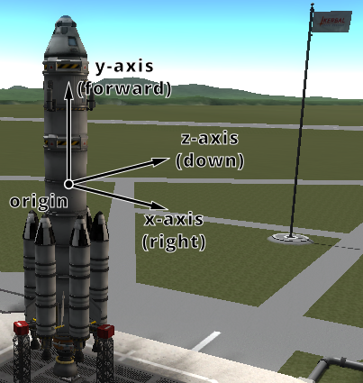

# Vessel

class Vessel
:   These objects are used to interact with vessels in KSP. This includes getting
    orbital and flight data, manipulating control inputs and managing resources.
    Created using [`active_vessel`](./space-center.md#SpaceCenter.active_vessel "SpaceCenter.active_vessel") or [`vessels`](./space-center.md#SpaceCenter.vessels "SpaceCenter.vessels").

    name
    :   The name of the vessel.

        Attribute:
        :   Can be read or written

        Return type:
        :   str

    type
    :   The type of the vessel.

        Attribute:
        :   Can be read or written

        Return type:
        :   [`VesselType`](#SpaceCenter.VesselType "SpaceCenter.VesselType")

    situation
    :   The situation the vessel is in.

        Attribute:
        :   Read-only, cannot be set

        Return type:
        :   [`VesselSituation`](#SpaceCenter.VesselSituation "SpaceCenter.VesselSituation")

    loaded
    :   Whether the vessel is loaded, i.e. its parts are instantiated in the scene
        because it is within loading range of the active vessel. A vessel that is not
        loaded exists only as orbital data and is always on-rails (see [`Vessel.packed`](#SpaceCenter.Vessel.packed "SpaceCenter.Vessel.packed")).

        Attribute:
        :   Read-only, cannot be set

        Return type:
        :   bool

    packed
    :   Whether the vessel is packed (on-rails). A packed vessel has its physics
        simulation suspended and follows its orbit analytically. A vessel that is not
        loaded (see [`Vessel.loaded`](#SpaceCenter.Vessel.loaded "SpaceCenter.Vessel.loaded")) is always packed.

        Attribute:
        :   Read-only, cannot be set

        Return type:
        :   bool

    physics\_range
    :   The distance from the active vessel, in meters, out to which this vessel keeps running
        its physics simulation — and so stays controllable, able to burn its engines and
        respond to its autopilot. Setting this raises the vessel out of the stock physics
        bubble, so that it keeps flying while the active vessel is far away. Set to zero to
        restore the game’s default range.

        Attribute:
        :   Can be read or written

        Return type:
        :   float

        Game Scenes:
        :   Flight

        > **Note**
        >
        > This always reports the vessel’s live range, so reading it when no range has been set
        > gives the game’s default for the vessel’s current [`Vessel.situation`](#SpaceCenter.Vessel.situation "SpaceCenter.Vessel.situation") — which is
        > much shorter than the distance at which the vessel unloads. In orbit a vessel is put
        > on rails just 350m away, long before it unloads at 2.5km, and a vessel on rails
        > produces no thrust and ignores control input even though it is still loaded.
        >
        > There is a 10% margin below the range, so that a vessel hovering at the threshold does
        > not repeatedly drop out of the simulation and rejoin it. The vessel leaves the
        > simulation at the distance set here, and rejoins it at 90% of that distance; in
        > between it keeps whichever state it is already in.
        >
        > The requested range applies in every situation. The game’s own defaults are not
        > uniform — a vessel flying in atmosphere stays loaded out to 22.5km — so setting a
        > small range can shorten the range such a vessel would otherwise have had.
        >
        > A range lasts until it is set back to zero or the game is exited. Unlike most state a
        > client sets, it is not released when that client disconnects, because dropping a
        > distant vessel back to the default range would put it on-rails part way through a
        > maneuver.
        >
        > Holding a vessel off-rails a long way from the active vessel costs performance, and
        > accumulates positional error that can destroy it. Raise the range on the vessels that
        > need it, by as little as they need.

    recoverable
    :   Whether the vessel is recoverable.

        Attribute:
        :   Read-only, cannot be set

        Return type:
        :   bool

    recover()
    :   Recover the vessel.

    met
    :   The mission elapsed time in seconds.

        Attribute:
        :   Read-only, cannot be set

        Return type:
        :   float

    biome
    :   The name of the biome the vessel is currently in.

        Attribute:
        :   Read-only, cannot be set

        Return type:
        :   str

    flight([*reference\_frame=None*])
    :   Returns a [`Vessel.flight()`](#SpaceCenter.Vessel.flight "SpaceCenter.Vessel.flight") object that can be used to get flight
        telemetry for the vessel, in the specified reference frame.

        Parameters:
        :   **reference\_frame** ([*ReferenceFrame*](./reference-frame.md#SpaceCenter.ReferenceFrame "SpaceCenter.ReferenceFrame")) – Reference frame. Defaults to the vessel’s surface reference frame ([`Vessel.surface_reference_frame`](#SpaceCenter.Vessel.surface_reference_frame "SpaceCenter.Vessel.surface_reference_frame")).

        Return type:
        :   [`Flight`](./flight.md#SpaceCenter.Flight "SpaceCenter.Flight")

        Game Scenes:
        :   Flight

        > **Note**
        >
        > When this is called with no arguments, the vessel’s surface reference
        > frame is used. This reference frame moves with the vessel, therefore
        > velocities and speeds returned by the flight object will be zero. See
        > the [reference frames tutorial](../../../tutorials/reference-frames.md#tutorial-reference-frames)
        > for examples of getting [the orbital and surface speeds of a
        > vessel](../../../tutorials/reference-frames.md#tutorial-reference-frames-vessel-speed).

    orbit
    :   The current orbit of the vessel.

        Attribute:
        :   Read-only, cannot be set

        Return type:
        :   [`Orbit`](./orbit.md#SpaceCenter.Orbit "SpaceCenter.Orbit")

    control
    :   Returns a [`Vessel.control`](#SpaceCenter.Vessel.control "SpaceCenter.Vessel.control") object that can be used to manipulate
        the vessel’s control inputs. For example, its pitch/yaw/roll controls,
        RCS and thrust.

        Attribute:
        :   Read-only, cannot be set

        Return type:
        :   [`Control`](./control.md#SpaceCenter.Control "SpaceCenter.Control")

        Game Scenes:
        :   Flight

    comms
    :   Returns a [`Vessel.comms`](#SpaceCenter.Vessel.comms "SpaceCenter.Vessel.comms") object that can be used to interact
        with CommNet for this vessel.

        Attribute:
        :   Read-only, cannot be set

        Return type:
        :   [`Comms`](./comms.md#SpaceCenter.Comms "SpaceCenter.Comms")

        Game Scenes:
        :   Flight

    auto\_pilot
    :   An [`Vessel.auto_pilot`](#SpaceCenter.Vessel.auto_pilot "SpaceCenter.Vessel.auto_pilot") object, that can be used to perform
        simple auto-piloting of the vessel.

        Attribute:
        :   Read-only, cannot be set

        Return type:
        :   [`AutoPilot`](./auto-pilot.md#SpaceCenter.AutoPilot "SpaceCenter.AutoPilot")

        Game Scenes:
        :   Flight

    crew\_capacity
    :   The number of crew that can occupy the vessel.

        Attribute:
        :   Read-only, cannot be set

        Return type:
        :   int

    crew\_count
    :   The number of crew that are occupying the vessel.

        Attribute:
        :   Read-only, cannot be set

        Return type:
        :   int

    crew
    :   The crew in the vessel.

        Attribute:
        :   Read-only, cannot be set

        Return type:
        :   list([`CrewMember`](#SpaceCenter.CrewMember "SpaceCenter.CrewMember"))

    resources
    :   A [`Vessel.resources`](#SpaceCenter.Vessel.resources "SpaceCenter.Vessel.resources") object, that can used to get information
        about resources stored in the vessel.

        Attribute:
        :   Read-only, cannot be set

        Return type:
        :   [`Resources`](./resources.md#SpaceCenter.Resources "SpaceCenter.Resources")

        Game Scenes:
        :   Flight

    resources\_in\_decouple\_stage(*stage*[, *cumulative=True*])
    :   > **Warning**
        >
        > Deprecated. Use [`Stage.resources()`](./stage.md#SpaceCenter.Stage.resources "SpaceCenter.Stage.resources") from the object returned by [`Vessel.decouple_stage_at()`](#SpaceCenter.Vessel.decouple_stage_at "SpaceCenter.Vessel.decouple_stage_at") instead.

        Returns a [`Vessel.resources`](#SpaceCenter.Vessel.resources "SpaceCenter.Vessel.resources") object, that can used to get
        information about resources stored in a given *stage*.

        Parameters:
        :   - **stage** (*int*) – Get resources for parts that are decoupled in this stage.
            - **cumulative** (*bool*) – When `False`, returns the resources for parts decoupled in just the given stage. When `True` returns the resources decoupled in the given stage and all subsequent stages combined.

        Return type:
        :   [`Resources`](./resources.md#SpaceCenter.Resources "SpaceCenter.Resources")

        Game Scenes:
        :   Flight

        > **Note**
        >
        > Deprecated. Use [`Vessel.decouple_stage_at()`](#SpaceCenter.Vessel.decouple_stage_at "SpaceCenter.Vessel.decouple_stage_at")
        > and [`Stage.resources()`](./stage.md#SpaceCenter.Stage.resources "SpaceCenter.Stage.resources") instead. For details on
        > stage numbering, see the discussion on [Staging](./parts.md#python-api-parts-staging).

    stages
    :   Activation (burn) stages for this vessel, in ascending stage order. This does
        not include the -1 stage (parts with no staging icon), as it carries no
        delta-v; use [`Vessel.stage_at()`](#SpaceCenter.Vessel.stage_at "SpaceCenter.Vessel.stage_at") with -1 to get those parts.

        Attribute:
        :   Read-only, cannot be set

        Return type:
        :   list([`Stage`](./stage.md#SpaceCenter.Stage "SpaceCenter.Stage"))

        Game Scenes:
        :   Flight

        > **Note**
        >
        > Lists activation stages only (`decouple` is `false`). See also
        > [Staging](./parts.md#python-api-parts-staging).

    stage\_at(*stage*)
    :   The activation stage with the given number. Pass -1 to get the parts that are
        never activated (those with no staging icon).

        Parameters:
        :   **stage** (*int*) – Get activation stage at this index.

        Return type:
        :   [`Stage`](./stage.md#SpaceCenter.Stage "SpaceCenter.Stage")

        Game Scenes:
        :   Flight

    decouple\_stages
    :   Decouple stages for this vessel, in ascending stage order. The -1 stage,
        containing the parts that are never decoupled and remain on the vessel, is
        included first when any such parts exist.

        Attribute:
        :   Read-only, cannot be set

        Return type:
        :   list([`Stage`](./stage.md#SpaceCenter.Stage "SpaceCenter.Stage"))

        Game Scenes:
        :   Flight

        > **Note**
        >
        > Lists decouple stages only. Delta-v is not defined on these stages.

    decouple\_stage\_at(*stage*)
    :   The decouple stage with the given number. Pass -1 to get the parts that are
        never decoupled and remain on the vessel after all stages have fired.

        Parameters:
        :   **stage** (*int*) – Get decouple stage at this index.

        Return type:
        :   [`Stage`](./stage.md#SpaceCenter.Stage "SpaceCenter.Stage")

        Game Scenes:
        :   Flight

    delta\_v
    :   Total delta-v for the vessel in the current situation, in m/s.

        Attribute:
        :   Read-only, cannot be set

        Return type:
        :   float

        Game Scenes:
        :   Flight

        > **Note**
        >
        > Requires the stock delta-v display to be ready. Units are meters per second.

    vacuum\_delta\_v
    :   Total vacuum delta-v for the vessel, in m/s.

        Attribute:
        :   Read-only, cannot be set

        Return type:
        :   float

        Game Scenes:
        :   Flight

    sea\_level\_delta\_v
    :   Total sea-level delta-v for the vessel, in m/s.

        Attribute:
        :   Read-only, cannot be set

        Return type:
        :   float

        Game Scenes:
        :   Flight

    burn\_time
    :   Total burn time for the vessel, in seconds.

        Attribute:
        :   Read-only, cannot be set

        Return type:
        :   float

        Game Scenes:
        :   Flight

    parts
    :   A [`Parts`](./parts.md#SpaceCenter.Parts "SpaceCenter.Parts") object, that can used to interact with the parts that make up this vessel.

        Attribute:
        :   Read-only, cannot be set

        Return type:
        :   [`Parts`](./parts.md#SpaceCenter.Parts "SpaceCenter.Parts")

        Game Scenes:
        :   Flight

    mass
    :   The total mass of the vessel, including resources, in kg.

        Attribute:
        :   Read-only, cannot be set

        Return type:
        :   float

        Game Scenes:
        :   Flight

    dry\_mass
    :   The total mass of the vessel, excluding resources, in kg.

        Attribute:
        :   Read-only, cannot be set

        Return type:
        :   float

        Game Scenes:
        :   Flight

    thrust
    :   The total thrust currently being produced by the vessel’s engines, in
        Newtons. This is computed by summing [`Engine.thrust`](./parts.md#SpaceCenter.Engine.thrust "SpaceCenter.Engine.thrust") for
        every engine in the vessel.

        Attribute:
        :   Read-only, cannot be set

        Return type:
        :   float

        Game Scenes:
        :   Flight

    available\_thrust
    :   Gets the total available thrust that can be produced by the vessel’s
        active engines, in Newtons. This is computed by summing
        [`Engine.available_thrust`](./parts.md#SpaceCenter.Engine.available_thrust "SpaceCenter.Engine.available_thrust") for every active engine in the vessel.

        Attribute:
        :   Read-only, cannot be set

        Return type:
        :   float

        Game Scenes:
        :   Flight

    available\_thrust\_at(*pressure*)
    :   Gets the total available thrust that can be produced by the vessel’s
        active engines, in Newtons. This is computed by summing
        [`Engine.available_thrust_at()`](./parts.md#SpaceCenter.Engine.available_thrust_at "SpaceCenter.Engine.available_thrust_at") for every active engine in the vessel.
        Takes the given pressure into account.

        Parameters:
        :   **pressure** (*float*) – Atmospheric pressure in atmospheres

        Return type:
        :   float

        Game Scenes:
        :   Flight

    max\_thrust
    :   The total maximum thrust that can be produced by the vessel’s active
        engines, in Newtons. This is computed by summing
        [`Engine.max_thrust`](./parts.md#SpaceCenter.Engine.max_thrust "SpaceCenter.Engine.max_thrust") for every active engine.

        Attribute:
        :   Read-only, cannot be set

        Return type:
        :   float

        Game Scenes:
        :   Flight

    max\_thrust\_at(*pressure*)
    :   The total maximum thrust that can be produced by the vessel’s active
        engines, in Newtons. This is computed by summing
        [`Engine.max_thrust_at()`](./parts.md#SpaceCenter.Engine.max_thrust_at "SpaceCenter.Engine.max_thrust_at") for every active engine.
        Takes the given pressure into account.

        Parameters:
        :   **pressure** (*float*) – Atmospheric pressure in atmospheres

        Return type:
        :   float

        Game Scenes:
        :   Flight

    max\_vacuum\_thrust
    :   The total maximum thrust that can be produced by the vessel’s active
        engines when the vessel is in a vacuum, in Newtons. This is computed by
        summing [`Engine.max_vacuum_thrust`](./parts.md#SpaceCenter.Engine.max_vacuum_thrust "SpaceCenter.Engine.max_vacuum_thrust") for every active engine.

        Attribute:
        :   Read-only, cannot be set

        Return type:
        :   float

        Game Scenes:
        :   Flight

    acceleration
    :   The acceleration currently produced by the vessel’s engines, in
        \(m/s^2\). This is [`Vessel.thrust`](#SpaceCenter.Vessel.thrust "SpaceCenter.Vessel.thrust") divided by the
        vessel’s [`Vessel.mass`](#SpaceCenter.Vessel.mass "SpaceCenter.Vessel.mass").

        Attribute:
        :   Read-only, cannot be set

        Return type:
        :   float

        Game Scenes:
        :   Flight

    available\_acceleration
    :   The total available acceleration that can be produced by the vessel’s
        active engines, in \(m/s^2\). This is [`Vessel.available_thrust`](#SpaceCenter.Vessel.available_thrust "SpaceCenter.Vessel.available_thrust")
        divided by the vessel’s [`Vessel.mass`](#SpaceCenter.Vessel.mass "SpaceCenter.Vessel.mass").

        Attribute:
        :   Read-only, cannot be set

        Return type:
        :   float

        Game Scenes:
        :   Flight

    available\_acceleration\_at(*pressure*)
    :   The total available acceleration that can be produced by the vessel’s
        active engines, in \(m/s^2\). This is [`Vessel.available_thrust_at()`](#SpaceCenter.Vessel.available_thrust_at "SpaceCenter.Vessel.available_thrust_at")
        divided by the vessel’s [`Vessel.mass`](#SpaceCenter.Vessel.mass "SpaceCenter.Vessel.mass"). Takes the given pressure into account.

        Parameters:
        :   **pressure** (*float*) – Atmospheric pressure in atmospheres

        Return type:
        :   float

        Game Scenes:
        :   Flight

    max\_acceleration
    :   The total maximum acceleration that can be produced by the vessel’s active
        engines, in \(m/s^2\). This is [`Vessel.max_thrust`](#SpaceCenter.Vessel.max_thrust "SpaceCenter.Vessel.max_thrust") divided by
        the vessel’s [`Vessel.mass`](#SpaceCenter.Vessel.mass "SpaceCenter.Vessel.mass").

        Attribute:
        :   Read-only, cannot be set

        Return type:
        :   float

        Game Scenes:
        :   Flight

    max\_acceleration\_at(*pressure*)
    :   The total maximum acceleration that can be produced by the vessel’s active
        engines, in \(m/s^2\). This is [`Vessel.max_thrust_at()`](#SpaceCenter.Vessel.max_thrust_at "SpaceCenter.Vessel.max_thrust_at") divided by
        the vessel’s [`Vessel.mass`](#SpaceCenter.Vessel.mass "SpaceCenter.Vessel.mass"). Takes the given pressure into account.

        Parameters:
        :   **pressure** (*float*) – Atmospheric pressure in atmospheres

        Return type:
        :   float

        Game Scenes:
        :   Flight

    max\_vacuum\_acceleration
    :   The total maximum acceleration that can be produced by the vessel’s active
        engines when the vessel is in a vacuum, in \(m/s^2\). This is
        [`Vessel.max_vacuum_thrust`](#SpaceCenter.Vessel.max_vacuum_thrust "SpaceCenter.Vessel.max_vacuum_thrust") divided by the vessel’s [`Vessel.mass`](#SpaceCenter.Vessel.mass "SpaceCenter.Vessel.mass").

        Attribute:
        :   Read-only, cannot be set

        Return type:
        :   float

        Game Scenes:
        :   Flight

    specific\_impulse
    :   The combined specific impulse of all active engines, in seconds. This is computed using the formula
        [described here](https://wiki.kerbalspaceprogram.com/wiki/Specific_impulse#Multiple_engines).

        Attribute:
        :   Read-only, cannot be set

        Return type:
        :   float

        Game Scenes:
        :   Flight

    specific\_impulse\_at(*pressure*)
    :   The combined specific impulse of all active engines, in seconds. This is computed using the formula
        [described here](https://wiki.kerbalspaceprogram.com/wiki/Specific_impulse#Multiple_engines).
        Takes the given pressure into account.

        Parameters:
        :   **pressure** (*float*) – Atmospheric pressure in atmospheres

        Return type:
        :   float

        Game Scenes:
        :   Flight

    vacuum\_specific\_impulse
    :   The combined vacuum specific impulse of all active engines, in seconds. This is computed using the formula
        [described here](https://wiki.kerbalspaceprogram.com/wiki/Specific_impulse#Multiple_engines).

        Attribute:
        :   Read-only, cannot be set

        Return type:
        :   float

        Game Scenes:
        :   Flight

    kerbin\_sea\_level\_specific\_impulse
    :   The combined specific impulse of all active engines at sea level on Kerbin, in seconds.
        This is computed using the formula
        [described here](https://wiki.kerbalspaceprogram.com/wiki/Specific_impulse#Multiple_engines).

        Attribute:
        :   Read-only, cannot be set

        Return type:
        :   float

        Game Scenes:
        :   Flight

    moment\_of\_inertia
    :   The moment of inertia of the vessel around its center of mass in \(kg.m^2\).
        The inertia values in the returned 3-tuple are around the
        pitch, roll and yaw directions respectively.
        This corresponds to the vessels reference frame ([`Vessel.reference_frame`](#SpaceCenter.Vessel.reference_frame "SpaceCenter.Vessel.reference_frame")).

        Attribute:
        :   Read-only, cannot be set

        Return type:
        :   tuple(float, float, float)

        Game Scenes:
        :   Flight

    inertia\_tensor
    :   The inertia tensor of the vessel around its center of mass,
        in the vessels reference frame ([`Vessel.reference_frame`](#SpaceCenter.Vessel.reference_frame "SpaceCenter.Vessel.reference_frame")).
        Returns the 3x3 matrix as a list of elements, in row-major order.

        Attribute:
        :   Read-only, cannot be set

        Return type:
        :   list(float)

    available\_torque
    :   The maximum torque that the vessel generates. Includes contributions from
        reaction wheels, RCS, gimballed engines and aerodynamic control surfaces.
        Returns the torques in \(N.m\) around each of the coordinate axes of the
        vessels reference frame ([`Vessel.reference_frame`](#SpaceCenter.Vessel.reference_frame "SpaceCenter.Vessel.reference_frame")).
        These axes are equivalent to the pitch, roll and yaw axes of the vessel.

        Attribute:
        :   Read-only, cannot be set

        Return type:
        :   tuple(tuple(float, float, float), tuple(float, float, float))

        Game Scenes:
        :   Flight

    available\_reaction\_wheel\_torque
    :   The maximum torque that the currently active and powered reaction wheels can generate.
        Returns the torques in \(N.m\) around each of the coordinate axes of the
        vessels reference frame ([`Vessel.reference_frame`](#SpaceCenter.Vessel.reference_frame "SpaceCenter.Vessel.reference_frame")).
        These axes are equivalent to the pitch, roll and yaw axes of the vessel.

        Attribute:
        :   Read-only, cannot be set

        Return type:
        :   tuple(tuple(float, float, float), tuple(float, float, float))

        Game Scenes:
        :   Flight

    available\_rcs\_torque
    :   The maximum torque that the currently active RCS thrusters can generate.
        Returns the torques in \(N.m\) around each of the coordinate axes of the
        vessels reference frame ([`Vessel.reference_frame`](#SpaceCenter.Vessel.reference_frame "SpaceCenter.Vessel.reference_frame")).
        These axes are equivalent to the pitch, roll and yaw axes of the vessel.

        Attribute:
        :   Read-only, cannot be set

        Return type:
        :   tuple(tuple(float, float, float), tuple(float, float, float))

        Game Scenes:
        :   Flight

    available\_rcs\_force
    :   The maximum force that the currently active RCS thrusters can generate.
        Returns the forces in \(N\) along each of the coordinate axes of the
        vessels reference frame ([`Vessel.reference_frame`](#SpaceCenter.Vessel.reference_frame "SpaceCenter.Vessel.reference_frame")).
        These axes are equivalent to the right, forward and bottom directions of the vessel.

        Attribute:
        :   Read-only, cannot be set

        Return type:
        :   tuple(tuple(float, float, float), tuple(float, float, float))

        Game Scenes:
        :   Flight

    available\_rcs\_acceleration
    :   The maximum acceleration that the currently active RCS thrusters can generate.
        This is [`Vessel.available_rcs_force`](#SpaceCenter.Vessel.available_rcs_force "SpaceCenter.Vessel.available_rcs_force") divided by the vessel’s [`Vessel.mass`](#SpaceCenter.Vessel.mass "SpaceCenter.Vessel.mass").
        Returns the accelerations in \(m/s^2\) along each of the coordinate axes of the
        vessels reference frame ([`Vessel.reference_frame`](#SpaceCenter.Vessel.reference_frame "SpaceCenter.Vessel.reference_frame")).
        These axes are equivalent to the right, forward and bottom directions of the vessel.

        Attribute:
        :   Read-only, cannot be set

        Return type:
        :   tuple(tuple(float, float, float), tuple(float, float, float))

        Game Scenes:
        :   Flight

    available\_engine\_torque
    :   The maximum torque that the currently active and gimballed engines can generate.
        Returns the torques in \(N.m\) around each of the coordinate axes of the
        vessels reference frame ([`Vessel.reference_frame`](#SpaceCenter.Vessel.reference_frame "SpaceCenter.Vessel.reference_frame")).
        These axes are equivalent to the pitch, roll and yaw axes of the vessel.

        Attribute:
        :   Read-only, cannot be set

        Return type:
        :   tuple(tuple(float, float, float), tuple(float, float, float))

        Game Scenes:
        :   Flight

    available\_control\_surface\_torque
    :   The maximum torque that the aerodynamic control surfaces can generate.
        Returns the torques in \(N.m\) around each of the coordinate axes of the
        vessels reference frame ([`Vessel.reference_frame`](#SpaceCenter.Vessel.reference_frame "SpaceCenter.Vessel.reference_frame")).
        These axes are equivalent to the pitch, roll and yaw axes of the vessel.

        Attribute:
        :   Read-only, cannot be set

        Return type:
        :   tuple(tuple(float, float, float), tuple(float, float, float))

        Game Scenes:
        :   Flight

    available\_other\_torque
    :   The maximum torque that parts (excluding reaction wheels, gimballed engines,
        RCS and control surfaces) can generate.
        Returns the torques in \(N.m\) around each of the coordinate axes of the
        vessels reference frame ([`Vessel.reference_frame`](#SpaceCenter.Vessel.reference_frame "SpaceCenter.Vessel.reference_frame")).
        These axes are equivalent to the pitch, roll and yaw axes of the vessel.

        Attribute:
        :   Read-only, cannot be set

        Return type:
        :   tuple(tuple(float, float, float), tuple(float, float, float))

        Game Scenes:
        :   Flight

    available\_angular\_acceleration
    :   The maximum angular acceleration that the vessel can generate. Includes contributions
        from reaction wheels, RCS, gimballed engines and aerodynamic control surfaces.
        This is [`Vessel.available_torque`](#SpaceCenter.Vessel.available_torque "SpaceCenter.Vessel.available_torque") divided by the vessel’s [`Vessel.moment_of_inertia`](#SpaceCenter.Vessel.moment_of_inertia "SpaceCenter.Vessel.moment_of_inertia").
        Returns the angular accelerations in \(rad/s^2\) around each of the coordinate
        axes of the vessels reference frame ([`Vessel.reference_frame`](#SpaceCenter.Vessel.reference_frame "SpaceCenter.Vessel.reference_frame")).
        These axes are equivalent to the pitch, roll and yaw axes of the vessel.

        Attribute:
        :   Read-only, cannot be set

        Return type:
        :   tuple(tuple(float, float, float), tuple(float, float, float))

        Game Scenes:
        :   Flight

    available\_reaction\_wheel\_angular\_acceleration
    :   The maximum angular acceleration that the currently active and powered reaction wheels
        can generate. This is [`Vessel.available_reaction_wheel_torque`](#SpaceCenter.Vessel.available_reaction_wheel_torque "SpaceCenter.Vessel.available_reaction_wheel_torque") divided by the vessel’s
        [`Vessel.moment_of_inertia`](#SpaceCenter.Vessel.moment_of_inertia "SpaceCenter.Vessel.moment_of_inertia").
        Returns the angular accelerations in \(rad/s^2\) around each of the coordinate
        axes of the vessels reference frame ([`Vessel.reference_frame`](#SpaceCenter.Vessel.reference_frame "SpaceCenter.Vessel.reference_frame")).
        These axes are equivalent to the pitch, roll and yaw axes of the vessel.

        Attribute:
        :   Read-only, cannot be set

        Return type:
        :   tuple(tuple(float, float, float), tuple(float, float, float))

        Game Scenes:
        :   Flight

    available\_rcs\_angular\_acceleration
    :   The maximum angular acceleration that the currently active RCS thrusters can generate.
        This is [`Vessel.available_rcs_torque`](#SpaceCenter.Vessel.available_rcs_torque "SpaceCenter.Vessel.available_rcs_torque") divided by the vessel’s [`Vessel.moment_of_inertia`](#SpaceCenter.Vessel.moment_of_inertia "SpaceCenter.Vessel.moment_of_inertia").
        Returns the angular accelerations in \(rad/s^2\) around each of the coordinate
        axes of the vessels reference frame ([`Vessel.reference_frame`](#SpaceCenter.Vessel.reference_frame "SpaceCenter.Vessel.reference_frame")).
        These axes are equivalent to the pitch, roll and yaw axes of the vessel.

        Attribute:
        :   Read-only, cannot be set

        Return type:
        :   tuple(tuple(float, float, float), tuple(float, float, float))

        Game Scenes:
        :   Flight

    available\_engine\_angular\_acceleration
    :   The maximum angular acceleration that the currently active and gimballed engines can
        generate. This is [`Vessel.available_engine_torque`](#SpaceCenter.Vessel.available_engine_torque "SpaceCenter.Vessel.available_engine_torque") divided by the vessel’s
        [`Vessel.moment_of_inertia`](#SpaceCenter.Vessel.moment_of_inertia "SpaceCenter.Vessel.moment_of_inertia").
        Returns the angular accelerations in \(rad/s^2\) around each of the coordinate
        axes of the vessels reference frame ([`Vessel.reference_frame`](#SpaceCenter.Vessel.reference_frame "SpaceCenter.Vessel.reference_frame")).
        These axes are equivalent to the pitch, roll and yaw axes of the vessel.

        Attribute:
        :   Read-only, cannot be set

        Return type:
        :   tuple(tuple(float, float, float), tuple(float, float, float))

        Game Scenes:
        :   Flight

    available\_control\_surface\_angular\_acceleration
    :   The maximum angular acceleration that the aerodynamic control surfaces can generate.
        This is [`Vessel.available_control_surface_torque`](#SpaceCenter.Vessel.available_control_surface_torque "SpaceCenter.Vessel.available_control_surface_torque") divided by the vessel’s
        [`Vessel.moment_of_inertia`](#SpaceCenter.Vessel.moment_of_inertia "SpaceCenter.Vessel.moment_of_inertia").
        Returns the angular accelerations in \(rad/s^2\) around each of the coordinate
        axes of the vessels reference frame ([`Vessel.reference_frame`](#SpaceCenter.Vessel.reference_frame "SpaceCenter.Vessel.reference_frame")).
        These axes are equivalent to the pitch, roll and yaw axes of the vessel.

        Attribute:
        :   Read-only, cannot be set

        Return type:
        :   tuple(tuple(float, float, float), tuple(float, float, float))

        Game Scenes:
        :   Flight

    available\_other\_angular\_acceleration
    :   The maximum angular acceleration that parts (excluding reaction wheels, gimballed engines,
        RCS and control surfaces) can generate. This is [`Vessel.available_other_torque`](#SpaceCenter.Vessel.available_other_torque "SpaceCenter.Vessel.available_other_torque") divided
        by the vessel’s [`Vessel.moment_of_inertia`](#SpaceCenter.Vessel.moment_of_inertia "SpaceCenter.Vessel.moment_of_inertia").
        Returns the angular accelerations in \(rad/s^2\) around each of the coordinate
        axes of the vessels reference frame ([`Vessel.reference_frame`](#SpaceCenter.Vessel.reference_frame "SpaceCenter.Vessel.reference_frame")).
        These axes are equivalent to the pitch, roll and yaw axes of the vessel.

        Attribute:
        :   Read-only, cannot be set

        Return type:
        :   tuple(tuple(float, float, float), tuple(float, float, float))

        Game Scenes:
        :   Flight

    reference\_frame
    :   The reference frame that is fixed relative to the vessel,
        and orientated with the vessel.

        - The origin is at the center of mass of the vessel.
        - The axes rotate with the vessel.
        - The x-axis points out to the right of the vessel.
        - The y-axis points in the forward direction of the vessel.
        - The z-axis points out of the bottom off the vessel.

        Attribute:
        :   Read-only, cannot be set

        Return type:
        :   [`ReferenceFrame`](./reference-frame.md#SpaceCenter.ReferenceFrame "SpaceCenter.ReferenceFrame")

        Game Scenes:
        :   Flight

        

        Vessel reference frame origin and axes for the Aeris 3A aircraft

        

        Vessel reference frame origin and axes for the Kerbal-X rocket

    orbital\_reference\_frame
    :   The reference frame that is fixed relative to the vessel,
        and orientated with the vessels orbital prograde/normal/radial directions.

        - The origin is at the center of mass of the vessel.
        - The axes rotate with the orbital prograde/normal/radial directions.
        - The x-axis points in the orbital anti-radial direction.
        - The y-axis points in the orbital prograde direction.
        - The z-axis points in the orbital normal direction.

        Attribute:
        :   Read-only, cannot be set

        Return type:
        :   [`ReferenceFrame`](./reference-frame.md#SpaceCenter.ReferenceFrame "SpaceCenter.ReferenceFrame")

        Game Scenes:
        :   Flight

        > **Note**
        >
        > Be careful not to confuse this with ‘orbit’ mode on the navball.

        

        Vessel orbital reference frame origin and axes

    surface\_reference\_frame
    :   The reference frame that is fixed relative to the vessel,
        and orientated with the surface of the body being orbited.

        - The origin is at the center of mass of the vessel.
        - The axes rotate with the north and up directions on the surface of the body.
        - The x-axis points in the [zenith](https://en.wikipedia.org/wiki/Zenith)
          direction (upwards, normal to the body being orbited, from the center of the body towards the center of
          mass of the vessel).
        - The y-axis points northwards towards the
          [astronomical horizon](https://en.wikipedia.org/wiki/Horizon) (north, and tangential to the
          surface of the body – the direction in which a compass would point when on the surface).
        - The z-axis points eastwards towards the
          [astronomical horizon](https://en.wikipedia.org/wiki/Horizon) (east, and tangential to the
          surface of the body – east on a compass when on the surface).

        Attribute:
        :   Read-only, cannot be set

        Return type:
        :   [`ReferenceFrame`](./reference-frame.md#SpaceCenter.ReferenceFrame "SpaceCenter.ReferenceFrame")

        Game Scenes:
        :   Flight

        > **Note**
        >
        > Be careful not to confuse this with ‘surface’ mode on the navball.

        

        Vessel surface reference frame origin and axes

    surface\_velocity\_reference\_frame
    :   The reference frame that is fixed relative to the vessel,
        and orientated with the velocity vector of the vessel relative
        to the surface of the body being orbited.

        - The origin is at the center of mass of the vessel.
        - The axes rotate with the vessel’s velocity vector.
        - The y-axis points in the direction of the vessel’s velocity vector,
          relative to the surface of the body being orbited.
        - The z-axis is in the plane of the
          [astronomical horizon](https://en.wikipedia.org/wiki/Horizon).
        - The x-axis is orthogonal to the other two axes.

        Attribute:
        :   Read-only, cannot be set

        Return type:
        :   [`ReferenceFrame`](./reference-frame.md#SpaceCenter.ReferenceFrame "SpaceCenter.ReferenceFrame")

        Game Scenes:
        :   Flight

        

        Vessel surface velocity reference frame origin and axes

    position(*reference\_frame*)
    :   The position of the center of mass of the vessel, in the given reference frame.

        Parameters:
        :   **reference\_frame** ([*ReferenceFrame*](./reference-frame.md#SpaceCenter.ReferenceFrame "SpaceCenter.ReferenceFrame")) – The reference frame that the returned position vector is in.

        Returns:
        :   The position as a vector.

        Return type:
        :   tuple(float, float, float)

        Game Scenes:
        :   Flight

    bounding\_box(*reference\_frame*)
    :   The axis-aligned bounding box of the vessel in the given reference frame.

        Parameters:
        :   **reference\_frame** ([*ReferenceFrame*](./reference-frame.md#SpaceCenter.ReferenceFrame "SpaceCenter.ReferenceFrame")) – The reference frame that the returned position vectors are in.

        Returns:
        :   The positions of the minimum and maximum vertices of the box, as position vectors.

        Return type:
        :   tuple(tuple(float, float, float), tuple(float, float, float))

        Game Scenes:
        :   Flight

    velocity(*reference\_frame*)
    :   The velocity of the center of mass of the vessel, in the given reference frame.

        Parameters:
        :   **reference\_frame** ([*ReferenceFrame*](./reference-frame.md#SpaceCenter.ReferenceFrame "SpaceCenter.ReferenceFrame")) – The reference frame that the returned velocity vector is in.

        Returns:
        :   The velocity as a vector. The vector points in the direction of travel, and its magnitude is the speed of the body in meters per second.

        Return type:
        :   tuple(float, float, float)

        Game Scenes:
        :   Flight

    rotation(*reference\_frame*)
    :   The rotation of the vessel, in the given reference frame.

        Parameters:
        :   **reference\_frame** ([*ReferenceFrame*](./reference-frame.md#SpaceCenter.ReferenceFrame "SpaceCenter.ReferenceFrame")) – The reference frame that the returned rotation is in.

        Returns:
        :   The rotation as a quaternion of the form \((x, y, z, w)\).

        Return type:
        :   tuple(float, float, float, float)

        Game Scenes:
        :   Flight

    direction(*reference\_frame*)
    :   The direction in which the vessel is pointing, in the given reference frame.

        Parameters:
        :   **reference\_frame** ([*ReferenceFrame*](./reference-frame.md#SpaceCenter.ReferenceFrame "SpaceCenter.ReferenceFrame")) – The reference frame that the returned direction is in.

        Returns:
        :   The direction as a unit vector.

        Return type:
        :   tuple(float, float, float)

        Game Scenes:
        :   Flight

    angular\_velocity(*reference\_frame*)
    :   The angular velocity of the vessel, in the given reference frame.

        Parameters:
        :   **reference\_frame** ([*ReferenceFrame*](./reference-frame.md#SpaceCenter.ReferenceFrame "SpaceCenter.ReferenceFrame")) – The reference frame the returned angular velocity is in.

        Returns:
        :   The angular velocity as a vector. The magnitude of the vector is the rotational speed of the vessel, in radians per second. The direction of the vector indicates the axis of rotation, using the right-hand rule.

        Return type:
        :   tuple(float, float, float)

        Game Scenes:
        :   Flight

class VesselType
:   The type of a vessel.
    See [`Vessel.type`](#SpaceCenter.Vessel.type "SpaceCenter.Vessel.type").

    base
    :   Base.

    debris
    :   Debris.

    lander
    :   Lander.

    plane
    :   Plane.

    probe
    :   Probe.

    relay
    :   Relay.

    rover
    :   Rover.

    ship
    :   Ship.

    station
    :   Station.

    space\_object
    :   SpaceObject.

    unknown
    :   Unknown.

    eva
    :   EVA.

    flag
    :   Flag.

    deployed\_science\_controller
    :   DeployedScienceController.

    deployed\_science\_part
    :   DeploedSciencePart.

    dropped\_part
    :   DroppedPart.

    deployed\_ground\_part
    :   DeployedGroundPart.

class VesselSituation
:   The situation a vessel is in.
    See [`Vessel.situation`](#SpaceCenter.Vessel.situation "SpaceCenter.Vessel.situation").

    docked
    :   Vessel is docked to another.

    escaping
    :   Escaping.

    flying
    :   Vessel is flying through an atmosphere.

    landed
    :   Vessel is landed on the surface of a body.

    orbiting
    :   Vessel is orbiting a body.

    pre\_launch
    :   Vessel is awaiting launch.

    splashed
    :   Vessel has splashed down in an ocean.

    sub\_orbital
    :   Vessel is on a sub-orbital trajectory.

class CrewMember
:   Represents crew in a vessel. Can be obtained using [`Vessel.crew`](#SpaceCenter.Vessel.crew "SpaceCenter.Vessel.crew").

    name
    :   The crew members name.

        Attribute:
        :   Can be read or written

        Return type:
        :   str

    type
    :   The type of crew member.

        Attribute:
        :   Read-only, cannot be set

        Return type:
        :   [`CrewMemberType`](#SpaceCenter.CrewMemberType "SpaceCenter.CrewMemberType")

    on\_mission
    :   Whether the crew member is on a mission.

        Attribute:
        :   Read-only, cannot be set

        Return type:
        :   bool

    courage
    :   The crew members courage.

        Attribute:
        :   Can be read or written

        Return type:
        :   float

    stupidity
    :   The crew members stupidity.

        Attribute:
        :   Can be read or written

        Return type:
        :   float

    experience
    :   The crew members experience.

        Attribute:
        :   Can be read or written

        Return type:
        :   float

    badass
    :   Whether the crew member is a badass.

        Attribute:
        :   Can be read or written

        Return type:
        :   bool

    veteran
    :   Whether the crew member is a veteran.

        Attribute:
        :   Can be read or written

        Return type:
        :   bool

    trait
    :   The crew member’s job.

        Attribute:
        :   Read-only, cannot be set

        Return type:
        :   str

    gender
    :   The crew member’s gender.

        Attribute:
        :   Read-only, cannot be set

        Return type:
        :   [`CrewMemberGender`](#SpaceCenter.CrewMemberGender "SpaceCenter.CrewMemberGender")

    roster\_status
    :   The crew member’s current roster status.

        Attribute:
        :   Read-only, cannot be set

        Return type:
        :   [`RosterStatus`](#SpaceCenter.RosterStatus "SpaceCenter.RosterStatus")

    part
    :   The part containing the crew member. Returns `None` if the crew member is not
        occupying a part, or the vessel containing the part is not loaded.

        Attribute:
        :   Read-only, cannot be set

        Return type:
        :   [`Part`](./parts.md#SpaceCenter.Part "SpaceCenter.Part")

        Game Scenes:
        :   Flight

    suit\_type
    :   The crew member’s suit type.

        Attribute:
        :   Can be read or written

        Return type:
        :   [`SuitType`](#SpaceCenter.SuitType "SpaceCenter.SuitType")

    career\_log\_flights
    :   The flight IDs for each entry in the career flight log.

        Attribute:
        :   Read-only, cannot be set

        Return type:
        :   list(int)

    career\_log\_types
    :   The type for each entry in the career flight log.

        Attribute:
        :   Read-only, cannot be set

        Return type:
        :   list(str)

    career\_log\_targets
    :   The body name for each entry in the career flight log.

        Attribute:
        :   Read-only, cannot be set

        Return type:
        :   list(str)

class CrewMemberType
:   The type of a crew member.
    See [`CrewMember.type`](#SpaceCenter.CrewMember.type "SpaceCenter.CrewMember.type").

    applicant
    :   An applicant for crew.

    crew
    :   Rocket crew.

    tourist
    :   A tourist.

    unowned
    :   An unowned crew member.

class CrewMemberGender
:   A crew member’s gender.
    See [`CrewMember.gender`](#SpaceCenter.CrewMember.gender "SpaceCenter.CrewMember.gender").

    male
    :   Male.

    female
    :   Female.

class RosterStatus
:   A crew member’s roster status.
    See [`CrewMember.roster_status`](#SpaceCenter.CrewMember.roster_status "SpaceCenter.CrewMember.roster_status").

    available
    :   Available.

    assigned
    :   Assigned.

    dead
    :   Dead.

    missing
    :   Missing.

class SuitType
:   A crew member’s suit type.
    See [`CrewMember.suit_type`](#SpaceCenter.CrewMember.suit_type "SpaceCenter.CrewMember.suit_type").

    default
    :   Default.

    vintage
    :   Vintage.

    future
    :   Future.

    slim
    :   Slim.
