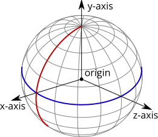
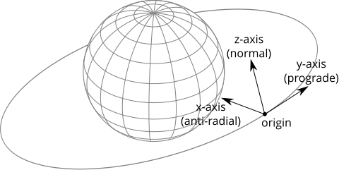
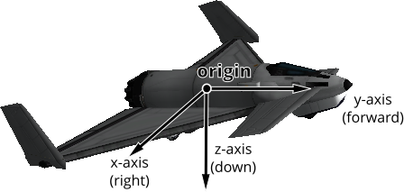
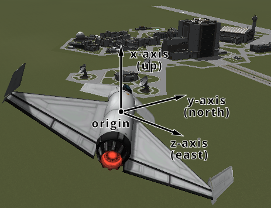
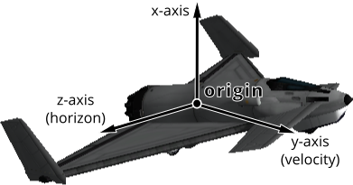

# Reference Frames

- [Introduction](#introduction)

  - [Origin Position and Axis Orientation](#origin-position-and-axis-orientation)

    - [Celestial Body Reference Frame](#celestial-body-reference-frame)
    - [Vessel Orbital Reference Frame](#vessel-orbital-reference-frame)
    - [Vessel Reference Frame](#vessel-reference-frame)
  - [Linear Velocity and Angular Velocity](#linear-velocity-and-angular-velocity)
- [Available Reference Frames](#available-reference-frames)
- [Custom Reference Frames](#custom-reference-frames)
- [Converting Between Reference Frames](#converting-between-reference-frames)
- [Visual Debugging](#visual-debugging)
- [Examples](#examples)

  - [Navball directions](#navball-directions)
  - [Orbital directions](#orbital-directions)
  - [Surface ‘prograde’](#surface-prograde)
  - [Vessel Speed](#vessel-speed)
  - [Vessel Velocity](#vessel-velocity)
  - [Angle of attack](#angle-of-attack)
  - [Landing Site](#landing-site)

## [Introduction](#id4)

All of the positions, directions, velocities and rotations in kRPC are relative
to something, and *reference frames* define what that something is.

A reference frame specifies:

- The position of the origin at (0,0,0)
- the direction of the coordinate axes x, y, and z
- the linear velocity of the origin (if the reference frame moves)
- The angular velocity of the coordinate axes (the speed and direction of rotation of the axes)

> **Note**
>
> KSP and kRPC use a left handed coordinate system

### [Origin Position and Axis Orientation](#id5)

The following gives some examples of the position of the origin and the
orientation of the coordinate axes for various reference frames.

#### [Celestial Body Reference Frame](#id6)



The reference frame for a celestial body, such as Kerbin. The equator is
shown in blue, and the prime meridian in red. The black arrows show the
coordinate axes, and the origin is at the center of the planet.

The reference frame obtained by calling [`CelestialBody.reference_frame`](../python/api/space-center/celestial-body.md#SpaceCenter.CelestialBody.reference_frame "SpaceCenter.CelestialBody.reference_frame")
for Kerbin has the following properties:

- The origin is at the center of Kerbin,
- the y-axis points from the center of Kerbin to the north pole,
- the x-axis points from the center of Kerbin to the intersection of the prime
  meridian and equator (the surface position at 0° longitude, 0° latitude),
- the z-axis points from the center of Kerbin to the equator at 90°E longitude,
- and the axes rotate with the planet, i.e. the reference frame has the same
  rotational/angular velocity as Kerbin.

This means that the reference frame is *fixed* relative to Kerbin – it moves
with the center of the planet, and also rotates with the planet. Therefore,
positions in this reference frame are relative to the center of the planet. The
following code prints out the position of the active vessel in Kerbin’s
reference frame:

```python
import krpc

conn = krpc.connect()
vessel = conn.space_center.active_vessel
print("(%.1f, %.1f, %.1f)" % vessel.position(vessel.orbit.body.reference_frame))
```

For a vessel sat on the launchpad, the magnitude of this position vector will be
roughly 600,000 meters (equal to the radius of Kerbin). The position vector will
also not change over time, because the vessel is sat on the surface of Kerbin
and the reference frame also rotates with Kerbin.

#### [Vessel Orbital Reference Frame](#id7)



The orbital reference frame for a vessel.

Another example is the orbital reference frame for a vessel, obtained by calling
[`Vessel.orbital_reference_frame`](../python/api/space-center/vessel.md#SpaceCenter.Vessel.orbital_reference_frame "SpaceCenter.Vessel.orbital_reference_frame"). This is fixed to the vessel (the origin
moves with the vessel) and is orientated so that the axes point in the orbital
prograde/normal/radial directions.

- The origin is at the center of mass of the vessel,
- the y-axis points in the prograde direction of the vessels orbit,
- the x-axis points in the anti-radial direction of the vessels orbit,
- the z-axis points in the normal direction of the vessels orbit,
- and the axes rotate to match any changes to the prograde/normal/radial directions,
  for example when the prograde direction changes as the vessel continues on its
  orbit.

#### [Vessel Reference Frame](#id8)



The reference frame for an aircraft.

Another example is [`Vessel.reference_frame`](../python/api/space-center/vessel.md#SpaceCenter.Vessel.reference_frame "SpaceCenter.Vessel.reference_frame"). As with the previous example,
it is fixed to the vessel (the origin moves with the vessel), however the
orientation of the coordinate axes is different. They track the orientation of
the vessel:

- The origin is at the center of mass of the vessel,
- the y-axis points in the same direction that the vessel is pointing,
- the x-axis points out of the right side of the vessel,
- the z-axis points downwards out of the bottom of the vessel,
- and the axes rotate with any changes to the direction of the vessel.

### [Linear Velocity and Angular Velocity](#id9)

Reference frames move and rotate relative to one another. For example, the
reference frames discussed previously all have their origin position fixed to
some object (such as a vessel or a planet). This means that they move and rotate
to track the object, and so have a linear and angular velocity associated with
them.

For example, the reference frame obtained by calling
[`CelestialBody.reference_frame`](../python/api/space-center/celestial-body.md#SpaceCenter.CelestialBody.reference_frame "SpaceCenter.CelestialBody.reference_frame") for Kerbin is fixed relative to
Kerbin. This means the angular velocity of the reference frame is identical to
Kerbin’s angular velocity, and the linear velocity of the reference frame
matches the current orbital velocity of Kerbin.

## [Available Reference Frames](#id10)

kRPC provides the following reference frames:

Relative and hybrid reference frames can also be constructed from the above.

## [Custom Reference Frames](#id11)

Custom reference frames can be constructed from the built in frames listed
above. They come in two varieties: ‘relative’ and ‘hybrid’.

A relative reference frame is constructed from a parent reference frame, a fixed
position offset and a fixed rotation offset. For example, this could be used to
construct a reference frame whose origin is 10m below the vessel as follows, by
applying a position offset of 10 along the z-axis to
[`Vessel.reference_frame`](../python/api/space-center/vessel.md#SpaceCenter.Vessel.reference_frame "SpaceCenter.Vessel.reference_frame"). Relative reference frames can be constructed by
calling [`ReferenceFrame.create_relative()`](../python/api/space-center/reference-frame.md#SpaceCenter.ReferenceFrame.create_relative "SpaceCenter.ReferenceFrame.create_relative").

A hybrid reference frame inherits its components (position, rotation, velocity
and angular velocity) from the components of other reference frames. Note that
these components need not be fixed. For example, you could construct a reference
frame whose position is the center of mass of the vessel (inherited from
[`Vessel.reference_frame`](../python/api/space-center/vessel.md#SpaceCenter.Vessel.reference_frame "SpaceCenter.Vessel.reference_frame")) and whose rotation is that of the planet being
orbited (inherited from [`CelestialBody.reference_frame`](../python/api/space-center/celestial-body.md#SpaceCenter.CelestialBody.reference_frame "SpaceCenter.CelestialBody.reference_frame")). Hybrid
reference frames can be constructed by calling
[`ReferenceFrame.create_hybrid()`](../python/api/space-center/reference-frame.md#SpaceCenter.ReferenceFrame.create_hybrid "SpaceCenter.ReferenceFrame.create_hybrid").

The parent reference frame(s) of a custom reference frame can also be other
custom reference frames. For example, you could combine the two example frames
from above: construct a hybrid reference frame, centered on the vessel and
rotated with the planet being orbited, and then create a relative reference that
offsets the position of this 10m along the z-axis. The resulting frame will have
its origin 10m below the vessel, and will be rotated with the planet being
orbited.

## [Converting Between Reference Frames](#id12)

kRPC provides utility methods to convert positions, directions, rotations and
velocities between the different reference frames:

## [Visual Debugging](#id13)

References frames can be confusing, and choosing the correct one is a challenge
in itself. To aid debugging, kRPCs drawing functionality can be used to
visualize direction vectors in-game.

[`Drawing.add_direction_from_com()`](../python/api/drawing/drawing.md#Drawing.add_direction_from_com "Drawing.add_direction_from_com") will draw a direction vector, starting from the
center of mass of the active vessel. For example, the following code draws the
direction of the current vessels velocity relative to the surface of the body it
is orbiting:

```python
import krpc

conn = krpc.connect(name="Visual Debugging")
vessel = conn.space_center.active_vessel

ref_frame = vessel.surface_velocity_reference_frame
conn.drawing.add_direction_from_com((0, 1, 0), ref_frame)
while True:
    pass
```

> **Note**
>
> This example uses [`Vessel.surface_velocity_reference_frame`](../python/api/space-center/vessel.md#SpaceCenter.Vessel.surface_velocity_reference_frame "SpaceCenter.Vessel.surface_velocity_reference_frame"), which is
> singular when the vessel’s surface speed is zero (hovering, landed). Run it while the
> vessel is moving; on the launchpad the drawing calls will raise an error.

> **Note**
>
> The client must remain connected for the line to continue to be drawn,
> hence the infinite loop at the end of this example.

## [Examples](#id14)

The following examples demonstrate various uses of reference frames.

### [Navball directions](#id15)

This example demonstrates how to make the vessel point in various directions on
the navball:

```python
import krpc

conn = krpc.connect(name="Navball directions")
vessel = conn.space_center.active_vessel
ap = vessel.auto_pilot
ap.reference_frame = vessel.surface_reference_frame
ap.engaged = True

# Point the vessel north on the navball, with a pitch of 0 degrees
ap.target_direction = (0, 1, 0)
ap.wait()

# Point the vessel vertically upwards on the navball
ap.target_direction = (1, 0, 0)
ap.wait()

# Point the vessel west (heading of 270 degrees), with a pitch of 0 degrees
ap.target_direction = (0, 0, -1)
ap.wait()

ap.engaged = False
```

The code uses the vessel’s surface reference frame
([`Vessel.surface_reference_frame`](../python/api/space-center/vessel.md#SpaceCenter.Vessel.surface_reference_frame "SpaceCenter.Vessel.surface_reference_frame")), pictured below:



The first part instructs the auto-pilot to point in direction `(0,1,0)`
(i.e. along the y-axis) in the vessel’s surface reference frame. The y-axis of
the reference frame points in the north direction, as required.

The second part instructs the auto-pilot to point in direction `(1,0,0)`
(along the x-axis) in the vessel’s surface reference frame. This x-axis of the
reference frame points upwards (away from the planet) as required.

Finally, the code instructs the auto-pilot to point in direction `(0,0,-1)`
(along the negative z axis). The z-axis of the reference frame points east, so
the requested direction points west – as required.

### [Orbital directions](#id16)

This example demonstrates how to make the vessel point in the various orbital
directions, as seen on the navball when it is in ‘orbit’ mode. It uses
[`Vessel.orbital_reference_frame`](../python/api/space-center/vessel.md#SpaceCenter.Vessel.orbital_reference_frame "SpaceCenter.Vessel.orbital_reference_frame").

```python
import krpc

conn = krpc.connect(name="Orbital directions")
vessel = conn.space_center.active_vessel
ap = vessel.auto_pilot
ap.reference_frame = vessel.orbital_reference_frame
ap.engaged = True

# Point the vessel in the prograde direction
ap.target_direction = (0, 1, 0)
ap.wait()

# Point the vessel in the orbit normal direction
ap.target_direction = (0, 0, 1)
ap.wait()

# Point the vessel in the orbit radial direction
ap.target_direction = (-1, 0, 0)
ap.wait()

ap.engaged = False
```

This code uses the vessel’s orbital reference frame, pictured below:


### [Surface ‘prograde’](#id17)

This example demonstrates how to point the vessel in the ‘prograde’ direction on
the navball, when in ‘surface’ mode. This is the direction of the vessels
velocity relative to the surface:

```python
import krpc

conn = krpc.connect(name="Surface prograde")
vessel = conn.space_center.active_vessel
ap = vessel.auto_pilot

ap.reference_frame = vessel.surface_velocity_reference_frame
ap.target_direction = (0, 1, 0)
ap.engaged = True
ap.wait()
ap.engaged = False
```

> **Note**
>
> [`Vessel.surface_velocity_reference_frame`](../python/api/space-center/vessel.md#SpaceCenter.Vessel.surface_velocity_reference_frame "SpaceCenter.Vessel.surface_velocity_reference_frame") is singular when the
> vessel’s surface speed is zero (hovering, landed). Calling this when the
> vessel is stationary will raise an error.

This code uses the [`Vessel.surface_velocity_reference_frame`](../python/api/space-center/vessel.md#SpaceCenter.Vessel.surface_velocity_reference_frame "SpaceCenter.Vessel.surface_velocity_reference_frame"), pictured
below:


> **See also**
>
> If you only need the surface prograde or retrograde direction as a
> vector, rather than a reference frame to point the auto-pilot at,
> [`Flight.surface_prograde`](../python/api/space-center/flight.md#SpaceCenter.Flight.surface_prograde "SpaceCenter.Flight.surface_prograde") and [`Flight.surface_retrograde`](../python/api/space-center/flight.md#SpaceCenter.Flight.surface_retrograde "SpaceCenter.Flight.surface_retrograde") return
> it directly, matching the navball’s surface mode.

### [Vessel Speed](#id18)

This example demonstrates how to get the orbital and surface speeds of the
vessel, equivalent to the values displayed by the navball.

To compute the orbital speed of a vessel, you need to get the velocity relative
to the planet’s *non-rotating* reference frame
([`CelestialBody.non_rotating_reference_frame`](../python/api/space-center/celestial-body.md#SpaceCenter.CelestialBody.non_rotating_reference_frame "SpaceCenter.CelestialBody.non_rotating_reference_frame")). This reference frame is
fixed relative to the body, but does not rotate.

For the surface speed, the planet’s reference frame
([`CelestialBody.reference_frame`](../python/api/space-center/celestial-body.md#SpaceCenter.CelestialBody.reference_frame "SpaceCenter.CelestialBody.reference_frame")) is required, as this reference frame
rotates with the body.

```python
import time
import krpc

conn = krpc.connect(name="Vessel speed")
vessel = conn.space_center.active_vessel
obt_frame = vessel.orbit.body.non_rotating_reference_frame
srf_frame = vessel.orbit.body.reference_frame

while True:
    obt_speed = vessel.flight(obt_frame).speed
    srf_speed = vessel.flight(srf_frame).speed
    print("Orbital speed = %.1f m/s, Surface speed = %.1f m/s" % (obt_speed, srf_speed))
    time.sleep(1)
```

### [Vessel Velocity](#id19)

This example demonstrates how to get the velocity of the vessel (as a vector),
relative to the surface of the body being orbited.

To do this, a hybrid reference frame is required. This is because we want a
reference frame that is centered on the vessel, but whose linear velocity is
fixed relative to the ground.

We therefore create a hybrid reference frame with its rotation set to the
vessel’s surface reference frame ([`Vessel.surface_reference_frame`](../python/api/space-center/vessel.md#SpaceCenter.Vessel.surface_reference_frame "SpaceCenter.Vessel.surface_reference_frame")), and
all other properties (including position and velocity) set to the body’s
reference frame ([`CelestialBody.reference_frame`](../python/api/space-center/celestial-body.md#SpaceCenter.CelestialBody.reference_frame "SpaceCenter.CelestialBody.reference_frame")) – which rotates with
the body.

```python
import time
import krpc

conn = krpc.connect(name="Orbital speed")
vessel = conn.space_center.active_vessel
ref_frame = conn.space_center.ReferenceFrame.create_hybrid(
    position=vessel.orbit.body.reference_frame, rotation=vessel.surface_reference_frame
)

while True:
    velocity = vessel.flight(ref_frame).velocity
    print("Surface velocity = (%.1f, %.1f, %.1f)" % velocity)
    time.sleep(1)
```

### [Angle of attack](#id20)

This example computes the angle between the direction the vessel is pointing in,
and the direction that the vessel is moving in (relative to the surface):

```python
import math
import time
import krpc

conn = krpc.connect(name="Angle of attack")
vessel = conn.space_center.active_vessel

while True:

    d = vessel.direction(vessel.orbit.body.reference_frame)
    v = vessel.velocity(vessel.orbit.body.reference_frame)

    # Compute the dot product of d and v
    dotprod = d[0] * v[0] + d[1] * v[1] + d[2] * v[2]

    # Compute the magnitude of v
    vmag = math.sqrt(v[0] ** 2 + v[1] ** 2 + v[2] ** 2)
    # Note: don't need to magnitude of d as it is a unit vector

    # Compute the angle between the vectors
    angle = 0.0
    if vmag > 0:
        angle = math.acos(dotprod / vmag) * (180.0 / math.pi)

    print("Angle of attack = %.1f degrees" % angle)

    time.sleep(1)
```

Note that the orientation of the reference frame used to get the direction and
velocity vectors does not matter, as the angle between two vectors is the same
regardless of the orientation of the axes. However, if we were to use a
reference frame that moves with the vessel, the velocity would return
`(0,0,0)`. We therefore need a reference frame that is not fixed relative to
the vessel. [`CelestialBody.reference_frame`](../python/api/space-center/celestial-body.md#SpaceCenter.CelestialBody.reference_frame "SpaceCenter.CelestialBody.reference_frame") fits these requirements.

The angle computed here is the total angle between the two vectors, in the range
0° to 180°. This is not the same quantity as [`Flight.angle_of_attack`](../python/api/space-center/flight.md#SpaceCenter.Flight.angle_of_attack "SpaceCenter.Flight.angle_of_attack"),
which is the signed angle of attack in the vessel’s pitch plane, in the range
-90° to +90° (with the sideways component reported separately by
[`Flight.sideslip_angle`](../python/api/space-center/flight.md#SpaceCenter.Flight.sideslip_angle "SpaceCenter.Flight.sideslip_angle")).

### [Landing Site](#id21)

This example computes a reference frame that is located on the surface of a body
at a given altitude, which could be used as the target for a landing auto pilot.

```python
import time
from math import sin, cos, pi
import krpc

conn = krpc.connect(name="Landing Site")
vessel = conn.space_center.active_vessel
body = vessel.orbit.body
create_relative = conn.space_center.ReferenceFrame.create_relative

# Define the landing site as the top of the VAB
landing_latitude = -(0 + (5.0 / 60) + (48.38 / 60 / 60))
landing_longitude = -(74 + (37.0 / 60) + (12.2 / 60 / 60))
landing_altitude = 111

# Determine landing site reference frame
# (orientation: x=zenith, y=north, z=east)
landing_position = body.surface_position(
    landing_latitude, landing_longitude, body.reference_frame
)
q_long = (
    0,
    sin(-landing_longitude * 0.5 * pi / 180),
    0,
    cos(-landing_longitude * 0.5 * pi / 180),
)
q_lat = (
    0,
    0,
    sin(landing_latitude * 0.5 * pi / 180),
    cos(landing_latitude * 0.5 * pi / 180),
)
landing_reference_frame = create_relative(
    create_relative(
        create_relative(body.reference_frame, landing_position, q_long),
        (0, 0, 0),
        q_lat,
    ),
    (landing_altitude, 0, 0),
)

# Draw axes
conn.drawing.add_line((0, 0, 0), (1, 0, 0), landing_reference_frame)
conn.drawing.add_line((0, 0, 0), (0, 1, 0), landing_reference_frame)
conn.drawing.add_line((0, 0, 0), (0, 0, 1), landing_reference_frame)

while True:
    time.sleep(1)
```
